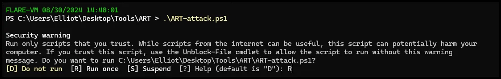

# Intro to Windows Endpoint Forensic Analysis: Artifacts (VMware Lab)

## Summary:

Today we will review basic Windows endpoint forensic artifacts used during a DFIR investigation and then introduce tools used to parse and analyze those artifacts. It is important to review these artifacts and understand their value from a forensic perspective. These artifacts serve as vital clues that reveal traces of human interaction, offering insights into various activities. Collectively, these artifacts form a narrative reconstructing the sequence of events of a compromise. We will be using the 4N6Lab VM for all the forensic exercises.  

## Scope:

This session will only cover a limited number of forensic artifacts. With the exception of memory analysis, which we will cover in a separate exercise, these are some of the most common artifacts analyzed during a DFIR investigation.  There are many more forensic artifacts available; however, for our purposes today we will only cover these. The intent is to provide you with the baseline knowledge to conduct incident response and to knowledgeably communicate with Tier 3 forensic analysts.   


## Objectives:

1) Familiarization with key forensic artifacts.

2) Introduction to tools and techniques used to parse and analyze forensic artifacts.

## Lab Setup

It is highly encouraged to use the 4N6Lab VM for the forensic exercises. It was built with all the tools you’ll need already installed. In order to take advantage of all the functionalities, the 4N6Lab VM is built for VMWare Workstation. 

If you do not already have VMWare Workstation, download and install VMWare Workstation from one of the links below.

[VMware-workstation-full-17.5.2-23775571.exe](https://ln5.sync.com/dl/8efb027d0/km8j7nt2-csvsixjd-azcyfmhv-hghnxcc3)

or go to the official site and follow the links and instructions:

[VMware Workstation Pro: Now Available Free for Personal Use](https://blogs.vmware.com/workstation/2024/05/vmware-workstation-pro-now-available-free-for-personal-use.html)

Download the 4N6Lab VM from one of the links below. This VM will be used for all forensics exercises. All the tools needed for the forensic exercises are pre-installed on the 4N6Lab VM. The VM is large and will take some time to download. 

[4N6Lab_V2.7z](https://drive.google.com/file/d/18RMGYywOmhactjP6gkkrclRkYuVQQnyp/view?usp=sh
aring)

## Create and Collect Forensic Artifacts

Before we discuss Windows forensic artifacts we will emulate an attack using Atomic Red Team and then capture the Windows artifacts.

Before conducting the attack emulation turn on internal logging in Splunk. 

 1. Open a browser and navigate to 127.0.0.1:8000 

Login credentials are Username=Elliot Password=Password1

Enable log collection by navigating to Settings and Data Inputs.


Select “Remote event log collections” and select “Enable”


**Attack Emulation**

Launch the Atomic Red Team PowerShell script on your Windows VM.

1. Open a PowerShell terminal as administrator and navigate to the ART folder located at C:\Users\Elliot\Desktop\Tools\ART.
2. Run the PowerShell script called ART-attack.ps1

 


Select “R” when prompted.



Select “Y”


Select OK on the pop up.


Once the emulation is completed the curser will return and you can close the notepad app that should have started.


**Disable Splunk logging**

Go back to Splunk and disable logging the same way you enabled it.

**Take a forensic triage capture using Kape.**

Navigate to the Kape folder on the desktop. Right click “gkape.exe” and run as administrator.


Once the GUI for Kape opens, select the C: drive as the target and create a folder on your Desktop for the Target Destination and choose it.


Under Targets scroll down to Kape Triage and check the box. Then select Execute.


This may take several minutes to complete. Be patient. Once it is completed you will receive the “Press any key to exit” message. 


You can then close Kape. 

## Artifacts

During forensic analysis, the term 'artifact' frequently arises as a crucial element. These artifacts serve as vital clues that reveal traces of human interaction, offering insights into various activities. For instance, in the examination of a crime scene, items such as fingerprints, torn clothing buttons, or the implements utilized in the commission of the offense are all categorized as forensic artifacts. Collectively, these artifacts form a narrative reconstructing the sequence of events leading to the crime. Similarly, Within the realm of computer forensics, forensic artifacts manifest as subtle traces of activity embedded within the system. Particularly on Windows platforms, these artifacts intricately document user actions, often in obscure corners of the system inaccessible to ordinary users. Analyzing these artifacts enables the reconstruction of activity trails essential for investigative purposes, furnishing valuable evidence in legal proceedings.

Below are some of the key Windows forensic artifacts we will be examing. Please note that memory is also a key artifact; however, we will be examining Windows memory in a later exercise.


# Windows Event Log Analysis

Windows Event Logs. Imagine Windows Event Logs as the digital footprints left behind by every action taken on a system. Just like a detective uses clues to solve a mystery, we, as forensic investigators, use event logs to piece together the story of what happened on a computer system.

Windows Event Logs are a detailed record of system, security, and application events on a Windows system. They are automatically generated by the operating system and are invaluable in helping us understand what has occurred on a machine. Whether it’s a user login, a failed application, or a security breach attempt, it's all recorded here.

**Types of Event Logs:**

There are several types of event logs, each serving a specific purpose:

- **Application Logs:** These logs contain events logged by applications or programs. For example, a database program might record a file error in the application log.
- **Security Logs:** This log contains information about security-related events like successful and failed login attempts. This is where we look for evidence of unauthorized access.
- **System Logs:** These logs contain events logged by Windows system components, such as driver failures or system errors.
- **Setup Logs:** These are used primarily to log events related to application installation.
- **Forwarded Events:** This log contains events that have been forwarded from other machines. This is useful in centralized logging scenarios, often used in enterprise environments.
- **Sysmon Logs:** Sysmon, or System Monitor, is a Windows system service and device driver that logs detailed information about process creation, network connections, file creation, and other system activities to the Windows Event Log. Sysmon logs provide a deeper insight into the behavior of processes and system activity, which is invaluable for detecting advanced persistent threats (APTs) and other malicious activities.
- **PowerShell Logs:** PowerShell logs provide detailed information on all PowerShell activities, including executed scripts, command lines, and module loads. PowerShell is a powerful tool often used by attackers for malicious purposes, so these logs are essential for identifying and understanding script-based attacks, misuse of PowerShell for lateral movement, or unauthorized changes to the system.

**Detecting and Investigating Security Incidents:**

In the realm of forensics and incident response, our primary goal is to detect, investigate, and respond to security incidents. Windows Event Logs play a pivotal role here. For example, if there's a suspected malware infection, the event logs can help trace the first occurrence, identify the affected files, and determine how the malware entered the system.

Security logs are particularly valuable for this. They can tell us:

- **Who** logged on to the system and when.
- **How** they accessed it—was it a local login, a remote access, or through a scheduled task?
- **What** actions they took—did they escalate privileges, create new user accounts, or attempt to disable security settings?

Sysmon logs add a deeper layer of insight, such as identifying the parent process of a suspicious executable, tracking unusual network connections, or detecting file modifications that could indicate tampering or data exfiltration.

PowerShell logs are critical for detecting script-based attacks. Since attackers often use PowerShell to execute malicious scripts or commands, these logs can help identify exactly what was run, by whom, and from where, providing crucial evidence for tracing the attack path.

**Timeline Reconstruction:**

Timeline reconstruction is another critical application of Windows Event Logs. By correlating timestamps across various logs, we can create a detailed timeline of events. This timeline allows us to see the progression of an incident, such as how an attacker moved through the network or what actions were taken before and after a system compromise.

For instance, if a user reports suspicious activity on their machine, we can start by checking the Security log for unusual login attempts. From there, Sysmon logs might reveal the execution of a suspicious process shortly afterward, and PowerShell logs can show if any scripts were executed during that time frame. This combined approach provides a comprehensive view of the attack.

**Identifying Anomalous Behavior:**

Windows Event Logs are also excellent for identifying anomalous behavior. Through regular monitoring and analysis, we establish a baseline of what normal activity looks like on the network. Once we know what’s normal, deviations from this baseline can indicate suspicious activity. For example, if Sysmon logs show a typically benign process suddenly making network connections to an unfamiliar IP, or PowerShell logs show a new script executing with elevated privileges, these are red flags worth investigating.

**Correlation with Other Data Sources:**

Windows Event Logs don't work in isolation—they're most powerful when correlated with other data sources. For example, you might correlate event logs with network logs to see if a suspicious login attempt coincided with unusual outbound connections. By combining different data sources, you create a more comprehensive view of the incident, allowing for more accurate and thorough investigations.

**Enabling and Configuring Event Logs:**

It's crucial to ensure that logging is properly configured on all systems. By default, Windows logs a lot of information, but you can fine-tune what is logged to ensure you're capturing all relevant data. For example, enabling advanced auditing settings can give you more detailed logs about file access, process creation, and more. Enabling and configuring Sysmon and PowerShell logging to capture detailed system and script activity can significantly enhance your forensic and incident response capabilities.

**Centralizing Logs for Analysis:**

For effective incident response, especially in larger environments, centralizing event logs is a best practice. Using solutions like Security Information and Event Management (SIEM) systems can help aggregate logs from multiple systems, making it easier to correlate and analyze them. This centralization is especially important when dealing with Sysmon and PowerShell logs, as attackers often target multiple systems within a network.

**Regular Monitoring and Alerting:**

Proactive monitoring of event logs and setting up alerts for specific events can help detect incidents early. For instance, setting alerts for failed login attempts, privilege escalation, or the creation of new user accounts can provide early warning signs of potential security incidents. Sysmon and PowerShell logs can also be monitored for specific indicators of compromise, such as unexpected process launches or PowerShell scripts executing from unusual locations.

**Conclusion:**

Lastly, windows Event Logs, including Sysmon and PowerShell logs, are a cornerstone of forensic and incident response investigations. They provide a detailed and chronological record of system and user activities that are crucial for detecting security incidents, reconstructing timelines, identifying anomalies, and correlating data with other sources. Mastering the interpretation of these logs allows us to effectively respond to and mitigate security incidents, keeping systems and data secure.

Remember, the key to effective use of Windows Event Logs is not just about collecting data—it's about knowing what to look for, how to interpret it, and how to act on the information. Thank you, and I look forward to exploring some real-world examples and hands-on exercises with you all today!

There are no shortage of tools to process .evtx logs
– Including the native Windows Event Viewer
• The data you see in the Event Viewer is a combination of the
data stored in the event logs and maps to label the data
**EvtxECmd** (by Eric Zimmerman) can extract Event Logs to be analyzed in a CSV
• EvtxECmd features:
– Include or exclude specific event IDs
– Provide custom mappings for event logs
– Only extract data from specific date and time ranges
– Deduplicate entries from Volume Shadow Copies
– Build a histogram of event IDs (EvtxECmd calls this “metrics”)

The command to run EvtxECmd is:

```powershell
EvtxeCmd.exe -d "C:\Users\Elliot\Desktop\Kape_out\C\Windows\System32\winevt\Logs" --csv C:\Users\Elliot\Desktop\Case_Files\Event_Logs --csvf EvtLogs.csv
```

Here's a breakdown of the command:

- **`EvtxeCmd.exe`**: This is the executable file for the EvtxeCmd tool, which is used to analyze Windows Event Log files.
- **`d "C:\Users\m122\Desktop\Collection\uploads\auto\C%3A\Windows\System32\winevt\Logs"`**: This specifies the directory containing the Event Log files to be analyzed. In this case, it's **`"C:\Users\m122\Desktop\Collection\uploads\auto\C%3A\Windows\System32\winevt\Logs"`**.
- **`-csv C:\Users\m122\Desktop\Case_Files\Event_Logs`**: This specifies the output directory where the extracted data will be saved. In this case, it's **`C:\Users\m122\Desktop\Case_Files\Event_Logs`**.
- **`-csvf EvtLogs.csv`**: This specifies the name of the output CSV file where the extracted Event Log data will be saved. In this case, it's **`EvtLogs.csv`**.

So, overall, this command is extracting and analyzing Event Log data from the specified directory and saving the results as a CSV file for further analysis.


We can drag the CSV to Timeline Explorer as seen below.


Or drag the actual logs from our collection to Event Log Explorer. Remember event logs are stored in the Windows\System32\winevt\logs directory. 

Open Event Log Explorer.

<aside>
💡


</aside>

When Event Log Explorer is opened, just drag the event logs you want to analyze. Since we will focus on the events logs in the table below, we will only drag the Microsoft-Windows-Windows Defender, System, Security, Windows PowerShell and Microsoft-Windows-Sysmon logs to Event Log Explorer.

<aside>
💡


</aside>

### Event Logs of Interest

**Provider**                         

Microsoft-Windows-Windows Defender

Microsoft-Windows-Windows Defender

System

Security

Windows PowerShell

Microsoft-Windows-Sysmon

Microsoft-Windows-Sysmon

Microsoft-Windows-Sysmon

Microsoft-Windows-Sysmon

Microsoft-Windows-Sysmon

[]()

**Event ID**

5000

5001

7045

4624

400

1

3

11

12,13

22

**Description**

Defender Enabled

Defender Disabled

New Service Installed

Successful login

Engine changed from none to available

Process Creation

Network Connection

File Create

Registry Events

DNS Query

**Defender**

By filtering for EventIDs 5000 and 5001 we can see that Windows Defender was disabled about six minutes before the incident. (Administrative note: Windows Defender was disabled to allow the attack script to run)


**Services**

We can now search the System logs (EventID 7045) to see if any new services were created. As seen below, we can see the AtomicService starting during the incident.


**Security**

Logon Types


By searching 4624 in the Security logs we can see successful logins. As seen below, the user m122 logged in. 


We can pivot on the Linked Logon ID to see what else the user did.


 As seen above, we can see m122 created the “art-test”.

**PowerShell**

By filtering for Event ID 400 in the PowerShell log, we immediately discover useful information. 


As seen above we see Invoke-WebRequest to download a .xlsm attachment. 

Additionally, as seen below we see a fileless attack because it is not downloading malware or depending on user action.  It is using Base64 encoded PowerShell.


Dropping the Base64 into CyberChef we can see that it is simply creating a .txt file in the SystemRoot/Tempt directory. The .txt file includes the string “Hello from Atomic Red Team”.


The following screenshots show PowerShell being used for persistence by putting a .bat file into the startup folder.


Below we see PowerShell opening notepad and capturing the PID of notepad. It then injects a malicious .dll into notepad. 


Below we see a file (deleteme_T1551.004) being deleted.


The screenshots above clearly demonstrate the value of logging PowerShell.

**Sysmon**

We can use Sysmon logs to pivot from the mavinject process we discovered in the PowerShell logs.


Additional information we see is process ID and GUID as well as parent process ID and GUID. Remember how we were able to “follow the bread crumbs” using the process/parent process GUIDs. The same concept applies here. 


As you can see above by pivoting to the GUID of the parent process and allowing any Event ID, we basically get a timeline of the incident.

However, we can filter down further by searching for network connections (Event ID 3) and DNS queries (Event ID 22).


As seen above, we can immediately discover IOCs, such as IP addresses and domain names.

Lastly, we can use Sysmon to discover changes to the registry by using Evend IDs 12 and 13. As seen below we see the AtomicTestService being started.


 

### Kape (Easy (EZ) Button)

We can do most of the parsing we did via command line using Kape. 


Note that to use most of the 3rd party tools in Kape there are requirements to download the binaries and place them in Kape’s Modules directory, as seen below for regripper.


Kape will run the parsing modules and place the results in the destination folder.

We can then use Timeline Explorer or Registry Explorer to analyze the results, just as we did after manually running each tool.


Additionally, since we ran regripper, the text files are in the Registry folder. We can open them in Notepad++ and search as we did before.


The other artifacts can be analyzed  in much the same way as the artifacts we discussed today.

## Conclusion

Basic forensic analysis can play a large role in incident response. Knowing where to look and what to look for is 90% of the DFIR challenge. The artifacts and techniques discussed today are only a basic baseline of knowledge for you to build on.  

# Clean Up

Ensure you run the ART clean up script.

1. Open a PowerShell terminal as administrator and navigate to the ART folder located at C:\Users\Elliot\Desktop\Tools\ART.
2. Run the PowerShell script called ART-attack-cleanup.ps1 

