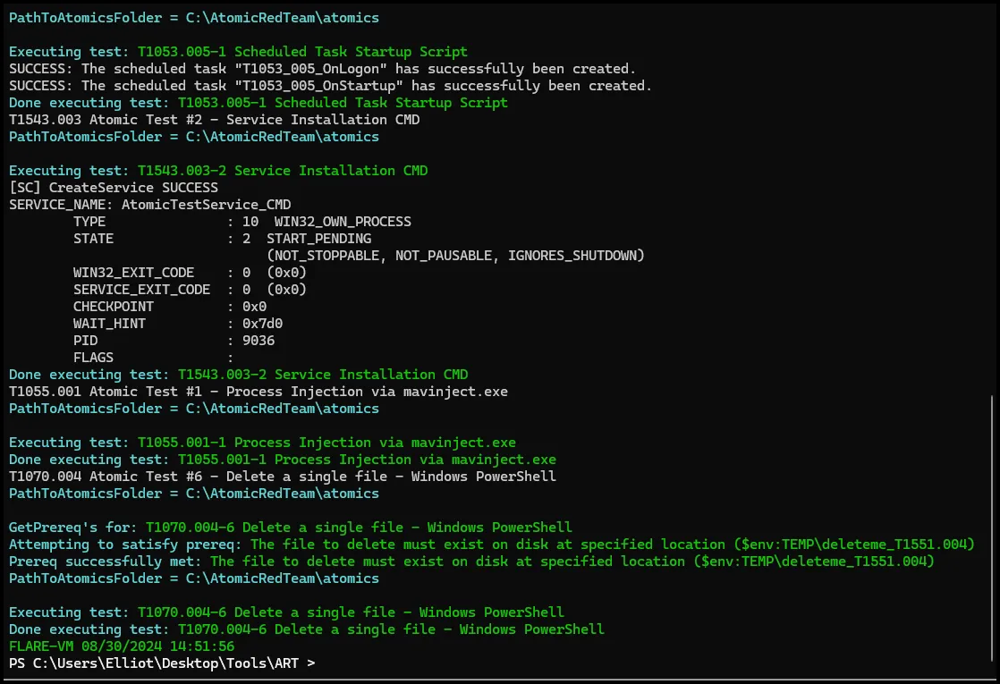
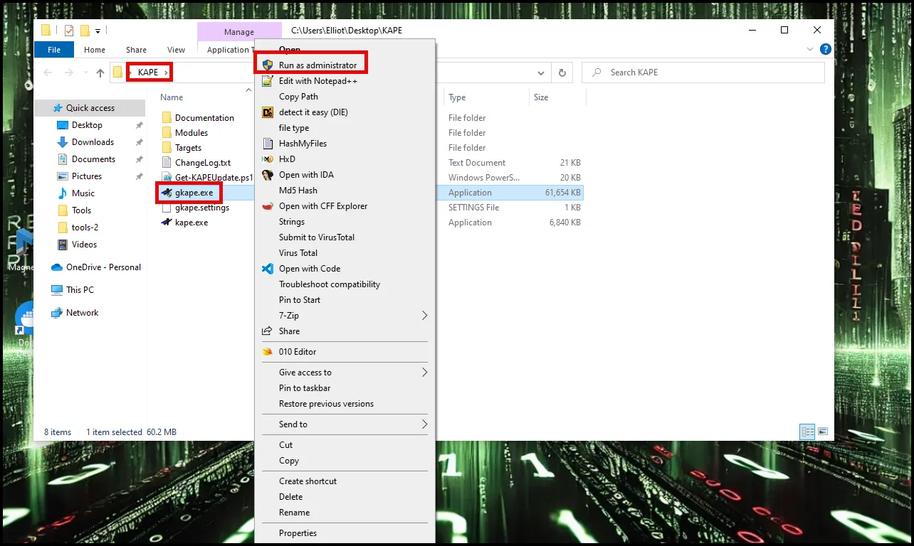
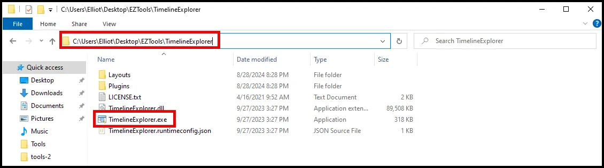

# Windows Endpoint Forensic Analysis: Artifacts

## Summary:

Today we will review basic Windows endpoint forensic artifacts used during a DFIR investigation and then introduce tools used to parse and analyze those artifacts. It is important to review these artifacts and understand their value from a forensic perspective. These artifacts serve as vital clues that reveal traces of human interaction, offering insights into various activities. Collectively, these artifacts form a narrative reconstructing the sequence of events of a compromise. We will be using the 4N6Lab VM for all the forensic exercises.  

## Scope:

This session will only cover a limited number of forensic artifacts. With the exception of memory analysis, which we will cover in a separate exercise, these are some of the most common artifacts analyzed during a DFIR investigation.  There are many more forensic artifacts available; however, for our purposes today we will only cover these. The intent is to provide you with the baseline knowledge to conduct incident response and to knowledgeably communicate with Tier 3 forensic analysts.   


## Objectives:

1) Familiarization with key forensic artifacts.

2) Introduction to tools and techniques used to parse and analyze forensic artifacts.

## Lab Setup

It is highly encouraged to use the 4N6Lab VM for the forensic exercises. It was built with all the tools you’ll need already installed. In order to take advantage of all the functionalities, the 4N6Lab VM is built for VMWare Workstation. 

If you do not already have VMWare Workstation, download and install VMWare Workstation from one of the links below.

[VMware-workstation-full-17.5.2-23775571.exe](https://ln5.sync.com/dl/8efb027d0/km8j7nt2-csvsixjd-azcyfmhv-hghnxcc3)

or go to the official site and follow the links and instructions:

[VMware Workstation Pro: Now Available Free for Personal Use](https://blogs.vmware.com/workstation/2024/05/vmware-workstation-pro-now-available-free-for-personal-use.html)

Download the 4N6Lab VM from one of the links below. This VM will be used for all forensics exercises. All the tools needed for the forensic exercises are pre-installed on the 4N6Lab VM. The VM is large and will take some time to download. 

[4N6Lab_V2.7z](https://drive.google.com/file/d/18RMGYywOmhactjP6gkkrclRkYuVQQnyp/view?usp=sh
aring)

## Create and Collect Forensic Artifacts

Before we discuss Windows forensic artifacts we will emulate an attack using Atomic Red Team and then capture the Windows artifacts.

Before conducting the attack emulation turn on internal logging in Splunk. 

 1. Open a browser and navigate to 127.0.0.1:8000 

Login credentials are Username=Elliot Password=Password1

Enable log collection by navigating to Settings and Data Inputs.


Select “Remote event log collections” and select “Enable”


**Attack Emulation**

Launch the Atomic Red Team PowerShell script on your Windows VM.

1. Open a PowerShell terminal as administrator and navigate to the ART folder located at C:\Users\Elliot\Desktop\Tools\ART.
2. Run the PowerShell script called ART-attack.ps1

 


Select “R” when prompted.


Select “Y”


Select OK on the pop up.


Once the emulation is completed the curser will return and you can close the notepad app that should have started.



**Disable Splunk logging**

Go back to Splunk and disable logging the same way you enabled it.

**Take a forensic triage capture using Kape.**

Navigate to the Kape folder on the desktop. Right click “gkape.exe” and run as administrator.


Once the GUI for Kape opens, select the C: drive as the target and create a folder on your Desktop for the Target Destination and choose it.



Under Targets scroll down to Kape Triage and check the box. Then select Execute.


This may take several minutes to complete. Be patient. Once it is completed you will receive the “Press any key to exit” message. 


You can then close Kape. 

## Artifacts

During forensic analysis, the term 'artifact' frequently arises as a crucial element. These artifacts serve as vital clues that reveal traces of human interaction, offering insights into various activities. For instance, in the examination of a crime scene, items such as fingerprints, torn clothing buttons, or the implements utilized in the commission of the offense are all categorized as forensic artifacts. Collectively, these artifacts form a narrative reconstructing the sequence of events leading to the crime. Similarly, Within the realm of computer forensics, forensic artifacts manifest as subtle traces of activity embedded within the system. Particularly on Windows platforms, these artifacts intricately document user actions, often in obscure corners of the system inaccessible to ordinary users. Analyzing these artifacts enables the reconstruction of activity trails essential for investigative purposes, furnishing valuable evidence in legal proceedings.

Below are some of the key Windows forensic artifacts we will be examing. Please note that memory is also a key artifact; however, we will be examining Windows memory in a later exercise.


## Filesystem Analysis ($MFT and $J)

### TimeStamps

Before we discuss the $MFT and $J it is important to discuss timestamps.

Timestamps within NTFS (New Technology File System), which is the default file system for modern Windows operating systems. NTFS timestamps are a critical part of digital forensics, as they allow us to reconstruct timelines, verify actions, and track user or attacker activity on a compromised system. Understanding NTFS timestamps and their nuances can make a significant difference in accurately interpreting the evidence.

Timestamps in NTFS file systems are metadata elements that record specific dates and times associated with files and directories. NTFS maintains a comprehensive set of timestamps, commonly referred to as MACB: Modified, Accessed, Created, and Entry Modified (or Birth). These timestamps provide detailed information about file activities and can be crucial for forensic investigations.

NTFS timestamps help forensic investigators reconstruct the sequence of events by showing when files were created, modified, accessed, or had their metadata changed. This allows us to establish timelines and link user actions or attacker activities to specific moments in time.

Timestamps allow us to correlate evidence across different artifacts, such as logs, registry entries, and network activity. By comparing timestamps, we can validate findings, identify patterns, and detect inconsistencies that may point to tampering or unauthorized actions.

Analyzing NTFS timestamps can also reveal anomalies, such as files modified outside of normal working hours, or discrepancies in timestamp sequences that suggest intentional tampering by an attacker trying to cover their tracks.

- **MACB Timestamps**:
    - **Modified (M)**: The last time the content of a file was changed.
    - **Accessed (A)**: The last time the file was opened or read.
    - **Created (C)**: The time when the file was first created or copied onto the NTFS volume.
    - **Entry Modified (B)**: The last time the file’s metadata (like its filename or attributes) was altered, also known as the "MFT Modified" timestamp.
- **File System and MFT**: "In NTFS, timestamps are stored in the Master File Table (MFT), where each file or directory entry has its own record containing these timestamps. This structured approach allows NTFS to maintain detailed information about each file, which is invaluable for forensic analysis."

One challenge in using NTFS timestamps is the potential for manipulation. Attackers can use tools or scripts to alter timestamps in an attempt to hide their tracks. It’s important for investigators to recognize signs of tampering, such as out-of-sequence timestamps, inconsistencies with related artifacts, or unusual patterns that don’t align with normal user behavior.

Another challenge is dealing with time zone differences and system clock inaccuracies. Timestamps are typically recorded in Coordinated Universal Time (UTC), so proper conversion to local time is essential for accurate timeline reconstruction. Additionally, if a system clock was altered—either accidentally or maliciously—this can complicate the analysis.

Most forensic tools will annotate the MACB timestamps using the format seen below. The dots (periods) mean that there was no change to that timestamp.


**$STANDARD_INFO**

**$STANDARD_INFO** ($SI) stores file metadata such as flags, the file SID, the file owner and a set of MAC(b) timestamps.

*$STANDARD_INFO is the timestamp collected by Windows explorer, fls, mactime, timestomp, find and the other utilities related to the display of timestamps.*

**$FILE_NAME**

The **$File_Name** attribute contains forensically interesting bits, such as **MACB** times, file name, file length and more.

*Timestamps are only updated when the attribute is changed.*

**What are the differences?**

- **$STANDARD_INFO** can be modified by user level processes like timestomp.
- **$FILE_NAME** can only be modified by the system kernel. (*There are no known anti-forensics utilities that can accomplish this.)*

The `$STANDARD_INFORMATION` and `$FILE_NAME` attributes in Windows file systems both store timestamps, but they serve different roles and can have discrepancies. The `$STANDARD_INFORMATION` attribute contains the primary timestamps for a file, including creation, modification, MFT modification, and access times, and these are updated frequently based on user or system actions. In contrast, the `$FILE_NAME` attribute also holds similar timestamps but can differ due to certain file operations, such as renaming or moving files, which may update the `$FILE_NAME` timestamps without altering the `$STANDARD_INFORMATION` ones. These differences are significant in forensic analysis, as they can reveal actions like file movement or tampering, providing additional context or historical reference points for investigators.
**We will focus only on the $STANDARD_INFO timestamps.**

The table below from a SANS poster shows how time stamps are created and modified when various functions are performed on the file.


In conclusion, NTFS timestamps are a cornerstone of digital forensics, providing detailed insights into file and directory activities on Windows systems. By mastering the analysis of NTFS timestamps, you gain the ability to reconstruct events, detect anomalies, and build compelling timelines that support your investigations.

## **Case Study: Reconstructing User Actions on a Compromised System Using NTFS Timestamps**

**Scenario Overview**

A large financial institution detected unusual activity on a key executive’s laptop, leading to the unauthorized transfer of sensitive financial documents to an external server. The initial investigation revealed that a malicious insider or an external attacker might have gained access to the system. The forensic team was tasked with reconstructing the sequence of user actions to determine how the breach occurred, identify any unauthorized software used, and understand the full scope of the compromise.

**Initial Forensic Findings**

1. **Suspicious Network Activity**: Network logs indicated repeated connections from the executive’s laptop to an external IP address linked to a known data exfiltration domain. The connections occurred during non-business hours, suggesting automated or remote access.
2. **Evidence of Unauthorized Access**: Windows event logs showed multiple logins using the executive’s credentials during odd hours, which were inconsistent with the executive’s normal work patterns.
3. **Detection of Suspicious Files**: Preliminary scans detected traces of a deleted executable in the system’s temporary directories, but it was unclear when this software was introduced or executed.

**Role of NTFS Timestamps**

To accurately piece together the sequence of events, forensic analysts focused on NTFS timestamps, which provided a detailed timeline of file activities. The timestamps were crucial in identifying when unauthorized software was installed, accessed, and executed on the compromised system.

**Analysis of NTFS Timestamps**

1. **Extraction and Examination**: Using FTK Imager and MFTECmd, analysts extracted NTFS timestamps from the Master File Table (MFT) entries on the compromised laptop. They focused on Modified, Accessed, Created, and Entry Modified (MACB) timestamps of key files, including executables, system logs, and sensitive documents.
2. **Identifying Unauthorized Software Use**: The analysis revealed a suspicious executable named data_transfer.exe located in a hidden directory (C:\Users\Public\Downloads\System\). The MACB timestamps showed that the executable was created late at night, which coincided with the first instance of the suspicious network activity. The Modified timestamp indicated the executable had been run multiple times, aligning with the ongoing data transfers identified in the network logs.
3. **Timeline Reconstruction**: By examining the NTFS timestamps, analysts reconstructed a detailed timeline showing the sequence of actions taken on the system:
    - **Creation (C)**: The data_transfer.exe file was created on the system at 11:45 PM, just after the first unauthorized login.
    - **Modified (M)**: The file was modified several times over the next few days, indicating repeated execution.
    - **Accessed (A)**: The accessed timestamp showed that the file was last accessed minutes before the final data transfer, suggesting that it was actively used for exfiltration.
    - **Entry Modified (B)**: The metadata timestamp showed changes consistent with attempts to alter the file’s properties, possibly to obscure its true purpose or origin.
4. **Detecting Tampering and Persistence**: Analysts noticed discrepancies between the Created and Modified timestamps on certain system files, indicating potential timestamp manipulation by the attacker to hide traces of software installation. Additionally, NTFS timestamps revealed that related files in the same directory were accessed repeatedly, suggesting the presence of a persistence mechanism that was triggered automatically.

**Corroborating Evidence**

1. **Cross-Referencing with Event Logs**: The timeline derived from NTFS timestamps was cross-referenced with Windows event logs, confirming that the unauthorized logins occurred shortly before the creation and modification times of the data_transfer.exe file. This correlation supported the hypothesis that the attacker used the compromised credentials to deploy and execute the unauthorized software.
2. **Alignment with Network Logs and File Access Data**: The timestamps from the MFT entries aligned with network logs, which showed data being sent to the external server at times matching the Modified timestamps of the unauthorized executable. File access logs also confirmed that sensitive documents were accessed around the same time, reinforcing the evidence of data exfiltration.
3. **Supporting Evidence from Prefetch Files and Registry Entries**: Prefetch files on the system confirmed that data_transfer.exe was executed multiple times, while related Registry entries indicated that the executable was configured to run on system startup, providing persistence across reboots. This combination of evidence further corroborated the findings from the NTFS timestamps, creating a comprehensive picture of the attack.

**Conclusion**

The analysis of NTFS timestamps was pivotal in reconstructing the sequence of actions on the compromised system. By examining MACB timestamps, investigators identified when unauthorized software was introduced, how it was used for data exfiltration, and how the attacker attempted to cover their tracks through timestamp manipulation.

The detailed timeline constructed from NTFS timestamps, corroborated by event logs, network activity, Prefetch data, and Registry entries, allowed the forensic team to establish a clear narrative of the breach. The timestamps not only highlighted the attacker’s use of unauthorized software but also helped pinpoint critical moments in the attack, providing invaluable insights for remediation and strengthening the institution’s defenses against future incidents.

This case underscores the importance of NTFS timestamps in digital forensics, demonstrating their power in uncovering hidden activities, validating other forensic findings, and constructing accurate timelines of user actions on compromised systems.

# **$MFT**

The Master File Table (MFT) is a crucial component of the NTFS (New Technology File System) used by Windows operating systems. It serves as a database that stores information about all files and directories on an NTFS volume.

Here's a breakdown of its key features:

1. **Metadata Storage**: The MFT stores metadata about each file and directory on the NTFS volume, including attributes such as file name, size, timestamps (creation, modification, access), permissions, and data content.
2. **Indexing**: The MFT contains an index that enables fast access to file and directory entries. This index speeds up file access and directory listing operations.
3. **Resilience**: The MFT is a critical part of the file system, and its integrity is essential for the proper functioning of NTFS. NTFS uses redundancy and journaling mechanisms to protect the MFT from corruption.
4. **Allocation**: The MFT itself is a file stored on the NTFS volume. As files are created and deleted, space within the MFT is allocated and deallocated dynamically to accommodate changes in the file system.
5. **MFT Zone**: NTFS reserves a portion of the disk specifically for storing the MFT, known as the MFT zone. Placing the MFT in a reserved area helps reduce fragmentation and improves performance by ensuring that the MFT is contiguous and easily accessible.
6. **Alternate Data Streams**: The MFT supports alternate data streams, which allow additional data to be associated with a file beyond its main content. This feature enables NTFS to store metadata, thumbnails, and other related information alongside the primary file data.

In summary, the Master File Table is a central component of the NTFS file system, responsible for managing metadata about files and directories, providing fast access to file information, and ensuring the integrity and performance of the file system.


The tool **MFTECmd** (by Eric Zimmerman) parses the NTFS central database, the $MFT
(Master File Table) The MFT is typically parsed into a CSV that is then loaded into another
tool, such as Excel or **Timeline Explorer.** The Timeline Explorer tool (by Eric Zimmerman) displays timeline CSV files in a more convenient format than Excel (and many other tools).

1. Open a command prompt and navigate to the C:\Users\Elliot\Desktop\EZTools folder 
2. Use the command below to create a CSV of the $MFT.

```powershell
MFTECmd.exe -f C:\Users\Elliot\Desktop\Kape_Out\C\$MFT --csv C:\Users\Elliot\Desktop\Case_Files\File_System --csvf MFT.csv
```


Here's a breakdown of the command:

- **`MFTECmd.exe`**: This is the executable file being run, a command-line tool used for parsing and analyzing Master File Table (MFT) data.
- **`f C:\Users\m122\Desktop\Kape_out\C\$MFT`**: This flag (**`f`**) indicates the input file or directory being processed. In this case, it specifies the path to the Master File Table file (**`$MFT`**) located at **`C:\Users\m122\Desktop\Kape_out\C\$MFT`**.
- **`-csv C:\Users\m122\Desktop\Case_Files\File_System`**: This flag (**`-csv`**) specifies the output format of the analysis results. Here, it indicates that the output should be generated in CSV (Comma-Separated Values) format, and the results will be saved to the directory specified (**`C:\Users\m122\Desktop\Case_Files\File_System`**).
- **`-csvf MFT.csv`**: This flag (**`-csvf`**) specifies the filename for the CSV output. In this case, it indicates that the output CSV file will be named **`MFT.csv`**.

So, overall, this command is extracting data from the MFT of an NTFS file system and saving it as a CSV file for further analysis or processing.

**Use Timeline Explorer (Zimmerman Tool) to open the MFT csv.**

Navigate to the C:\Users\Elliot\Desktop\EZTools\TimelineExplorer directory and double click Timeline Explorer.



Once in Timeline Explorer open the MFT.csv file with Timeline Explorer.


Once the file is loaded use the “Find” function to search for the attack script in the MFT. Search for ART-attack.

```powershell
ART-attack.ps1
```


To record the details of the attack script entry in the MFT it is easiest to use the command line version (MFTECmd) and search using the entry number (identified in previously).

```powershell
MFTECmd.exe -f C:\Users\Elliot\Desktop\Kape_Out\C\$MFT --de 109518
```

Here's a breakdown of the command:

- **`MFTECmd.exe`**: This is the executable file for the MFTECmd tool, which is used to analyze and extract data from NTFS file systems.
- **`f C:\Users\m122\Desktop\Kape_out\$MFT`**: This specifies the input file or device. In this case, it's the MFT of an NTFS file system located at **`C:\Users\m122\Desktop\Kape_out\$MFT`**.
- **`-de 217964`**: This option specifies the specific MFT entry to extract. In this case, it's extracting the entry with the index number 217946.

So, overall, this command is extracting a specific entry from the MFT of an NTFS file system based on its index number.


## **Case Study: Reconstructing User Actions on a Compromised System Using MFT Entries**

**Scenario Overview**

A cybersecurity firm was hired to investigate a data breach at a manufacturing company where critical design files were stolen and sold to a competitor. The breach was suspected to have originated from a compromised engineer’s workstation. The forensic team’s task was to reconstruct the sequence of user actions, identify how the breach occurred, determine what unauthorized software was used, and understand how the attacker maintained access to the system.

**Initial Forensic Findings**

1. **Unusual Network Traffic**: Network logs showed large data transfers from the engineer’s workstation to an external IP address associated with a cloud storage service, which was not used by the company.
2. **Suspicious Login Activity**: System event logs indicated multiple logins with the engineer’s credentials during non-working hours, suggesting possible credential theft or misuse.
3. **Malware Alerts**: Antivirus logs showed repeated alerts for a known data exfiltration tool, but the tool had been quarantined multiple times and appeared to re-emerge, suggesting persistence mechanisms that were not fully understood.

**Role of MFT Entries**

To accurately reconstruct the timeline and identify unauthorized software use, forensic analysts focused on the Master File Table (MFT) entries from the NTFS file system. MFT entries provided detailed information about file creation, modification, access, and deletion, which were crucial for piecing together the sequence of actions on the compromised system.

**Analysis of MFT Entries**

1. **Extraction and Examination**: Using MFTECmd and other forensic tools like Autopsy, analysts extracted MFT entries from the compromised workstation. The MFT, a critical component of the NTFS file system, contained records for every file and directory on the system, including their MACB (Modified, Accessed, Created, and Entry Modified) timestamps.
2. **Identifying Unauthorized Software**: The analysis revealed a hidden executable named stealth_transfer.exe located in an obscure folder (C:\Windows\Temp\System\). The MFT entries for this executable showed that it was created shortly after the first unauthorized login, with Created (C) timestamps aligning with the timing of the suspicious logins noted in the event logs.
    - **Modified (M) Timestamps**: These indicated that the executable was modified several times during the period of the data exfiltration, suggesting it was actively used or reconfigured.
    - **Accessed (A) Timestamps**: These showed that the file was accessed repeatedly just before the large data transfers, correlating with the periods of unusual network activity.
    - **Entry Modified (B) Timestamps**: The metadata was altered around the times when the malware alerts occurred, indicating attempts by the attacker to alter or replace the executable after it was quarantined by antivirus software.
3. **Timeline Reconstruction**: By piecing together the MACB timestamps from the MFT entries, analysts established a detailed timeline:
    - The stealth_transfer.exe was created and executed shortly after the initial unauthorized access.
    - The file was accessed and modified multiple times, coinciding with network data transfers to the external cloud storage service.
    - The attacker’s modifications to the metadata indicated efforts to maintain the tool’s functionality even after being flagged by security software.
4. **Detection of Additional Malicious Activity**: Further MFT analysis uncovered another executable named keylogger.exe in the same hidden directory, with similar patterns of creation and access during off-hours. This tool was likely used to capture the engineer’s credentials, allowing the attacker to maintain access to the workstation and continue exfiltrating sensitive data.

**Corroborating Evidence**

1. **Cross-Referencing with System Event Logs**: The timeline derived from MFT entries was cross-referenced with system event logs, confirming the alignment between the creation and access of the unauthorized software and the times of the suspicious logins. This supported the theory that the attacker deployed and executed the tools immediately after gaining access.
2. **Alignment with Network and File System Activity**: The MFT data was also aligned with network logs showing data transfers to the unauthorized cloud storage, and file system logs indicated that the design files were accessed and copied shortly before the exfiltration times recorded by network monitoring tools.
3. **Supporting Evidence from Prefetch Files and Scheduled Tasks**: Prefetch files confirmed that both stealth_transfer.exe and keylogger.exe were executed multiple times, while scheduled tasks analysis revealed a task that was set up to run stealth_transfer.exe at regular intervals, providing persistence even after reboots. This persistence mechanism explained why the malware continued to reappear despite multiple removals by security software.

**Conclusion**

The analysis of MFT entries was pivotal in reconstructing the sequence of user actions on the compromised workstation. By examining the detailed timestamps in the MFT, investigators identified when unauthorized software was introduced, how it was used to exfiltrate data, and how the attacker maintained access through persistence mechanisms.

The MFT analysis, corroborated by system event logs, network activity, Prefetch data, and scheduled tasks, allowed the forensic team to establish a comprehensive narrative of the breach. This case highlights the importance of MFT entries in digital forensics, demonstrating how they can reveal hidden actions, validate other findings, and construct an accurate timeline of events on compromised systems. The detailed examination of MFT entries not only pinpointed the attacker’s actions but also provided critical insights into the tools and techniques used, guiding the company in strengthening its defenses against future incidents.

# USN Journal Analysis ($J)

While the MFT does track last access timestamps, as we noted, these may be disabled. The USN (Update Sequence Number) Journal provides data showing the operations performed on files.
• This provides more than a simple timestamp when the last operation of a given type (create, access, modify, change metadata) was performed.
– The USN Journal also captures significantly more operation types than just MACB.
– USN journal data may include references to operations on deleted files.

Some use cases for USN Journal analysis:
– Knowledge that a file existed on the system
– Knowledge of file deletion (and when)
– Identifying that **Prefetch files** have been deleted (and which ones)
– Seeing when a user has overwritten a file prior to deletion (often used
in secure delete and anti-forensics)
– Locating a staging directory where files were collected prior to being
archived, exfiltrated, and deleted
– Identifying when malware has marked files with the hidden or system
attribute to limit visibility in Explorer (and unfortunately, other tools)

The **MFTECmd** application from Eric Zimmerman used for MFT processing
also processes data from the USN journal
– The file name you need to acquire is $Extend\$UsnJrnl
– The data is in a special stream named $J
Point to the $J file with the -f parameter, just like when using the tool to parse an MFT.

```powershell
MFTECmd.exe -f C:\Users\Elliot\Desktop\Kape_Out\C\$Extend\$J  -m C:\Users\Elliot\Desktop\Kape_out\C\$MFT --csv C:\Users\Elliot\Desktop\Case_Files\File_System --csvf $J.csv
```

Here's a breakdown of the command:

- **`MFTECmd.exe`**: This is the executable file, a command-line tool specifically designed for processing MFT data.
- **`f C:\Users\m122\Desktop\Kape_out\C\$Extend\$J`**: This flag (**`f`**) indicates the input file or directory being processed. In this case, it specifies the path to a particular file or directory within the **`$Extend`** folder, which is often used for various metadata in NTFS file systems. **`$J`** refers to the journal file, which records changes to the file system.
- **`m C:\Users\m122\Desktop\Kape_out\C\$MFT`**: This flag (**`m`**) is used to specify an additional MFT file to be used in the analysis. Here, it points to the Master File Table (**`$MFT`**) located at **`C:\Users\m122\Desktop\Kape_out\C\$MFT`**.
- **`-csv C:\Users\m122\Desktop\Case_Files\File_System`**: This flag (**`-csv`**) indicates the desired output format, which is CSV (Comma-Separated Values) in this case. It specifies the directory where the CSV file will be saved, likely containing the results of the analysis.
- **`-csvf $J.csv`**: This flag (**`-csvf`**) specifies the filename for the CSV output. In this case, it's **`$J.csv`**, suggesting that the output CSV file will be named after the **`$J`** file being analyzed.

Overall, this command is analyzing the **`$J`** file, utilizing the MFT data from **`$MFT`**, and saving the analysis results in CSV format to a specified directory.


Open the $J CSV in Timeline Explorer and search for “deleteme_”

```powershell
deleteme_
```


As seen above, the USN Journal records file create, file close, and file delete.  

We can pivot from the entry number (339185) to the $MFT to see if the file still exists in the $MFT.

```powershell
MFTECmd.exe -f C:\Users\Elliot\Desktop\Kape_Out\C\$MFT --de 339185
```


At first it appears that the file is still in the $MFT; however, closer examination shows us that the filenames are different. This means that the original file (deleteme_) has been overwritten and is likely not recoverable. 

The above search of the $MFT shows the value of $J. 

## **Case Study: Reconstructing User Actions on a Compromised System Using the $J Data Stream**

**Scenario Overview**

A healthcare organization experienced a data breach in which patient records were accessed and exfiltrated from a secure server. Initial investigations pointed to a compromised administrative account, but the exact method of access and the actions taken by the attacker remained unclear. The forensic team was tasked with reconstructing the sequence of user actions on the compromised system to determine how the breach occurred, identify unauthorized software used, and understand the attacker’s persistence mechanisms.

**Initial Forensic Findings**

1. **Suspicious Network Activity**: Network monitoring revealed large data transfers to an external IP address associated with a known malicious domain. The transfers occurred late at night, suggesting automated or remote operations.
2. **Anomalous Login Patterns**: Event logs showed multiple logins using the compromised account during off-hours, which were inconsistent with the normal working schedule of the legitimate user.
3. **Detection of Deleted Files**: Preliminary scans identified deleted executable files in the system’s temporary directories, but it was unclear how these files were used or when they were removed.

**Role of the $J Data Stream**

To piece together the attacker’s actions, forensic analysts examined the $J data stream, which is part of the USN (Update Sequence Number) Journal in NTFS. The $J data stream tracks changes to files and directories, including creation, modification, and deletion events. This data is invaluable for reconstructing activities on the file system, especially when direct evidence has been deleted.

**Analysis of the $J Data Stream**

1. **Extraction and Examination**: Using tools like UsnJrnl2csv and AnalyzeMFT, analysts extracted and parsed the $J data stream entries from the compromised server’s NTFS volume. The $J stream provided a chronological record of file system changes, including detailed information on files that were created, modified, or deleted.
2. **Identifying Unauthorized Software Use**: The $J data stream revealed the creation and execution of a suspicious executable named exfil_tool.exe located in C:\Temp\. The entries showed that this file was created shortly after an unauthorized login using the compromised account. Importantly, the $J stream recorded that the file was deleted a few hours later, but not before it had been executed multiple times.
    - **Creation and Deletion Timestamps**: The creation timestamp in the $J stream matched the initial unauthorized access, while the deletion timestamp aligned with the termination of the last suspicious network connection, suggesting that the tool was used for data exfiltration.
    - **Modification Entries**: Modification entries for exfil_tool.exe indicated that it was actively used during the time window when patient records were accessed and transferred. This aligned with the unusual network activity logs, providing a direct link between the unauthorized software and the data breach.
3. **Reconstructing the Sequence of Actions**: By examining the sequence of entries in the $J data stream, analysts reconstructed the timeline:
    - **Login and Deployment**: The attacker logged in using stolen credentials and immediately deployed exfil_tool.exe.
    - **Execution and Modification**: The tool was executed several times, modifying its settings or logs to evade detection, as evidenced by multiple modification entries in the $J stream.
    - **File Access and Exfiltration**: The attacker accessed and exfiltrated patient records using the tool, as confirmed by the timestamps in both the $J stream and the network logs.
    - **Cleanup Attempts**: The final action recorded in the $J data stream was the deletion of exfil_tool.exe, likely an attempt to cover the attacker’s tracks.
4. **Detection of Persistence Mechanisms**: Further analysis of the $J data stream revealed changes to the Registry associated with a new Run Key (HKCU\Software\Microsoft\Windows\CurrentVersion\Run) that pointed to another hidden executable, auto_start.exe. This executable was designed to re-establish the attacker’s access upon system reboot, indicating a persistence mechanism.

**Corroborating Evidence**

1. **Cross-Referencing with Event Logs**: The timeline from the $J data stream was cross-referenced with Windows event logs, which confirmed the unauthorized logins and subsequent file creation and deletion activities. This correlation provided strong evidence linking the attacker’s actions to the compromised account and the unauthorized software.
2. **Alignment with Network and File Access Logs**: Network logs showing data transfers to the malicious domain matched the periods when exfil_tool.exe was active, as indicated by the $J stream’s modification entries. File access logs further confirmed that patient records were accessed during the times exfil_tool.exe was running.
3. **Supporting Evidence from Prefetch Files and Scheduled Tasks**: Prefetch files on the system confirmed that both exfil_tool.exe and auto_start.exe were executed multiple times, supporting the findings from the $J data stream. Scheduled tasks analysis revealed a task linked to auto_start.exe, which was set to run automatically on system reboot, corroborating the persistence mechanism identified through the Registry changes recorded in the $J stream.

**Conclusion**

The analysis of the $J data stream was pivotal in reconstructing the sequence of actions on the compromised system. By examining the detailed records of file system changes, investigators identified when unauthorized software was introduced, how it was used to exfiltrate data, and how the attacker attempted to cover their tracks through deletion.

The $J data stream analysis, corroborated by event logs, network activity, Prefetch data, and Registry changes, provided a comprehensive view of the breach. It allowed the forensic team to establish a detailed timeline of the attacker’s actions, linking the unauthorized software to the data exfiltration and revealing the persistence mechanisms used to maintain access. This case underscores the importance of the $J data stream in digital forensics, demonstrating how it can uncover hidden activities, validate other forensic findings, and construct an accurate narrative of events on compromised systems.

## Registry Analysis

The Registry is often referred to as the heart of the Windows OS because it stores configuration settings and options for the operating system, hardware, user preferences, and much more. For forensic investigators, the Registry is a treasure trove of information that can reveal user activity, system configurations, installed software, and traces of malware.

The Windows Registry is a hierarchical database that stores low-level settings for the Windows OS and installed applications. It functions as a centralized repository for system, application, and user settings, making it essential for both the normal operation of Windows and as a source of evidence in forensic investigations.

The Registry records a wide range of information, from details about user accounts, connected devices, recently accessed files, and network connections, to the presence of malicious software. It provides a detailed view of how a system has been used, which can be invaluable when reconstructing user actions or investigating suspicious activities.

Attackers frequently use the Registry to establish persistence on compromised systems. By modifying specific keys and values, they can ensure their malicious code runs automatically on startup or whenever a specific event occurs. Understanding the structure of the Registry and how to analyze it can help investigators identify these persistence mechanisms and mitigate potential threats.

The Registry is organized into hives, keys, and values, much like a file system. The main hives include:

- `HKEY_LOCAL_MACHINE (HKLM)`: Contains hardware and software settings that are common to all users.
- `HKEY_CURRENT_USER (HKCU)`: Stores settings specific to the currently logged-in user.
- `HKEY_CLASSES_ROOT (HKCR)`: Associates file types with the programs that open them.
- `HKEY_USERS (HKU)`: Contains settings for all user profiles on the system.
- `HKEY_CURRENT_CONFIG (HKCC)`: Stores hardware profile information.

Each hive contains keys and subkeys, which function like folders, and values, which are akin to files, holding specific configuration data.

One of the challenges in working with the Registry is its complexity and volatility. It’s a live database that changes frequently as the system operates, so capturing a reliable snapshot during an investigation is crucial. Moreover, some keys and values are dynamic and may not retain historical data, which can complicate the timeline reconstruction.

Another challenge is that attackers with sufficient knowledge can manipulate or delete Registry entries to hide their tracks. Therefore, it’s essential to use robust forensic methods and tools to identify tampering and recover deleted or hidden data whenever possible.

You can view these keys when you open the **`regedit.exe`** utility. 

In this prompt, type **`regedit.exe`**, and you will be greeted with the registry editor window. It will look something like this:


Here you can see the root keys in the left pane in a tree view that shows the included registry keys, and the values in the selected key are shown in the right pane. You can right-click on the value shown in the right pane and select properties to view the properties of this value.

Here is how Microsoft defines each of these root keys. For more detail and information about the following Windows registry keys, please visit [Microsoft's documentation](https://docs.microsoft.com/en-US/troubleshoot/windows-server/performance/windows-registry-advanced-users).

| **Folder/ predefined key** | **Description** |
| --- | --- |
| **HKEY_CURRENT_USER** | Contains the root of the configuration information for the user who is currently logged on. The user's folders, screen colors, and Control Panel settings are stored here. This information is associated with the user's profile. This key is sometimes abbreviated as HKCU. |
| **HKEY_USERS** | Contains all the actively loaded user profiles on the computer. HKEY_CURRENT_USER is a subkey of HKEY_USERS. HKEY_USERS is sometimes abbreviated as HKU. |
| **HKEY_LOCAL_MACHINE** | Contains configuration information particular to the computer (for any user). This key is sometimes abbreviated as HKLM. |
| **HKEY_CLASSES_ROOT** | Is a subkey of **`HKEY_LOCAL_MACHINE\Software`**. The information that is stored here makes sure that the correct program opens when you open a file by using Windows Explorer. This key is sometimes abbreviated as HKCR.
Starting with Windows 2000, this information is stored under both the HKEY_LOCAL_MACHINE and HKEY_CURRENT_USER keys. The **`HKEY_LOCAL_MACHINE\Software\Classes`** key contains default settings that can apply to all users on the local computer. The **`HKEY_CURRENT_USER\Software\Classes`** key has settings that override the default settings and apply only to the interactive user.
The HKEY_CLASSES_ROOT key provides a view of the registry that merges the information from these two sources. HKEY_CLASSES_ROOT also provides this merged view for programs that are designed for earlier versions of Windows. To change the settings for the interactive user, changes must be made under **`HKEY_CURRENT_USER\Software\Classes`** instead of under HKEY_CLASSES_ROOT.
To change the default settings, changes must be made under **`HKEY_LOCAL_MACHINE\Software\Classes`** .If you write keys to a key under HKEY_CLASSES_ROOT, the system stores the information under **`HKEY_LOCAL_MACHINE\Software\Classes`**.
If you write values to a key under HKEY_CLASSES_ROOT, and the key already exists under **`HKEY_CURRENT_USER\Software\Classes`**, the system will store the information there instead of under **`HKEY_LOCAL_MACHINE\Software\Classes`**. |
| **HKEY_CURRENT_CONFIG** | Contains information about the hardware profile that is used by the local computer at system startup. |

You would not normally conduct a forensic investigation using the built-in registry editor tool. 

Below are a the two main tools to parse and analyze Windows registry hives.

### Registry Explorer

Registry Explorer is a GUI based tool used to view the contents of offline Registry Hives. It can load
multiple hives at once, search across all loaded hives using strings or regular expressions, exporting
of data, and much more.

Registry Explorer fills the gaps in existing tools and expands the capabilities of Registry viewers in
many unique and powerful ways. It is GUI based and contains powerful searching, filtering, and
other visualization concepts that makes exploring Registry hives very easy while exposing all the
technical information contained in Registry hives

Registry analysis can provide multiple types of useful evidence for investigations, including:
– Malware persistence
– Evidence of file knowledge
– Mounted drives
– Services created
– Software installed (and often uninstalled)
– Files viewed in Explorer (USRCLASS.DAT)
– Evidence of execution
– etc…

Open Registry Explorer by going to the C:\Users\Elliot\Desktop\EZTools\RegistryExplorer directory.

 


Process the SYSTEM, SECURITY, SOFTWARE, SAM, NTUser.dat, and UsrClass.dat registry hives with Registry Explorer. The registry hives can be found in the following paths:

**C:\Users\Elliot\Desktop\Kape_out\C\Windows\System32\config\SAM**

**C:\Users\Elliot\Desktop\Kape_out\C\Windows\System32\config\SECURITY**

**C:\Users\Elliot\Desktop\Kape_out\C\Windows\System32\config\SOFTWARE**

**C:\Users\Elliot\Desktop\Kape_out\C\Windows\System32\config\SYSTEM**

**C:\Users\Elliot\Desktop\Kape_out\C\Users\<Your User Name>\NTUser.dat**

**C:\Users\Elliot\AppData\Local\Microsoft\Windows\UsrClass.dat**


### RegRipper

From the directory where the clean registry hives are located run the following for loop.

```powershell
for /r %i in (*) do (C:\Users\Elliot\Desktop\Tools\RegRipper3.0-master\rip.exe -r %i -a > %i.txt)
```


This command loops through all registry hives in the current directory and executes regripper on each of them.

Let's break it down:

- **`for /r %i in (*) do`**: This starts a loop where **`%i`** is a variable for each registry hive recursively (**`/r`**) in the current directory. The **`(*)`** specifies that we're considering all files and directories.
- **`(C:\Users\m122\Downloads\RegRipper3.0-master\rip.exe -r %i -a > %i.txt)`**: This is the command that will be executed for each file or directory **`%i`** found in the loop.
    - **`C:\Users\m122\Downloads\RegRipper3.0-master\rip.exe`**: This is the path to the **`rip.exe`** executable.
    - **`r %i`**: **`r`** is an option for **`rip.exe`** indicating that it should parse a registry hive file. **`%i`** is the file being processed in the loop.
    - **`a`**: **`a`** is another option for **`rip.exe`**, indicating that it should analyze the hive file more thoroughly.
    - **`> %i.txt`**: This redirects the output of the command (**`rip.exe`**) to a file named **`%i.txt`**, where **`%i`** is the name of the file being processed in the loop.

So, in summary, this command is running  RegRipper on each file found in the current directory and its subdirectories, parsing each file as a registry hive and saving the output to a text file with the same name as the original file but with a **`.txt`** extension.

To parse through regripper TXT files open all the files in Notepad++ and conduct a search all documents.


### RegRipper GUI Option

There is also a GUI option to use RegRipper to create the .txt files. The GUI tool will be downloaded when you download RegRipper from github. To open it, right click the file rr.exe as administrator. 

<aside>
💡


</aside>

Once it is open browse to where the clean registry hives were stored and select the hive you wish to rip to a .txt file.  Note that you can only process one registry hive at a time.

<aside>
💡


</aside>

<aside>
💡


</aside>

Then select where you want to save the .txt file. 

<aside>
💡


</aside>

<aside>
💡


</aside>

Then select “Rip!”

<aside>
💡


</aside>

The .txt file is created in the directory you chose. You can use the same techniques to parse through them as previously discussed using the command line version of regripper.

In conclusion, the Windows Registry is a critical artifact in digital forensics, providing detailed insights into system and user behavior, configuration changes, and potential security breaches. By mastering Registry analysis, you equip yourself with the skills to uncover hidden evidence, identify persistence mechanisms, and construct comprehensive narratives of what occurred on a compromised system. 

We will now explore key Registry Keys.

# Run Keys

Run Keys—an essential aspect of the Windows Registry that plays a significant role in system startup and user sessions. Run Keys are often used by legitimate software to launch necessary programs at startup, but they’re also a favorite tool for attackers to achieve persistence on compromised systems.

Run Keys are specific Registry entries that automatically execute programs when a user logs in or the system starts. They are found in various locations within the Registry and are crucial for controlling which applications run automatically on a system. Understanding Run Keys can help us detect unauthorized or malicious programs that are designed to start without the user’s knowledge.

Attackers commonly use Run Keys as a persistence mechanism to ensure that their malware or unauthorized applications run every time a system starts or a user logs in. This makes Run Keys a critical artifact to examine during forensic investigations.

By analyzing Run Keys, we can reconstruct user actions and determine which programs were set to run automatically, providing insights into both legitimate and potentially malicious activities on a system.

Run Keys are found in several locations within the Windows Registry, including:

- `HKEY_LOCAL_MACHINE\Software\Microsoft\Windows\CurrentVersion\Run` (for system-wide startup applications)
- `HKEY_CURRENT_USER\Software\Microsoft\Windows\CurrentVersion\Run` (for user-specific startup applications)

Each Run Key entry typically contains the name of the application, the command to execute it, and sometimes parameters for its execution. By reviewing these entries, we can determine what software is configured to start automatically on a system.

One challenge in analyzing Run Keys is distinguishing between legitimate entries and those set up by attackers. Many legitimate applications use Run Keys, so it’s important to carefully evaluate each entry in the context of the system’s normal operations and user behavior.

Attackers may also modify or delete Run Key entries to cover their tracks, or use techniques like registry redirection to hide malicious entries. This makes it essential to conduct a thorough and methodical analysis when investigating Run Keys.

***HKEY_CURRENT_USER\Software\Microsoft\Windows\CurrentVersion\Run HKEY_CURRENT_USER\Software\Microsoft\Windows\CurrentVersion\RunOnce HKEY_LOCAL_MACHINE\Software\Microsoft\Windows\CurrentVersion\Run HKEY_LOCAL_MACHINE\Software\Microsoft\Windows\CurrentVersion\RunOnce***

Using Registry Explorer we can navigate to the first Run key and we discover AtomicRedTeam.exe, which is what is being used as a persistence mechanism.

<aside>
💡


</aside>

We can search the .txt files we created earlier with regripper and search for “CurrentVersion\Run” and find the same information.

```powershell
CurrentVersion\Run
```

<aside>
💡


</aside>

In conclusion, Run Keys are a powerful artifact in digital forensics, offering insights into which programs are set to run automatically on a Windows system. By mastering the analysis of Run Keys, you can uncover hidden persistence mechanisms, identify unauthorized applications, and better understand the sequence of events on a compromised system.

### Windows Services

Windows Services, an integral part of the Windows operating system that plays a crucial role in both legitimate system operations and malicious activities. Understanding Windows Services is vital for forensic investigators, as services can be manipulated to provide persistence, hide malicious operations, or execute unauthorized actions on a compromised system.

Windows Services are long-running executable applications that operate in the background and can start automatically at system boot, be paused, or be restarted. They are commonly used for essential system functions like networking, security, and application support. However, attackers can also misuse services to maintain persistence, run malicious code, or evade detection.

Windows Services are a popular persistence mechanism for attackers. By creating or modifying services, adversaries can ensure their malicious code runs every time the system starts or at specified intervals, making it a key artifact to examine during forensic investigations.

Malicious actors often use services to execute their payloads with higher privileges, allowing them to perform actions that regular user-level processes might not be able to achieve. Detecting rogue or modified services can therefore be a crucial step in identifying how an attack was carried out.

Windows Services information is stored in the Registry under the key:

- `HKEY_LOCAL_MACHINE\SYSTEM\CurrentControlSet\Services`

Each service entry contains important details such as the service name, display name, executable path, start type (automatic, manual, or disabled), and permissions. This information helps determine if a service is legitimate or potentially malicious.

One of the challenges in analyzing Windows Services is distinguishing between legitimate and malicious services. Attackers often disguise their services with names similar to legitimate Windows processes or use paths that look benign, requiring careful analysis and cross-referencing with known good baselines.

Another challenge is that services can be modified or deleted by attackers to hide their tracks. It’s important to capture system images and logs as soon as possible during an investigation to preserve this critical data.

<aside>
💡


</aside>

We can search the regripper txt files for “svc v.” to find a list of the services installed on the host and the timestamp.  

```powershell
svc v.
```

<aside>
💡


</aside>

In conclusion, Windows Services are a powerful artifact in digital forensics, offering insights into system operations and potential persistence mechanisms used by attackers. By mastering the analysis of Windows Services, you can uncover hidden threats, identify unauthorized activities, and better understand the scope of a compromise.

## **Case Study: Reconstructing User Actions on a Compromised System Using Run Keys**

**Scenario Overview**

A law firm experienced a data breach in which sensitive client information was leaked. The initial investigation suggested that a compromised workstation was used to exfiltrate data, but it was unclear how the attackers maintained persistence on the system. The forensic team was tasked with reconstructing the sequence of user actions to identify unauthorized software use, establish persistence mechanisms, and understand how the attackers maintained control over the compromised workstation.

**Initial Forensic Findings**

1. **Suspicious Network Activity**: Network logs showed frequent outbound connections from the compromised workstation to an external server associated with data leaks. The connections were intermittent but consistent, indicating some level of automated activity.
2. **System Alerts**: Antivirus logs recorded attempts to run a known malicious executable, which was subsequently quarantined. However, the malware seemed to reappear repeatedly, suggesting that the attacker had established persistence.
3. **Evidence of Credential Theft**: Windows event logs indicated the use of compromised credentials to access the workstation, correlating with the times of the suspicious network activity.

**Role of Run Keys**

To identify how the attackers maintained persistence and to uncover unauthorized software, the forensic analysts turned their attention to Run Keys in the Windows Registry. Run Keys were crucial in understanding how malicious programs were configured to start automatically and persist on the system despite removal attempts.

**Analysis of Run Keys Data**

1. **Extraction and Examination**: Using Autoruns and Registry Explorer, analysts extracted the Run Key entries from key locations in the Registry:
    - HKEY_LOCAL_MACHINE\Software\Microsoft\Windows\CurrentVersion\Run
    - HKEY_CURRENT_USER\Software\Microsoft\Windows\CurrentVersion\Run
2. **Identifying Unauthorized Entries**: The analysis revealed a suspicious entry named "Updater," which was configured to execute a hidden executable located in a seemingly benign directory (C:\Users\Public\Documents\Updater.exe). This executable was identified as the same malware flagged by the antivirus, set to run every time the user logged in, thus re-infecting the system after each removal attempt.
3. **Timeline Reconstruction**: By examining the creation and modification timestamps of the Run Key entries, investigators established that the "Updater" entry was created shortly after the first successful compromise of the user’s credentials. This timeline aligned with the first detected instance of the malware, suggesting that the Run Key was used to establish persistence almost immediately after the initial breach.
4. **Detection of Additional Malicious Run Keys**: Further analysis identified another Run Key entry named "SystemMonitor" linked to a keylogger executable. This program was designed to capture keystrokes and transmit them to the attacker’s server, explaining how credentials were continuously compromised and supporting the ongoing unauthorized access.

**Corroborating Evidence**

1. **Cross-Referencing with Event Logs**: The Run Key creation times were cross-referenced with Windows event logs, confirming that they were added during periods of unauthorized access. This correlation provided strong evidence that the Run Keys were established by the attacker to maintain persistence on the system.
2. **Alignment with Network and File System Logs**: The executable paths from the Run Keys were matched with network logs showing outbound connections to the attacker’s server, and file system logs indicated frequent modifications to the "Updater.exe" file around the times the Run Keys were executed. This alignment confirmed that the Run Keys were actively used to launch the malicious software.
3. **Supporting Evidence from Prefetch and Scheduled Tasks**: Prefetch files confirmed the repeated execution of both "Updater.exe" and the keylogger executable, while a review of Scheduled Tasks revealed attempts to use scheduled tasks as an additional persistence mechanism. However, these tasks were less consistently configured, indicating the primary reliance on Run Keys for persistence.

**Conclusion**

The analysis of Run Keys was pivotal in reconstructing the sequence of user actions on the compromised workstation. Run Keys provided clear evidence of how the attackers maintained persistence by automatically launching unauthorized software at startup, despite repeated removal attempts by security software.

By correlating Run Key data with other forensic artifacts, such as event logs, network activity, and file system changes, the forensic team was able to establish a detailed timeline of the attack, identify the persistence mechanisms used, and understand the full extent of the compromise. This case illustrates the importance of Run Keys in digital forensics, demonstrating how they can uncover hidden persistence strategies, reveal unauthorized software use, and corroborate other findings to provide a comprehensive understanding of security breaches on compromised systems.

# Scheduled Tasks

Scheduled Tasks—an often overlooked but incredibly valuable artifact in Windows forensics. Scheduled Tasks can provide key insights into both legitimate and malicious activities on a system, helping us to reconstruct user actions, identify persistence mechanisms used by malware, and understand how a system was compromised.

Scheduled Tasks are a feature in Windows that allows users and administrators to automate the execution of programs or scripts at specified times or intervals. While they are typically used for routine maintenance tasks, attackers often exploit them to achieve persistence, execute malicious code, or schedule data exfiltration.

Scheduled Tasks can be used to automate both system and user activities, making them a valuable artifact for understanding what has been running on a system. They record when tasks are scheduled, when they were last run, and what actions they performed, which is crucial for timeline reconstruction.

In many attacks, adversaries use Scheduled Tasks to maintain persistence on a compromised system. By analyzing Scheduled Tasks, forensic investigators can identify these persistence mechanisms and understand how attackers maintain their foothold on a system.

Each Scheduled Task file contains details such as the task’s name, triggers (when the task runs), actions (what the task does), execution times, and the user account under which the task is run. These details are vital for understanding the task’s purpose and timing.

Scheduled Tasks are stored in XML files located in the

```
C:\Windows\System32\Tasks
```

directory. Additionally, information about Scheduled Tasks can be found in the Windows Registry under:

- `HKEY_LOCAL_MACHINE\SOFTWARE\Microsoft\Windows NT\CurrentVersion\Schedule\TaskCache\Tasks`
- `HKEY_LOCAL_MACHINE\SOFTWARE\Microsoft\Windows NT\CurrentVersion\Schedule\TaskCache\Tree`

Each Scheduled Task file contains details such as the task’s name, triggers (when the task runs), actions (what the task does), execution times, and the user account under which the task is run. These details are vital for understanding the task’s purpose and timing.

One challenge in analyzing Scheduled Tasks is distinguishing between legitimate tasks and those set up by an attacker. Many Scheduled Tasks are created by legitimate applications or system processes, so it’s important to thoroughly investigate each task’s purpose and context.

Scheduled Tasks can be modified, disabled, or deleted by attackers to cover their tracks. While some task data might be recoverable, the completeness of the artifact can be affected, making it essential to cross-reference Scheduled Tasks with other forensic artifacts.

<aside>
💡


</aside>

<aside>
💡


</aside>

We can find the same information from regripper txt files.

```powershell
taskcache
```

<aside>
💡


</aside>

Lastly, we could follow the path in the Kape collection to find the same tasks.

<aside>
💡


</aside>

In conclusion, Scheduled Tasks are a powerful tool in the forensic investigator’s toolkit, offering insights into both legitimate system maintenance and malicious activities. By effectively analyzing Scheduled Tasks, you can uncover persistence mechanisms, reconstruct timelines, and identify unauthorized actions on a compromised system.

## **Case Study: Reconstructing User Actions on a Compromised System Using Scheduled Tasks**

**Scenario Overview**

A manufacturing company discovered that critical design files were accessed and transferred to an unauthorized external server. The breach occurred over a weekend when no employees were scheduled to work, raising suspicions of insider involvement or credential theft. The forensic investigation aimed to determine how the breach happened, identify the tools used, and reconstruct the sequence of actions taken on the compromised system.

**Initial Forensic Findings**

1. **Suspicious Network Activity**: Network monitoring logs indicated large data transfers from an engineer’s workstation to an external IP address during off-hours. This was unusual given the engineer's known work patterns and schedule.
2. **Unusual File Access**: File system logs showed that design files were accessed multiple times over the weekend, suggesting that an automated process, rather than manual intervention, was likely responsible for the data transfer.
3. **Possible Unauthorized Software**: Preliminary scans detected traces of file transfer software that was not approved or installed by the company’s IT department, but it was unclear when or how this software was executed.

**Role of Scheduled Tasks**

To create a detailed timeline and confirm the use of unauthorized software, forensic analysts focused on Scheduled Tasks data. Scheduled Tasks entries provided critical evidence of automated activities on the system, helping to establish the sequence of events that led to the data breach.

**Analysis of Scheduled Tasks**

1. **Extraction and Examination**: Using Task Scheduler Viewer and Registry Explorer, analysts extracted Scheduled Tasks data from the workstation. They examined the task XML files located in C:\Windows\System32\Tasks and correlated these with entries in the registry under HKEY_LOCAL_MACHINE\SOFTWARE\Microsoft\Windows NT\CurrentVersion\Schedule\TaskCache\Tasks.
2. **Identifying Unauthorized Scheduled Tasks**: The analysis revealed a Scheduled Task named "SystemMaintenance" that was set to run a hidden executable from a non-standard directory. This executable was identified as unauthorized file transfer software that matched the traces found in the initial scans. The task was set to run at regular intervals during weekends, aligning perfectly with the timeline of the data transfers.
3. **Timeline Reconstruction**: By examining the Scheduled Task’s triggers and execution history, investigators reconstructed the timeline of the breach. The task was created shortly after the engineer’s last legitimate login on Friday evening, suggesting that an unauthorized party, likely using stolen credentials, set up the task to run when the office was empty.
4. **Detection of Additional Malicious Tasks**: Further analysis uncovered another task labeled "Windows Update Check," which, instead of checking for updates, ran a script designed to delete logs and clear evidence of the breach activities. This task was scheduled to run immediately after the data transfer operations, demonstrating an attempt to cover the tracks of the unauthorized actions.

**Corroborating Evidence**

1. **Cross-Referencing with Event Logs**: The task creation and execution times were cross-referenced with Windows event logs, which confirmed the suspicious logins using the engineer's credentials during the times the tasks were created. This correlation supported the theory of credential theft and unauthorized access.
2. **Alignment with Network and File Access Logs**: The timestamps from the Scheduled Tasks matched the times of the network activity showing outbound connections to the external server and the file access logs showing repeated accesses to the design files. This alignment provided a cohesive narrative of how the Scheduled Tasks facilitated the automated exfiltration of sensitive data.
3. **Supporting Evidence from Prefetch and Shim Cache**: Prefetch and Application Compatibility Cache entries confirmed the execution of the unauthorized file transfer tool and the log-clearing script. This consistency across multiple artifacts further corroborated the findings from the Scheduled Tasks analysis, demonstrating the extent of the malicious actions taken on the system.

**Conclusion**

The analysis of Scheduled Tasks was pivotal in reconstructing the sequence of user actions on the compromised system. Scheduled Tasks entries revealed the use of unauthorized software to automate data exfiltration and conceal evidence, providing clear and timestamped records that aligned with other forensic findings.

By leveraging the detailed information from Scheduled Tasks, including triggers, actions, and execution history, investigators were able to establish a clear timeline of the breach, identify the malicious tools used, and confirm unauthorized access. This case underscores the value of Scheduled Tasks in digital forensics, highlighting their role in detecting persistence mechanisms, uncovering automated malicious activities, and corroborating other forensic artifacts to build a comprehensive understanding of security incidents on compromised systems.

# Prefetch Analysis

Now we’ll dive into prefetch files—one of the unsung heroes in the world of digital forensics. These files can tell us a lot about what has been executed on a Windows system, providing critical insights during an investigation.

Prefetch files are a component of Windows operating systems designed to speed up the startup of applications by caching data related to recently executed programs. They were introduced in Windows XP and continue to be part of newer Windows versions, though their structure and functionality have evolved over time.

Originally, prefetch files were developed to enhance system performance. They record information about application execution to optimize the loading process for future runs.

For forensic analysts, prefetch files are invaluable because they record execution timestamps, file paths, and the number of times an application has been run. This makes them a powerful artifact for tracking user activity, malware execution, or verifying an application's presence on a system.

Each prefetch file follows a specific structure, including headers, file paths, timestamps, and volume information. We’ll break down these components to understand how each piece of data contributes to a forensic investigation.

We must also consider variations across Windows versions. For example, Windows 10 changed the prefetch format, adding more detailed execution metadata, which provides additional context during an investigation.

Prefetch files are located in C:\windows\Prefetch and have a .PF extension
– One file is created per {appName, path, command line} tuple.


The **peCmd** tool from Eric Zimmerman is a tool that can parse all known
versions of prefetch files
– Many prefetch parsers cannot handle compressed prefetch files (Win8+)
• Unlike many other prefetch parsers, peCmd can process an entire directory of prefetch files simultaneously
– Most standalone parsers operate on a single file at a time
• The peCmd tool can also generate a timeline of Prefetch activity
– This is useful in understanding the larger context of an investigation, especially
when combined with filesystem timeline data

Check the registry to ensure prefetch has been enabled.


**PECmd**

```powershell
PECmd.exe -d C:\Users\Elliot\Desktop\Kape_out\C\Windows\Prefetch --csv C:\Users\Elliot\Desktop\Case_Files\Prefetch --csvf Prefetch.csv
```

Here's a breakdown of the command:

- **`PECmd.exe`**: This is the executable file for the Prefetch Extractor tool, which is used to analyze Prefetch files in Windows.
- **`d C:\Users\m122\Desktop\Kape_out\C\Windows\Prefetch`**: This specifies the directory containing the Prefetch files to be analyzed. In this case, it's **`C:\Users\m122\Desktop\Kape_out\C\Windows\Prefetch`**.
- **`-csv C:\Users\m122\Desktop\Case_Files\Prefetch`**: This specifies the output directory where the extracted data will be saved. In this case, it's **`C:\Users\m122\Desktop\Case_Files\Prefetch`**.
- **`-csvf Prefetch.csv`**: This specifies the name of the output CSV file where the extracted Prefetch data will be saved. In this case, it's **`Prefetch.csv`**.

So, overall, this command is extracting and analyzing Prefetch data from the specified directory and saving the results as a CSV file for further analysis.


As seen above, the command produces two CSV files. The first one provides details about each specific Prefetch file. The second one provides the timestamps and names of the prefetch files to use when building a timeline of events.

Since we know the approximate time the event starts we can search for prefetch entries at that time by dropping the csv into Timeline Explorer. As seen below we can check the checkbox for the prefetch files of interest to get a clearer picture of events.


After filtering we can see a series of suspicious events occuring within about 30 seconds.

<aside>
💡


</aside>

While working with prefetch files, it’s essential to ensure that timestamps are correctly interpreted according to the system’s timezone settings. Also, pay attention to how the presence of prefetch files aligns with system boot times and user activity.

Be aware of the limitations—prefetch files are cleared if they exceed the system's limit (usually 128 or 1024 entries, depending on the OS), and they can be deleted by users or cleaned up by the system, making them unavailable for analysis.

To wrap up, prefetch files are a potent forensic artifact that provides insights into application execution on Windows systems. By mastering the analysis of these files, you add a valuable tool to your digital forensics toolkit.

## **Case Study: Reconstructing User Actions on a Compromised System Using Prefetch Files**

**Scenario Overview**

A large corporation experienced a security incident involving the unauthorized access and exfiltration of sensitive intellectual property. The incident response team identified a specific workstation as the potential point of compromise. The objective of the forensic investigation was to reconstruct the sequence of user actions on the compromised system to determine the tools used, establish a timeline of events, and identify any unauthorized software that facilitated the data breach.

**Initial Forensic Findings**

1. **Suspicious Logins**: Security logs indicated unauthorized logins to the workstation during non-working hours. The logins were traced back to an employee who denied involvement, suggesting possible credential theft.
2. **Network Anomalies**: Network monitoring detected unusual outbound connections from the compromised workstation to an external IP address linked to known data exfiltration activity.
3. **System Artifacts**: Initial scans revealed traces of several tools typically associated with data exfiltration, but it was unclear when or how they were executed.

**Role of Prefetch Files**

To build a comprehensive timeline and identify the unauthorized software used, forensic analysts turned to prefetch files located in the C:\Windows\Prefetch directory. Prefetch files record metadata about executable files, including the last time they were run and the number of executions, making them crucial for reconstructing user actions.

**Analysis of Prefetch Files**

1. **Extraction and Examination**: Analysts extracted prefetch files from the compromised system. Using tools like PECmd and WinPrefetchView, they parsed the prefetch files to gather detailed information about executed applications.
2. **Identification of Unauthorized Tools**: Analysis of the prefetch entries revealed that specific unauthorized tools, including a file transfer application and a password cracker, were executed multiple times. These tools were not part of the corporation’s approved software list and were identified as key components in the data breach.
3. **Timeline Reconstruction**: The prefetch data provided precise timestamps for the last execution of each application. By sorting these entries chronologically, analysts could reconstruct a detailed timeline of actions, showing the sequence in which the unauthorized tools were run. This timeline matched the periods of suspicious login activity and the abnormal network connections, supporting the theory that the breach was orchestrated using these tools.
4. **Correlating Execution Counts**: Prefetch files also recorded the number of times each tool was executed. This information revealed that the unauthorized data transfer application was used repeatedly over a span of several days, indicating persistent activity rather than a one-time breach.

**Corroborating Evidence**

1. **Cross-Referencing with Event Logs**: The execution times from the prefetch files were cross-referenced with Windows event logs, confirming that the unauthorized tools were launched during the periods of suspicious login activity. This cross-correlation helped establish that the compromised user account was used to operate these tools.
2. **Alignment with Network Logs**: The timestamps from the prefetch files also aligned with the times of the detected outbound connections to the external IP address. This reinforced the link between the tool execution and the exfiltration of data.
3. **Support from Other Artifacts**: Analysis of other system artifacts, such as shellbags and registry entries, showed file and folder accesses that coincided with the use of the unauthorized applications identified in the prefetch files. This comprehensive view further substantiated the timeline and actions reconstructed from the prefetch data.

**Conclusion**

The analysis of prefetch files was pivotal in reconstructing the sequence of user actions on the compromised system, revealing that unauthorized data exfiltration tools were repeatedly executed. By correlating the prefetch data with event logs, network connections, and other system artifacts, the investigation confirmed the unauthorized use of specific software that facilitated the breach.

The prefetch files provided clear, timestamped evidence of when and how the unauthorized tools were used, creating a compelling narrative of the attacker’s actions. This case highlights the critical role of prefetch files in digital forensics for establishing timelines, identifying unauthorized software, and corroborating other forensic findings to fully understand the scope and nature of a security incident.

# User Assist

UserAssist files—a lesser-known but incredibly powerful artifact in the realm of Windows forensics. These files can reveal a wealth of information about user activity on a system, making them invaluable for investigations.

UserAssist files are registry entries within the Windows operating system that track the execution of GUI-based applications by a user. They are primarily used by Windows to provide quick access to frequently used programs, but for forensic analysts, they offer a timestamped history of user activity.

UserAssist files help us understand user behavior by recording interactions with the system, including which applications were opened, how often they were accessed, and when. This can be critical in cases involving insider threats, data exfiltration, or user activity reconstruction.

In incident response and malware investigations, UserAssist entries can show if and when a malicious application was executed, helping to establish a timeline of compromise.

- **Registry Path**: "UserAssist data is stored in the Windows Registry under the path: `HKEY_CURRENT_USER\Software\Microsoft\Windows\CurrentVersion\Explorer\UserAssist`. Within this key, there are subkeys named with GUIDs that contain ROT13-encoded values recording executed programs."
- **Data Structure**: "Each entry includes a timestamp of the last execution, a count of executions, and a path to the executable. The values are stored in ROT13 encoding, which is a simple substitution cipher, making it straightforward to decode."

We can find the UserAssist information from our regripper output in notepad++.

<aside>
💡


</aside>

{CEBFF5CD-ACE2-4F4F-9178-9926F41749EA}: Includes a list of applications, files, and other objects that have been accessed.

<aside>
💡


</aside>

{F4E57C4B-2036-45F0-A9AB-443BCFE33D9F}: A list of shortcut links used to start programs.

<aside>
💡


</aside>

To conclude, UserAssist files are a powerful tool for forensic investigators seeking to understand user behavior on Windows systems. They offer a detailed look at how and when applications are used, providing critical context in digital investigations.

## **Case Study: Reconstructing User Actions on a Compromised System Using UserAssist Files**

**Scenario Overview**

A financial institution experienced a data breach involving the unauthorized access and exfiltration of sensitive customer information. An internal employee was suspected of using unauthorized software to extract data from secure systems. The forensic investigation aimed to reconstruct the sequence of user actions to confirm whether the employee had accessed and used the software during the breach period.

**Initial Forensic Findings**

1. **Suspicious Network Activity**: Network logs indicated unusual data transfers from a workstation assigned to the suspect during non-business hours.
2. **System Artifacts**: Initial analysis of system artifacts revealed traces of software that was not approved for use within the organization, specifically data extraction tools.
3. **User Account Activity**: Windows event logs showed that the suspect’s user account was active during the times of the data transfers, aligning with the suspicious network activity.

**Role of UserAssist Files**

To build a more precise timeline of actions and identify specific software use, forensic analysts turned to UserAssist files. These files provided critical evidence of the suspect's interactions with the system, specifically GUI-based applications.

**Analysis of UserAssist Files**

1. **Extraction and Decoding**: Analysts extracted the UserAssist registry entries from the suspect's profile under HKEY_CURRENT_USER\Software\Microsoft\Windows\CurrentVersion\Explorer\UserAssist. Using tools like UserAssistView, they decoded the ROT13-encoded entries.
2. **Identification of Unauthorized Software**: The decoded entries revealed that a data extraction tool, previously flagged during the system artifact review, was executed multiple times. The timestamps from the UserAssist entries closely matched the periods of the suspicious data transfers identified in network logs.
3. **Execution Patterns**: The UserAssist data showed a consistent pattern of the suspect launching the unauthorized software immediately after logging into the system. This pattern corroborated the Windows event logs, reinforcing the timeline of events.
4. **Frequency and Timing**: The UserAssist files provided details on the frequency of software execution, showing repeated use on dates that aligned with key moments in the breach timeline. This demonstrated a deliberate and repeated action rather than an accidental launch of the software.

**Corroborating Evidence**

1. **Correlating with Event Logs**: The UserAssist entries were cross-referenced with Windows event logs, which confirmed that the suspect was logged in and active on the system at the times the unauthorized software was executed.
2. **Alignment with Network Data**: The timestamps from the UserAssist entries coincided with the timestamps of the abnormal data transfers captured in network logs. This alignment further substantiated the claim that the unauthorized software was used to exfiltrate data.
3. **System State Analysis**: Additional analysis of prefetch files showed that the unauthorized software was run from a portable storage device, which aligned with the UserAssist findings and indicated the software was not permanently installed on the system, thus avoiding detection by standard monitoring tools.

**Conclusion**

The UserAssist data was pivotal in reconstructing the sequence of user actions, demonstrating that the suspect had repeatedly used unauthorized data extraction software during the breach. By aligning UserAssist entries with network activity and event logs, the investigation confirmed the suspect's involvement in the unauthorized data exfiltration.

The evidence collected from UserAssist files provided clear and timestamped records of software execution, which, when combined with other forensic findings, created a comprehensive narrative of the suspect's actions. This case underscored the importance of UserAssist files in tracking user activity and substantiating claims of unauthorized software use in digital forensic investigations.

# RecentDocs

RecentDocs, an important artifact in Windows forensics that helps us track user activity by providing insights into recently accessed files and folders. RecentDocs entries can be a goldmine of information when reconstructing a user’s actions on a system. 

RecentDocs is a registry key in Windows that keeps track of the most recently accessed files and folders by the user. It’s part of the user’s activity history and is stored in the Windows Registry under `HKEY_CURRENT_USER\Software\Microsoft\Windows\CurrentVersion\Explorer\RecentDocs`.

RecentDocs is particularly useful for tracking user activity on a system. It records the names of recently opened files, making it an essential artifact for investigations involving document access, intellectual property theft, or verifying claims of data access.

RecentDocs entries are timestamped, allowing forensic investigators to create a timeline of file access. This can be crucial when piecing together the sequence of events in an investigation.

Each entry records the name of the file or folder, its file path, and a timestamp of the last access. Windows uses this data to quickly display recently accessed items to the user in various interface elements, like the Start menu or File Explorer.

One limitation of RecentDocs is that it only retains a limited number of entries, as older entries are overwritten when new files are accessed. This means the data is most useful for recent activity, but may not provide a complete history if the user accesses a large number of files frequently.

Another challenge is that RecentDocs entries can be deleted or cleared by the user, either intentionally or as part of routine system cleanup, which can complicate forensic analysis.

We can find the recentdocs information in our regripper output using notepad++.


As you scroll down you can see the most recent documents by file extension.

<aside>
💡


</aside>

To wrap up, RecentDocs is a valuable artifact for forensic investigators looking to track user activity on Windows systems. By understanding how to extract and interpret RecentDocs entries, you add a crucial tool to your forensic toolkit, helping you piece together user actions and build a clear narrative in your investigations.

## **Case Study: Reconstructing User Actions on a Compromised System Using RecentDocs**

**Scenario Overview**

A mid-sized tech company suspected that an insider had accessed and copied confidential project documents related to an upcoming product launch. The investigation aimed to determine if the employee had accessed these sensitive files and if unauthorized software was used to facilitate data exfiltration. The forensic team needed to reconstruct the user’s actions to confirm or refute these suspicions.

**Initial Forensic Findings**

1. **Unusual File Access**: File server logs indicated that several confidential documents were accessed and downloaded by the suspect’s account during late hours when the employee was not scheduled to work.
2. **External Device Use**: Endpoint monitoring tools detected the connection of an unauthorized USB device to the suspect’s workstation around the same time the sensitive files were accessed.
3. **Potential Use of Unauthorized Software**: Preliminary scans hinted at the presence of unauthorized file transfer and archiving tools that could have been used to collect and move data.

**Role of RecentDocs**

To refine the timeline and identify specific user actions, forensic analysts focused on the RecentDocs entries in the Windows Registry. RecentDocs data provided direct evidence of files recently accessed by the user, including timestamps that aligned with the suspicious activity period.

**Analysis of RecentDocs**

1. **Extraction and Examination**: Using Registry Explorer, analysts extracted the RecentDocs entries from the suspect’s profile located at HKEY_CURRENT_USER\Software\Microsoft\Windows\CurrentVersion\Explorer\RecentDocs. They decoded the entries to identify recently accessed files and folders.
2. **Identifying Access to Confidential Documents**: RecentDocs entries revealed that multiple confidential project documents were accessed during the same timeframe as the suspicious downloads recorded in the file server logs. The file paths and filenames matched those of the sensitive documents, directly tying the suspect to their unauthorized access.
3. **Correlation with Unauthorized Software**: Among the RecentDocs entries, analysts found records of an executable file that was not part of the company’s approved software list. This executable was a portable file transfer tool capable of quickly copying large amounts of data to external devices, matching the type of software suspected to be used for exfiltration.
4. **Timeline Reconstruction**: By analyzing the timestamps associated with the RecentDocs entries, investigators constructed a timeline showing the sequential access of confidential documents followed by the launch of the unauthorized file transfer tool. This sequence matched the timeframe of the unauthorized USB device connection detected earlier.

**Corroborating Evidence**

1. **Cross-Referencing with USB Logs**: The RecentDocs timeline was cross-referenced with USB connection logs, which confirmed that the unauthorized USB device was connected shortly after the file transfer tool was accessed. This strongly suggested that the data transfer to the USB device occurred immediately after the documents were accessed.
2. **Matching with System Logs**: Event logs from the system showed that the suspect’s user account was actively logged in and performing actions at the exact times recorded in the RecentDocs entries, further confirming the link between the user’s actions and the unauthorized access.
3. **Supporting Evidence from File Metadata**: Metadata from the confidential documents showed that they were last opened and modified at times corresponding to the RecentDocs timestamps, reinforcing the narrative that the files were accessed and manipulated during the breach period.

**Conclusion**

The RecentDocs analysis was pivotal in reconstructing the sequence of user actions, revealing that the suspect accessed sensitive documents, utilized unauthorized software to collect the data, and transferred it to an external device. This clear timeline of activity, corroborated by other forensic evidence, provided irrefutable proof of the suspect's involvement in the data breach.

The RecentDocs entries not only confirmed unauthorized access to the files but also highlighted the use of unapproved software that facilitated the exfiltration. This case underscores the value of RecentDocs in forensic investigations, demonstrating how these entries can provide crucial insights into user actions, validate other findings, and ultimately help build a comprehensive picture of what occurred on a compromised system.

# Shell Bags

Shellbags, a powerful yet often underutilized artifact in digital forensics. Shellbags can provide critical insights into user activity, specifically regarding folder access and directory structure, even if the original files or folders no longer exist on the system.

Shellbags are a set of registry keys that store information about folders viewed through Windows Explorer. They track the user’s folder preferences, such as view settings, sizes, and positions, and can even reveal folders that were accessed on local, removable, or network drives.

Shellbags are incredibly useful for reconstructing folder access and directory structures, including deleted or moved folders. This can be vital in cases involving hidden files, deleted evidence, or attempts to cover up data access.

Shellbags provide insights into the user’s behavior by recording when and how directories were accessed. This can help investigators understand the context of file interactions, such as whether a user was browsing a folder that contained incriminating evidence.

Shellbags data is stored in multiple locations within the Windows Registry, primarily under:

- `HKEY_CURRENT_USER\Software\Classes\Local Settings\Software\Microsoft\Windows\Shell\BagMRU`
- `HKEY_CURRENT_USER\Software\Classes\Local Settings\Software\Microsoft\Windows\Shell\Bags`

Shellbags contain various details, such as folder names, paths, view settings, and timestamps of the last access. This data helps paint a picture of how and when folders were accessed by the user.

One challenge with Shellbags is that they do not record every folder access but rather a snapshot based on user interactions with Windows Explorer. They primarily track changes in folder views, so they may not capture every folder the user accessed, especially if accessed through other means.

Shellbags data can also be overwritten over time as more folders are accessed and settings change. This makes it important to collect and analyze this data promptly to preserve valuable evidence.

We can find the shellbags information in our regripper output using notepad++.


We can also use another Eric Zimmerman tool call ShellBagsExplorer (included in the download of Zimmerman tools).


<aside>
💡 Ignore the email address references and click OK.


</aside>

<aside>
💡 Close the Window using the X.


</aside>

<aside>
💡

Load the user.dat hive by selecting file and load offline hive. Then navigate to where the clean registry hives were saved and open userclass.dat.


</aside>

<aside>
💡 This presents a tree-like structure with additional information in the lower right. It shows folders that were interacted with and the timestamps.


</aside>

In conclusion, Shellbags are a powerful forensic artifact that provides insights into user interactions with directories on a Windows system. By effectively analyzing Shellbags, you can reconstruct folder access, identify hidden or deleted directories, and build a detailed timeline of user activity.

## **Case Study: Reconstructing User Actions on a Compromised System Using Shellbags**

**Scenario Overview**

A healthcare organization experienced a security breach involving the unauthorized access and potential exfiltration of patient records. A forensic investigation was initiated to determine how the breach occurred, identify the actions taken by the perpetrator, and assess the extent of data compromised. The suspect’s workstation was imaged, and investigators needed to reconstruct the sequence of user actions to determine if unauthorized software was used and how sensitive directories were accessed.

**Initial Forensic Findings**

1. **Unusual File Access Patterns**: Security logs indicated that patient records were accessed outside of normal working hours by an employee who denied any involvement, suggesting a possible compromise of their credentials.
2. **External Device Connections**: Endpoint monitoring data showed that a USB drive was connected to the workstation around the time of the suspicious access. This raised concerns about potential data exfiltration.
3. **Presence of Unauthorized Software**: A preliminary scan of system artifacts revealed traces of portable data extraction tools, but it was unclear when or how these tools were used.

**Role of Shellbags**

To create a detailed timeline and understand the actions taken by the user on the compromised system, forensic analysts focused on analyzing Shellbags data. Shellbags provided insights into the directories that were accessed, including those that were deleted or not directly visible in the file system.

**Analysis of Shellbags**

1. **Extraction and Examination**: Using ShellBags Explorer and Registry Explorer, analysts extracted Shellbags entries from the registry hive of the suspect’s user profile. They decoded these entries to identify accessed folder paths, view settings, and timestamps.
2. **Identifying Access to Sensitive Directories**: Shellbags data revealed that several sensitive folders containing patient records were accessed during the breach period. This included folders that were not explicitly listed in recent files or typical logs, indicating direct navigation to these directories using Windows Explorer.
3. **Correlation with Unauthorized Software**: Among the Shellbags entries, analysts found evidence of access to folders associated with unauthorized portable software, including data extraction tools located on the connected USB drive. This access occurred shortly before the suspicious patient record access, suggesting the use of these tools to facilitate the data breach.
4. **Timeline Reconstruction**: Shellbags provided precise timestamps for when the suspect accessed various directories, allowing investigators to construct a sequence of events. The data showed the user navigated through directories containing patient records immediately after connecting the USB drive and before using the unauthorized software. This sequence matched other findings related to the breach.

**Corroborating Evidence**

1. **Cross-Referencing with Event Logs**: The Shellbags timeline was cross-referenced with Windows event logs, which confirmed that the suspect’s user account was active at the times indicated by the Shellbags data. This supported the theory that the suspect was manually navigating through sensitive directories rather than accessing files automatically.
2. **Alignment with USB and File System Logs**: The timestamps from Shellbags closely matched the logs showing USB drive connections and the timestamps of the files modified during the breach. This alignment strongly suggested that files were copied or manipulated via the unauthorized software identified in the Shellbags analysis.
3. **Supporting Evidence from Other Artifacts**: Further corroboration came from prefetch files that confirmed the execution of the unauthorized portable software, and network logs that showed attempted connections to external IP addresses during the times sensitive folders were accessed. This evidence collectively supported the use of unauthorized tools for data exfiltration.

**Conclusion**

The analysis of Shellbags was pivotal in reconstructing the sequence of user actions on the compromised system. By revealing hidden and deleted folder access, Shellbags provided a detailed view of the suspect’s navigation through sensitive directories, use of unauthorized software, and the connection of an external USB device.

Shellbags entries directly linked the suspect’s actions to the data breach, showing deliberate and unauthorized access to patient records and the use of data extraction tools. This case highlights the importance of Shellbags in digital forensic investigations, demonstrating how these entries can uncover hidden user behaviors, validate other forensic findings, and help build a comprehensive narrative of what occurred on a compromised system.

# Background Activity Monitor (BAM)

The Background Activity Monitor, or BAM, a relatively new and highly insightful artifact in Windows forensics. BAM can help us understand what applications have been running on a system in the background, even if those applications leave little trace elsewhere.

BAM is a Windows feature introduced with the Windows 10 April 2018 Update (version 1803). It’s designed to improve battery life and system performance by managing the activity of background applications. However, from a forensic perspective, BAM records metadata about application executions, making it an excellent source of evidence for reconstructing user actions.

BAM provides a record of applications that have run on a system, including the path to the executable and the last run time. This data can be crucial in investigations where it’s important to know not just which applications were run, but also when they were last active.

BAM can help identify unauthorized or suspicious software running in the background, which is often missed by other system logs or artifacts. This makes it particularly useful in cases of malware analysis, data exfiltration, or policy violations.

BAM data is stored in the Windows Registry under the key:

- `HKEY_LOCAL_MACHINE\SYSTEM\CurrentControlSet\Services\bam\State\UserSettings\<User SID>`

Each entry in the BAM registry key records the path to an executable and a timestamp indicating the last time the application ran. This data is specific to each user on the system, identified by their Security Identifier (SID).

One limitation of BAM is that it only retains information for a finite period, and older entries can be overwritten as new applications run. This means that BAM is most useful for capturing recent activity rather than providing a long-term history.

Additionally, BAM does not capture every single execution of an application, particularly if it was quickly opened and closed. It’s also limited to tracking executables that run with user interaction, which may miss some background processes.

As seen below it can be accessed using Registry Explorer.

<aside>
💡 It lists the execution of .exe files and includes a timestamp.


</aside>

<aside>
💡

The BAM information can also be viewed in the regripper output. 


</aside>

To summarize, BAM is a powerful artifact in Windows forensics that provides insight into the background activity of applications on a system. By mastering the extraction and interpretation of BAM data, you add a valuable tool to your forensic toolkit, allowing you to track application usage, identify unauthorized software, and corroborate other findings in your investigations.

## **Case Study: Reconstructing User Actions on a Compromised System Using Background Activity Monitor (BAM)**

**Scenario Overview**

A financial services firm detected unusual behavior on a workstation belonging to a high-level employee. There were signs of unauthorized data access, and sensitive financial documents appeared to be compromised. An internal investigation was launched to determine how the breach occurred, what tools were used, and who was responsible. The forensic team needed to reconstruct the user’s actions on the compromised system to identify unauthorized software use and corroborate other findings.

**Initial Forensic Findings**

1. **Suspicious Logins**: System logs revealed multiple logins to the workstation outside normal working hours, suggesting unauthorized access or credential theft.
2. **Data Exfiltration Alerts**: Network monitoring tools detected large outbound data transfers from the workstation to an unfamiliar IP address, raising concerns of data exfiltration.
3. **Presence of Potentially Malicious Software**: Initial scans revealed traces of unauthorized software, including a file transfer tool not approved by the company’s IT policy.

**Role of BAM**

To provide a more detailed timeline and confirm the use of unauthorized software, forensic analysts turned to the Background Activity Monitor (BAM) data stored in the Windows Registry. BAM was used to identify applications that had run in the background, helping to piece together the actions taken on the compromised system.

**Analysis of BAM Data**

1. **Extraction and Examination**: Using Registry Explorer and BAM Parser, analysts extracted BAM data from the registry under HKEY_LOCAL_MACHINE\SYSTEM\CurrentControlSet\Services\bam\State\UserSettings\<User SID>. They reviewed the entries to identify all executables that had run recently on the system.
2. **Identifying Unauthorized Software Use**: BAM data revealed that a portable file transfer tool, previously identified as suspicious, had been executed multiple times in the background. The data included the path to the executable on the system, which was located on an external USB drive connected around the time of the suspicious activity.
3. **Timeline Reconstruction**: By analyzing the timestamps in the BAM entries, investigators constructed a timeline showing that the unauthorized file transfer tool ran immediately after the external USB drive was connected and before the abnormal outbound data transfers were detected. This confirmed the tool’s use in the data exfiltration process.
4. **Detection of Additional Suspicious Applications**: BAM data also showed the execution of a command-line scripting tool, which was not authorized for use within the organization. This tool was used shortly before the file transfer application, suggesting that the attacker may have scripted or automated parts of the data exfiltration process.

**Corroborating Evidence**

1. **Cross-Referencing with USB Logs**: The BAM timeline matched USB connection logs, which confirmed the external device was connected just before the unauthorized software executions. This alignment reinforced the suspicion that the USB drive was used to run portable applications without leaving traditional installation traces on the system.
2. **Alignment with Network and Event Logs**: The timestamps from BAM entries aligned with the network logs showing the outbound data transfers and the system event logs indicating the unusual logins. This synchronization of data provided a clear picture of the sequence of actions leading to the data exfiltration.
3. **Supporting Evidence from Prefetch Files**: Prefetch files confirmed the execution of both the file transfer tool and the scripting application, adding another layer of validation to the findings from BAM. Prefetch data showed these applications were used more frequently than initially visible from standard logs, indicating sustained unauthorized activity.

**Conclusion**

The BAM analysis was pivotal in reconstructing the sequence of user actions on the compromised system, revealing that unauthorized portable software was used to access and transfer sensitive data. By providing precise details on application executions, BAM helped identify the use of specific tools and their association with critical events in the breach.

The data from BAM entries, when correlated with USB connection logs, network activity, and prefetch files, painted a comprehensive narrative of the unauthorized actions taken on the workstation. This case illustrates the power of BAM in digital forensics, showing how it can uncover hidden background activities, identify unauthorized software use, and corroborate other forensic findings to build a detailed and accurate timeline of events on a compromised system.

# Application Compatability Cache (aka Shimcache)

The Application Compatibility Cache, commonly known as Shim Cache. This artifact is a critical part of forensic investigations as it provides evidence of program execution, even when other logs or artifacts are absent or have been tampered with.

The Application Compatibility Cache is a feature in Windows designed to maintain compatibility of older software with newer versions of Windows. It tracks executables that have been run on the system, recording key details such as file paths and timestamps. Although its primary purpose is to help with application compatibility, it also serves as a powerful forensic tool for tracking program execution.

Shim Cache records entries for executables that have been launched, providing a snapshot of program activity on the system. This data can help forensic analysts identify when and what applications were run, even if the application has been deleted or its traces have been wiped from other logs.

Because Shim Cache records timestamps, it can be used to create a timeline of program execution, helping to reconstruct user actions, validate claims, or refute alibis during investigations.

Shim Cache data is stored in the Windows Registry at:

- For Windows XP through Windows 7: `HKEY_LOCAL_MACHINE\SYSTEM\CurrentControlSet\Control\Session Manager\AppCompatCache`
- For Windows 8 and later: `HKEY_LOCAL_MACHINE\SYSTEM\CurrentControlSet\Control\Session Manager\AppCompatCache\AppCompatCache`

Shim Cache entries include the executable’s file path, the last modified time, and sometimes, the last execution time. However, it's important to note that the cache does not always record the actual execution time; it mainly logs when the system last processed the file’s metadata.

One limitation of Shim Cache is that it doesn’t guarantee an application was executed—it only indicates that the file was recognized by the system. Some entries are recorded simply because the file was present, not necessarily run.

Shim Cache entries are limited in number and can be overwritten as new entries are added. This makes it crucial to collect the data as soon as possible during an investigation to avoid losing critical information.

**It is only written on system shutdown.**

<aside>
💡


</aside>

We can also use another Eric Zimmerman tool call AppCompatParse. Navigate to where the Zimmerman tools are store and run the following command and it will produce a csv. 

```powershell
AppCompatCacheParser.exe -f C:\Users\Elliot\Desktop\Case_Files\Clean_Registry_Hives\SYSTEM_clean --csv C:\Users\Elliot\Desktop\Case_Files\Execution
```


Open the csv in Timeline Explorer.


In conclusion, the Application Compatibility Cache is a powerful artifact for tracking program activity on a Windows system. By understanding how to extract and interpret Shim Cache entries, you gain an invaluable tool for reconstructing user actions and identifying unauthorized software executions, even when other evidence has been tampered with or deleted.

## **Case Study: Reconstructing User Actions on a Compromised System Using Application Compatibility Cache (Shim Cache)**

**Scenario Overview**

A technology company discovered that sensitive source code from a critical project had been leaked online. An internal investigation revealed that a developer’s workstation was the likely source of the leak. However, the developer denied any involvement, claiming that their credentials must have been compromised. The forensic team was tasked with reconstructing the sequence of user actions on the compromised system to identify if unauthorized software was used for the data leak and to establish a clear timeline of events.

**Initial Forensic Findings**

1. **Unusual Network Activity**: Network monitoring logs showed large file transfers from the developer’s workstation to an external IP address linked to a file-sharing service. The transfers occurred late at night, outside of normal working hours.
2. **Suspicious Login Times**: Windows event logs indicated multiple logins to the developer’s account during the same period, suggesting potential unauthorized access or insider involvement.
3. **System Scans**: Initial scans of the system revealed traces of deleted executable files, including potential data exfiltration tools, but the exact nature and timing of their use were unclear.

**Role of Application Compatibility Cache (Shim Cache)**

To provide a more detailed understanding of the executables that were run on the system and establish a timeline of events, the forensic team turned to the Application Compatibility Cache (Shim Cache). Shim Cache was critical in identifying the execution of potentially unauthorized software that had been deleted from the system.

**Analysis of Shim Cache Data**

1. **Extraction and Examination**: Using ShimCacheParser and Registry Explorer, analysts extracted Shim Cache entries from the registry hive located at HKEY_LOCAL_MACHINE\SYSTEM\CurrentControlSet\Control\Session Manager\AppCompatCache. They parsed the data to identify executables that had been run on the system.
2. **Identifying Unauthorized Software**: Shim Cache revealed the presence of an unauthorized file transfer application that matched the description of the deleted executable found in the initial scans. This application was not part of the company’s approved software list and had been run shortly before the abnormal file transfers were detected. The entry provided the path to the executable and a last modified time, suggesting it was run close to the time of the data exfiltration.
3. **Reconstructing the Sequence of Actions**: By analyzing the timestamps recorded in Shim Cache, investigators reconstructed the sequence of events, showing that the unauthorized file transfer tool was run immediately after the suspicious logins occurred. This sequence matched the period of the abnormal network activity, strongly indicating the tool was used to exfiltrate data.
4. **Detecting Additional Suspicious Executables**: Further examination of Shim Cache entries identified another executable related to a credential-stealing tool. This tool was executed shortly before the unauthorized logins, suggesting that it might have been used to capture the developer’s credentials and gain access to the workstation.

**Corroborating Evidence**

1. **Cross-Referencing with Event Logs**: The timeline from Shim Cache entries was cross-referenced with Windows event logs, confirming that the suspect’s account was active and performing actions on the system at the times indicated by Shim Cache. This correlation supported the hypothesis that the credentials were compromised and used to perform unauthorized activities.
2. **Alignment with Network and File System Logs**: The Shim Cache entries were aligned with network logs showing the outbound data transfers and the suspicious external connections. Additionally, file system metadata corroborated that the identified unauthorized software matched the periods of data exfiltration.
3. **Supporting Evidence from Other Artifacts**: Prefetch files confirmed that the unauthorized file transfer tool had been executed multiple times, aligning with Shim Cache data. This consistency across multiple artifacts strengthened the overall findings, providing a clear picture of how the data exfiltration was carried out.

**Conclusion**

The analysis of the Application Compatibility Cache was pivotal in reconstructing the sequence of user actions on the compromised system. Shim Cache entries revealed the use of unauthorized software for data exfiltration and credential theft, providing crucial evidence that directly linked the compromised workstation to the data leak incident.

By piecing together Shim Cache data with event logs, network activity, and file system metadata, the forensic investigation was able to confirm the use of specific tools, establish a detailed timeline, and demonstrate the attacker’s actions on the system. This case highlights the value of Shim Cache in digital forensic investigations, showing how it can uncover hidden or deleted executable activity, identify unauthorized software use, and corroborate other findings to create a comprehensive narrative of events on a compromised system.

# Windows Event Log Analysis

Windows Event Logs. Imagine Windows Event Logs as the digital footprints left behind by every action taken on a system. Just like a detective uses clues to solve a mystery, we, as forensic investigators, use event logs to piece together the story of what happened on a computer system.

Windows Event Logs are a detailed record of system, security, and application events on a Windows system. They are automatically generated by the operating system and are invaluable in helping us understand what has occurred on a machine. Whether it’s a user login, a failed application, or a security breach attempt, it's all recorded here.

**Types of Event Logs:**

There are several types of event logs, each serving a specific purpose:

- **Application Logs:** These logs contain events logged by applications or programs. For example, a database program might record a file error in the application log.
- **Security Logs:** This log contains information about security-related events like successful and failed login attempts. This is where we look for evidence of unauthorized access.
- **System Logs:** These logs contain events logged by Windows system components, such as driver failures or system errors.
- **Setup Logs:** These are used primarily to log events related to application installation.
- **Forwarded Events:** This log contains events that have been forwarded from other machines. This is useful in centralized logging scenarios, often used in enterprise environments.
- **Sysmon Logs:** Sysmon, or System Monitor, is a Windows system service and device driver that logs detailed information about process creation, network connections, file creation, and other system activities to the Windows Event Log. Sysmon logs provide a deeper insight into the behavior of processes and system activity, which is invaluable for detecting advanced persistent threats (APTs) and other malicious activities.
- **PowerShell Logs:** PowerShell logs provide detailed information on all PowerShell activities, including executed scripts, command lines, and module loads. PowerShell is a powerful tool often used by attackers for malicious purposes, so these logs are essential for identifying and understanding script-based attacks, misuse of PowerShell for lateral movement, or unauthorized changes to the system.

**Detecting and Investigating Security Incidents:**

In the realm of forensics and incident response, our primary goal is to detect, investigate, and respond to security incidents. Windows Event Logs play a pivotal role here. For example, if there's a suspected malware infection, the event logs can help trace the first occurrence, identify the affected files, and determine how the malware entered the system.

Security logs are particularly valuable for this. They can tell us:

- **Who** logged on to the system and when.
- **How** they accessed it—was it a local login, a remote access, or through a scheduled task?
- **What** actions they took—did they escalate privileges, create new user accounts, or attempt to disable security settings?

Sysmon logs add a deeper layer of insight, such as identifying the parent process of a suspicious executable, tracking unusual network connections, or detecting file modifications that could indicate tampering or data exfiltration.

PowerShell logs are critical for detecting script-based attacks. Since attackers often use PowerShell to execute malicious scripts or commands, these logs can help identify exactly what was run, by whom, and from where, providing crucial evidence for tracing the attack path.

**Timeline Reconstruction:**

Timeline reconstruction is another critical application of Windows Event Logs. By correlating timestamps across various logs, we can create a detailed timeline of events. This timeline allows us to see the progression of an incident, such as how an attacker moved through the network or what actions were taken before and after a system compromise.

For instance, if a user reports suspicious activity on their machine, we can start by checking the Security log for unusual login attempts. From there, Sysmon logs might reveal the execution of a suspicious process shortly afterward, and PowerShell logs can show if any scripts were executed during that time frame. This combined approach provides a comprehensive view of the attack.

**Identifying Anomalous Behavior:**

Windows Event Logs are also excellent for identifying anomalous behavior. Through regular monitoring and analysis, we establish a baseline of what normal activity looks like on the network. Once we know what’s normal, deviations from this baseline can indicate suspicious activity. For example, if Sysmon logs show a typically benign process suddenly making network connections to an unfamiliar IP, or PowerShell logs show a new script executing with elevated privileges, these are red flags worth investigating.

**Correlation with Other Data Sources:**

Windows Event Logs don't work in isolation—they're most powerful when correlated with other data sources. For example, you might correlate event logs with network logs to see if a suspicious login attempt coincided with unusual outbound connections. By combining different data sources, you create a more comprehensive view of the incident, allowing for more accurate and thorough investigations.

**Enabling and Configuring Event Logs:**

It's crucial to ensure that logging is properly configured on all systems. By default, Windows logs a lot of information, but you can fine-tune what is logged to ensure you're capturing all relevant data. For example, enabling advanced auditing settings can give you more detailed logs about file access, process creation, and more. Enabling and configuring Sysmon and PowerShell logging to capture detailed system and script activity can significantly enhance your forensic and incident response capabilities.

**Centralizing Logs for Analysis:**

For effective incident response, especially in larger environments, centralizing event logs is a best practice. Using solutions like Security Information and Event Management (SIEM) systems can help aggregate logs from multiple systems, making it easier to correlate and analyze them. This centralization is especially important when dealing with Sysmon and PowerShell logs, as attackers often target multiple systems within a network.

**Regular Monitoring and Alerting:**

Proactive monitoring of event logs and setting up alerts for specific events can help detect incidents early. For instance, setting alerts for failed login attempts, privilege escalation, or the creation of new user accounts can provide early warning signs of potential security incidents. Sysmon and PowerShell logs can also be monitored for specific indicators of compromise, such as unexpected process launches or PowerShell scripts executing from unusual locations.

**Conclusion:**

Lastly, windows Event Logs, including Sysmon and PowerShell logs, are a cornerstone of forensic and incident response investigations. They provide a detailed and chronological record of system and user activities that are crucial for detecting security incidents, reconstructing timelines, identifying anomalies, and correlating data with other sources. Mastering the interpretation of these logs allows us to effectively respond to and mitigate security incidents, keeping systems and data secure.

Remember, the key to effective use of Windows Event Logs is not just about collecting data—it's about knowing what to look for, how to interpret it, and how to act on the information. Thank you, and I look forward to exploring some real-world examples and hands-on exercises with you all today!

There are no shortage of tools to process .evtx logs
– Including the native Windows Event Viewer
• The data you see in the Event Viewer is a combination of the
data stored in the event logs and maps to label the data
**EvtxECmd** (by Eric Zimmerman) can extract Event Logs to be analyzed in a CSV
• EvtxECmd features:
– Include or exclude specific event IDs
– Provide custom mappings for event logs
– Only extract data from specific date and time ranges
– Deduplicate entries from Volume Shadow Copies
– Build a histogram of event IDs (EvtxECmd calls this “metrics”)

The command to run EvtxECmd is:

```powershell
EvtxeCmd.exe -d "C:\Users\Elliot\Desktop\Kape_out\C\Windows\System32\winevt\Logs" --csv C:\Users\Elliot\Desktop\Case_Files\Event_Logs --csvf EvtLogs.csv
```

Here's a breakdown of the command:

- **`EvtxeCmd.exe`**: This is the executable file for the EvtxeCmd tool, which is used to analyze Windows Event Log files.
- **`d "C:\Users\m122\Desktop\Collection\uploads\auto\C%3A\Windows\System32\winevt\Logs"`**: This specifies the directory containing the Event Log files to be analyzed. In this case, it's **`"C:\Users\m122\Desktop\Collection\uploads\auto\C%3A\Windows\System32\winevt\Logs"`**.
- **`-csv C:\Users\m122\Desktop\Case_Files\Event_Logs`**: This specifies the output directory where the extracted data will be saved. In this case, it's **`C:\Users\m122\Desktop\Case_Files\Event_Logs`**.
- **`-csvf EvtLogs.csv`**: This specifies the name of the output CSV file where the extracted Event Log data will be saved. In this case, it's **`EvtLogs.csv`**.

So, overall, this command is extracting and analyzing Event Log data from the specified directory and saving the results as a CSV file for further analysis.


We can drag the CSV to Timeline Explorer as seen below.


Or drag the actual logs from our collection to Event Log Explorer. Remember event logs are stored in the Windows\System32\winevt\logs directory. 

Open Event Log Explorer.

<aside>
💡


</aside>

When Event Log Explorer is opened, just drag the event logs you want to analyze. Since we will focus on the events logs in the table below, we will only drag the Microsoft-Windows-Windows Defender, System, Security, Windows PowerShell and Microsoft-Windows-Sysmon logs to Event Log Explorer.

<aside>
💡


</aside>

### Event Logs of Interest

**Provider**                         

Microsoft-Windows-Windows Defender

Microsoft-Windows-Windows Defender

System

Security

Windows PowerShell

Microsoft-Windows-Sysmon

Microsoft-Windows-Sysmon

Microsoft-Windows-Sysmon

Microsoft-Windows-Sysmon

Microsoft-Windows-Sysmon

[]()

**Event ID**

5000

5001

7045

4624

400

1

3

11

12,13

22

**Description**

Defender Enabled

Defender Disabled

New Service Installed

Successful login

Engine changed from none to available

Process Creation

Network Connection

File Create

Registry Events

DNS Query

**Defender**

By filtering for EventIDs 5000 and 5001 we can see that Windows Defender was disabled about six minutes before the incident. (Administrative note: Windows Defender was disabled to allow the attack script to run)


**Services**

We can now search the System logs (EventID 7045) to see if any new services were created. As seen below, we can see the AtomicService starting during the incident.


**Security**

Logon Types


By searching 4624 in the Security logs we can see successful logins. As seen below, the user m122 logged in. 


We can pivot on the Linked Logon ID to see what else the user did.


 As seen above, we can see m122 created the “art-test”.

**PowerShell**

By filtering for Event ID 400 in the PowerShell log, we immediately discover useful information. 


As seen above we see Invoke-WebRequest to download a .xlsm attachment. 

Additionally, as seen below we see a fileless attack because it is not downloading malware or depending on user action.  It is using Base64 encoded PowerShell.


Dropping the Base64 into CyberChef we can see that it is simply creating a .txt file in the SystemRoot/Tempt directory. The .txt file includes the string “Hello from Atomic Red Team”.


The following screenshots show PowerShell being used for persistence by putting a .bat file into the startup folder.


Below we see PowerShell opening notepad and capturing the PID of notepad. It then injects a malicious .dll into notepad. 


Below we see a file (deleteme_T1551.004) being deleted.


The screenshots above clearly demonstrate the value of logging PowerShell.

**Sysmon**

We can use Sysmon logs to pivot from the mavinject process we discovered in the PowerShell logs.


Additional information we see is process ID and GUID as well as parent process ID and GUID. Remember how we were able to “follow the bread crumbs” using the process/parent process GUIDs. The same concept applies here. 


As you can see above by pivoting to the GUID of the parent process and allowing any Event ID, we basically get a timeline of the incident.

However, we can filter down further by searching for network connections (Event ID 3) and DNS queries (Event ID 22).


As seen above, we can immediately discover IOCs, such as IP addresses and domain names.

Lastly, we can use Sysmon to discover changes to the registry by using Evend IDs 12 and 13. As seen below we see the AtomicTestService being started.


 

### Kape (Easy (EZ) Button)

We can do most of the parsing we did via command line using Kape. 


Note that to use most of the 3rd party tools in Kape there are requirements to download the binaries and place them in Kape’s Modules directory, as seen below for regripper.


Kape will run the parsing modules and place the results in the destination folder.

We can then use Timeline Explorer or Registry Explorer to analyze the results, just as we did after manually running each tool.


Additionally, since we ran regripper, the text files are in the Registry folder. We can open them in Notepad++ and search as we did before.


The other artifacts can be analyzed  in much the same way as the artifacts we discussed today.

## Conclusion

Basic forensic analysis can play a large role in incident response. Knowing where to look and what to look for is 90% of the DFIR challenge. The artifacts and techniques discussed today are only a basic baseline of knowledge for you to build on.  

# Clean Up

Ensure you run the ART clean up script.

1. Open a PowerShell terminal as administrator and navigate to the ART folder located at C:\Users\Elliot\Desktop\Tools\ART.
2. Run the PowerShell script called ART-attack-cleanup.ps1 

