# Filesystem Analysis ($MFT and $J)

### TimeStamps

Before we discuss the $MFT and $J it is important to discuss timestamps.

Timestamps within NTFS (New Technology File System), which is the default file system for modern Windows operating systems. NTFS timestamps are a critical part of digital forensics, as they allow us to reconstruct timelines, verify actions, and track user or attacker activity on a compromised system. Understanding NTFS timestamps and their nuances can make a significant difference in accurately interpreting the evidence.

Timestamps in NTFS file systems are metadata elements that record specific dates and times associated with files and directories. NTFS maintains a comprehensive set of timestamps, commonly referred to as MACB: Modified, Accessed, Created, and Entry Modified (or Birth). These timestamps provide detailed information about file activities and can be crucial for forensic investigations.

NTFS timestamps help forensic investigators reconstruct the sequence of events by showing when files were created, modified, accessed, or had their metadata changed. This allows us to establish timelines and link user actions or attacker activities to specific moments in time.

Timestamps allow us to correlate evidence across different artifacts, such as logs, registry entries, and network activity. By comparing timestamps, we can validate findings, identify patterns, and detect inconsistencies that may point to tampering or unauthorized actions.

Analyzing NTFS timestamps can also reveal anomalies, such as files modified outside of normal working hours, or discrepancies in timestamp sequences that suggest intentional tampering by an attacker trying to cover their tracks.

- **MACB Timestamps**:
    - **Modified (M)**: The last time the content of a file was changed.
    - **Accessed (A)**: The last time the file was opened or read.
    - **Created (C)**: The time when the file was first created or copied onto the NTFS volume.
    - **Entry Modified (B)**: The last time the file’s metadata (like its filename or attributes) was altered, also known as the "MFT Modified" timestamp.
- **File System and MFT**: "In NTFS, timestamps are stored in the Master File Table (MFT), where each file or directory entry has its own record containing these timestamps. This structured approach allows NTFS to maintain detailed information about each file, which is invaluable for forensic analysis."

One challenge in using NTFS timestamps is the potential for manipulation. Attackers can use tools or scripts to alter timestamps in an attempt to hide their tracks. It’s important for investigators to recognize signs of tampering, such as out-of-sequence timestamps, inconsistencies with related artifacts, or unusual patterns that don’t align with normal user behavior.

Another challenge is dealing with time zone differences and system clock inaccuracies. Timestamps are typically recorded in Coordinated Universal Time (UTC), so proper conversion to local time is essential for accurate timeline reconstruction. Additionally, if a system clock was altered—either accidentally or maliciously—this can complicate the analysis.

Most forensic tools will annotate the MACB timestamps using the format seen below. The dots (periods) mean that there was no change to that timestamp.

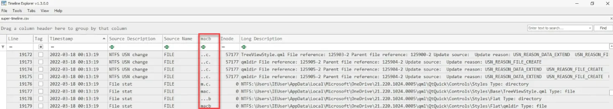

**$STANDARD_INFO**

**$STANDARD_INFO** ($SI) stores file metadata such as flags, the file SID, the file owner and a set of MAC(b) timestamps.

*$STANDARD_INFO is the timestamp collected by Windows explorer, fls, mactime, timestomp, find and the other utilities related to the display of timestamps.*

**$FILE_NAME**

The **$File_Name** attribute contains forensically interesting bits, such as **MACB** times, file name, file length and more.

*Timestamps are only updated when the attribute is changed.*

**What are the differences?**

- **$STANDARD_INFO** can be modified by user level processes like timestomp.
- **$FILE_NAME** can only be modified by the system kernel. (*There are no known anti-forensics utilities that can accomplish this.)*

The `$STANDARD_INFORMATION` and `$FILE_NAME` attributes in Windows file systems both store timestamps, but they serve different roles and can have discrepancies. The `$STANDARD_INFORMATION` attribute contains the primary timestamps for a file, including creation, modification, MFT modification, and access times, and these are updated frequently based on user or system actions. In contrast, the `$FILE_NAME` attribute also holds similar timestamps but can differ due to certain file operations, such as renaming or moving files, which may update the `$FILE_NAME` timestamps without altering the `$STANDARD_INFORMATION` ones. These differences are significant in forensic analysis, as they can reveal actions like file movement or tampering, providing additional context or historical reference points for investigators.
**We will focus only on the $STANDARD_INFO timestamps.**

The table below from a SANS poster shows how time stamps are created and modified when various functions are performed on the file.

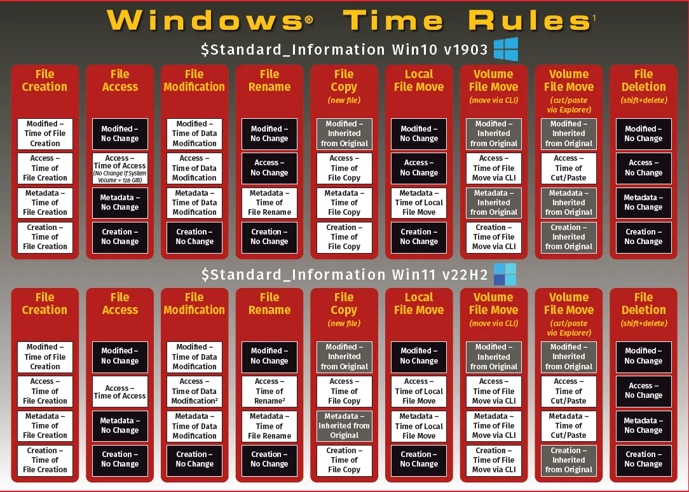

In conclusion, NTFS timestamps are a cornerstone of digital forensics, providing detailed insights into file and directory activities on Windows systems. By mastering the analysis of NTFS timestamps, you gain the ability to reconstruct events, detect anomalies, and build compelling timelines that support your investigations.

## **Case Study: Reconstructing User Actions on a Compromised System Using NTFS Timestamps**

**Scenario Overview**

A large financial institution detected unusual activity on a key executive’s laptop, leading to the unauthorized transfer of sensitive financial documents to an external server. The initial investigation revealed that a malicious insider or an external attacker might have gained access to the system. The forensic team was tasked with reconstructing the sequence of user actions to determine how the breach occurred, identify any unauthorized software used, and understand the full scope of the compromise.

**Initial Forensic Findings**

1. **Suspicious Network Activity**: Network logs indicated repeated connections from the executive’s laptop to an external IP address linked to a known data exfiltration domain. The connections occurred during non-business hours, suggesting automated or remote access.
2. **Evidence of Unauthorized Access**: Windows event logs showed multiple logins using the executive’s credentials during odd hours, which were inconsistent with the executive’s normal work patterns.
3. **Detection of Suspicious Files**: Preliminary scans detected traces of a deleted executable in the system’s temporary directories, but it was unclear when this software was introduced or executed.

**Role of NTFS Timestamps**

To accurately piece together the sequence of events, forensic analysts focused on NTFS timestamps, which provided a detailed timeline of file activities. The timestamps were crucial in identifying when unauthorized software was installed, accessed, and executed on the compromised system.

**Analysis of NTFS Timestamps**

1. **Extraction and Examination**: Using FTK Imager and MFTECmd, analysts extracted NTFS timestamps from the Master File Table (MFT) entries on the compromised laptop. They focused on Modified, Accessed, Created, and Entry Modified (MACB) timestamps of key files, including executables, system logs, and sensitive documents.
2. **Identifying Unauthorized Software Use**: The analysis revealed a suspicious executable named data_transfer.exe located in a hidden directory (C:\Users\Public\Downloads\System\). The MACB timestamps showed that the executable was created late at night, which coincided with the first instance of the suspicious network activity. The Modified timestamp indicated the executable had been run multiple times, aligning with the ongoing data transfers identified in the network logs.
3. **Timeline Reconstruction**: By examining the NTFS timestamps, analysts reconstructed a detailed timeline showing the sequence of actions taken on the system:
    - **Creation (C)**: The data_transfer.exe file was created on the system at 11:45 PM, just after the first unauthorized login.
    - **Modified (M)**: The file was modified several times over the next few days, indicating repeated execution.
    - **Accessed (A)**: The accessed timestamp showed that the file was last accessed minutes before the final data transfer, suggesting that it was actively used for exfiltration.
    - **Entry Modified (B)**: The metadata timestamp showed changes consistent with attempts to alter the file’s properties, possibly to obscure its true purpose or origin.
4. **Detecting Tampering and Persistence**: Analysts noticed discrepancies between the Created and Modified timestamps on certain system files, indicating potential timestamp manipulation by the attacker to hide traces of software installation. Additionally, NTFS timestamps revealed that related files in the same directory were accessed repeatedly, suggesting the presence of a persistence mechanism that was triggered automatically.

**Corroborating Evidence**

1. **Cross-Referencing with Event Logs**: The timeline derived from NTFS timestamps was cross-referenced with Windows event logs, confirming that the unauthorized logins occurred shortly before the creation and modification times of the data_transfer.exe file. This correlation supported the hypothesis that the attacker used the compromised credentials to deploy and execute the unauthorized software.
2. **Alignment with Network Logs and File Access Data**: The timestamps from the MFT entries aligned with network logs, which showed data being sent to the external server at times matching the Modified timestamps of the unauthorized executable. File access logs also confirmed that sensitive documents were accessed around the same time, reinforcing the evidence of data exfiltration.
3. **Supporting Evidence from Prefetch Files and Registry Entries**: Prefetch files on the system confirmed that data_transfer.exe was executed multiple times, while related Registry entries indicated that the executable was configured to run on system startup, providing persistence across reboots. This combination of evidence further corroborated the findings from the NTFS timestamps, creating a comprehensive picture of the attack.

**Conclusion**

The analysis of NTFS timestamps was pivotal in reconstructing the sequence of actions on the compromised system. By examining MACB timestamps, investigators identified when unauthorized software was introduced, how it was used for data exfiltration, and how the attacker attempted to cover their tracks through timestamp manipulation.

The detailed timeline constructed from NTFS timestamps, corroborated by event logs, network activity, Prefetch data, and Registry entries, allowed the forensic team to establish a clear narrative of the breach. The timestamps not only highlighted the attacker’s use of unauthorized software but also helped pinpoint critical moments in the attack, providing invaluable insights for remediation and strengthening the institution’s defenses against future incidents.

This case underscores the importance of NTFS timestamps in digital forensics, demonstrating their power in uncovering hidden activities, validating other forensic findings, and constructing accurate timelines of user actions on compromised systems.

# **$MFT**

The Master File Table (MFT) is a crucial component of the NTFS (New Technology File System) used by Windows operating systems. It serves as a database that stores information about all files and directories on an NTFS volume.

Here's a breakdown of its key features:

1. **Metadata Storage**: The MFT stores metadata about each file and directory on the NTFS volume, including attributes such as file name, size, timestamps (creation, modification, access), permissions, and data content.
2. **Indexing**: The MFT contains an index that enables fast access to file and directory entries. This index speeds up file access and directory listing operations.
3. **Resilience**: The MFT is a critical part of the file system, and its integrity is essential for the proper functioning of NTFS. NTFS uses redundancy and journaling mechanisms to protect the MFT from corruption.
4. **Allocation**: The MFT itself is a file stored on the NTFS volume. As files are created and deleted, space within the MFT is allocated and deallocated dynamically to accommodate changes in the file system.
5. **MFT Zone**: NTFS reserves a portion of the disk specifically for storing the MFT, known as the MFT zone. Placing the MFT in a reserved area helps reduce fragmentation and improves performance by ensuring that the MFT is contiguous and easily accessible.
6. **Alternate Data Streams**: The MFT supports alternate data streams, which allow additional data to be associated with a file beyond its main content. This feature enables NTFS to store metadata, thumbnails, and other related information alongside the primary file data.

In summary, the Master File Table is a central component of the NTFS file system, responsible for managing metadata about files and directories, providing fast access to file information, and ensuring the integrity and performance of the file system.

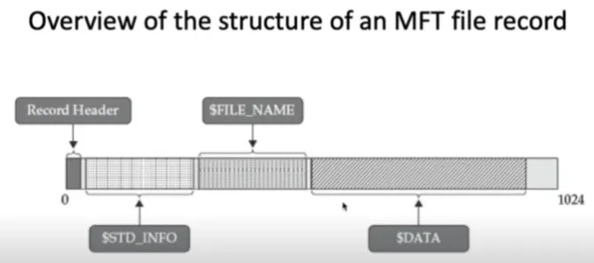

The tool **MFTECmd** (by Eric Zimmerman) parses the NTFS central database, the $MFT
(Master File Table) The MFT is typically parsed into a CSV that is then loaded into another
tool, such as Excel or **Timeline Explorer.** The Timeline Explorer tool (by Eric Zimmerman) displays timeline CSV files in a more convenient format than Excel (and many other tools).

1. Open a command prompt and navigate to the C:\Users\Elliot\Desktop\EZTools folder 
2. Use the command below to create a CSV of the $MFT.

```powershell
MFTECmd.exe -f C:\Users\Elliot\Desktop\Kape_Out\C\$MFT --csv C:\Users\Elliot\Desktop\Case_Files\File_System --csvf MFT.csv
```

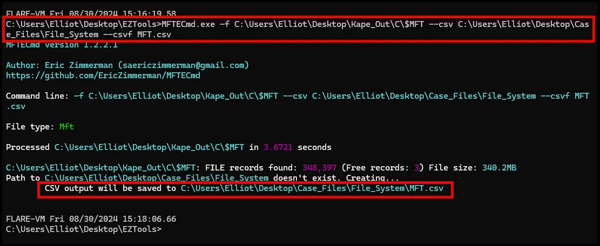

Here's a breakdown of the command:

- **`MFTECmd.exe`**: This is the executable file being run, a command-line tool used for parsing and analyzing Master File Table (MFT) data.
- **`f C:\Users\m122\Desktop\Kape_out\C\$MFT`**: This flag (**`f`**) indicates the input file or directory being processed. In this case, it specifies the path to the Master File Table file (**`$MFT`**) located at **`C:\Users\m122\Desktop\Kape_out\C\$MFT`**.
- **`-csv C:\Users\m122\Desktop\Case_Files\File_System`**: This flag (**`-csv`**) specifies the output format of the analysis results. Here, it indicates that the output should be generated in CSV (Comma-Separated Values) format, and the results will be saved to the directory specified (**`C:\Users\m122\Desktop\Case_Files\File_System`**).
- **`-csvf MFT.csv`**: This flag (**`-csvf`**) specifies the filename for the CSV output. In this case, it indicates that the output CSV file will be named **`MFT.csv`**.

So, overall, this command is extracting data from the MFT of an NTFS file system and saving it as a CSV file for further analysis or processing.

**Use Timeline Explorer (Zimmerman Tool) to open the MFT csv.**

Navigate to the C:\Users\Elliot\Desktop\EZTools\TimelineExplorer directory and double click Timeline Explorer.

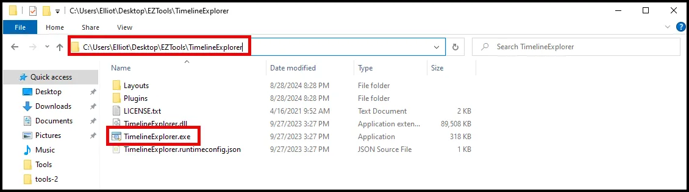

Once in Timeline Explorer open the MFT.csv file with Timeline Explorer.

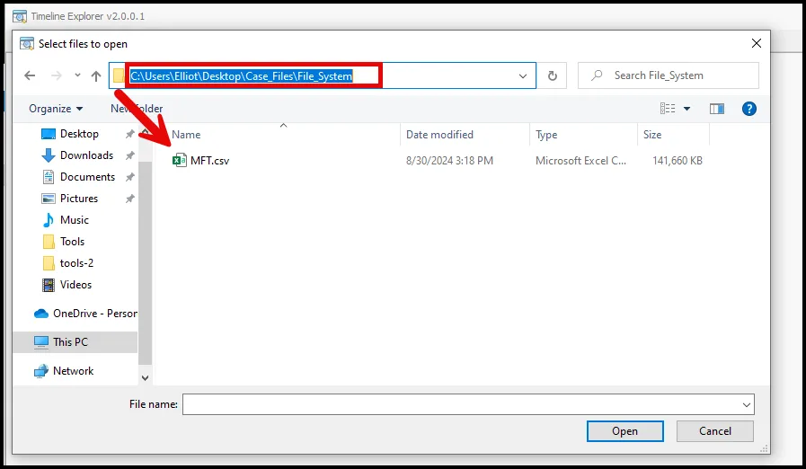

Once the file is loaded use the “Find” function to search for the attack script in the MFT. Search for ART-attack.

```powershell
ART-attack.ps1
```

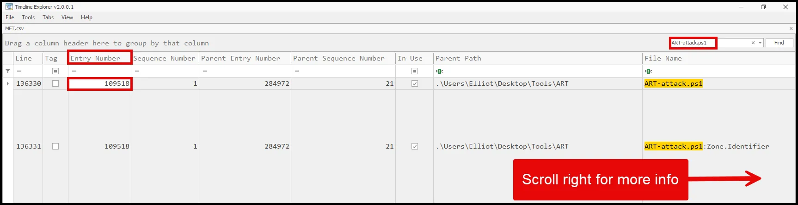

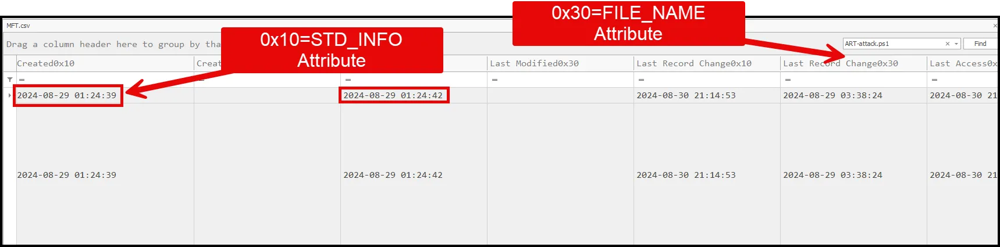

To record the details of the attack script entry in the MFT it is easiest to use the command line version (MFTECmd) and search using the entry number (identified in previously).

```powershell
MFTECmd.exe -f C:\Users\Elliot\Desktop\Kape_Out\C\$MFT --de 109518
```

Here's a breakdown of the command:

- **`MFTECmd.exe`**: This is the executable file for the MFTECmd tool, which is used to analyze and extract data from NTFS file systems.
- **`f C:\Users\m122\Desktop\Kape_out\$MFT`**: This specifies the input file or device. In this case, it's the MFT of an NTFS file system located at **`C:\Users\m122\Desktop\Kape_out\$MFT`**.
- **`-de 217964`**: This option specifies the specific MFT entry to extract. In this case, it's extracting the entry with the index number 217946.

So, overall, this command is extracting a specific entry from the MFT of an NTFS file system based on its index number.

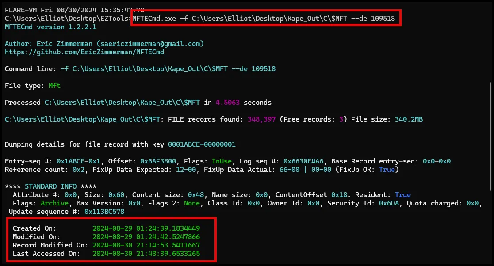

## **Case Study: Reconstructing User Actions on a Compromised System Using MFT Entries**

**Scenario Overview**

A cybersecurity firm was hired to investigate a data breach at a manufacturing company where critical design files were stolen and sold to a competitor. The breach was suspected to have originated from a compromised engineer’s workstation. The forensic team’s task was to reconstruct the sequence of user actions, identify how the breach occurred, determine what unauthorized software was used, and understand how the attacker maintained access to the system.

**Initial Forensic Findings**

1. **Unusual Network Traffic**: Network logs showed large data transfers from the engineer’s workstation to an external IP address associated with a cloud storage service, which was not used by the company.
2. **Suspicious Login Activity**: System event logs indicated multiple logins with the engineer’s credentials during non-working hours, suggesting possible credential theft or misuse.
3. **Malware Alerts**: Antivirus logs showed repeated alerts for a known data exfiltration tool, but the tool had been quarantined multiple times and appeared to re-emerge, suggesting persistence mechanisms that were not fully understood.

**Role of MFT Entries**

To accurately reconstruct the timeline and identify unauthorized software use, forensic analysts focused on the Master File Table (MFT) entries from the NTFS file system. MFT entries provided detailed information about file creation, modification, access, and deletion, which were crucial for piecing together the sequence of actions on the compromised system.

**Analysis of MFT Entries**

1. **Extraction and Examination**: Using MFTECmd and other forensic tools like Autopsy, analysts extracted MFT entries from the compromised workstation. The MFT, a critical component of the NTFS file system, contained records for every file and directory on the system, including their MACB (Modified, Accessed, Created, and Entry Modified) timestamps.
2. **Identifying Unauthorized Software**: The analysis revealed a hidden executable named stealth_transfer.exe located in an obscure folder (C:\Windows\Temp\System\). The MFT entries for this executable showed that it was created shortly after the first unauthorized login, with Created (C) timestamps aligning with the timing of the suspicious logins noted in the event logs.
    - **Modified (M) Timestamps**: These indicated that the executable was modified several times during the period of the data exfiltration, suggesting it was actively used or reconfigured.
    - **Accessed (A) Timestamps**: These showed that the file was accessed repeatedly just before the large data transfers, correlating with the periods of unusual network activity.
    - **Entry Modified (B) Timestamps**: The metadata was altered around the times when the malware alerts occurred, indicating attempts by the attacker to alter or replace the executable after it was quarantined by antivirus software.
3. **Timeline Reconstruction**: By piecing together the MACB timestamps from the MFT entries, analysts established a detailed timeline:
    - The stealth_transfer.exe was created and executed shortly after the initial unauthorized access.
    - The file was accessed and modified multiple times, coinciding with network data transfers to the external cloud storage service.
    - The attacker’s modifications to the metadata indicated efforts to maintain the tool’s functionality even after being flagged by security software.
4. **Detection of Additional Malicious Activity**: Further MFT analysis uncovered another executable named keylogger.exe in the same hidden directory, with similar patterns of creation and access during off-hours. This tool was likely used to capture the engineer’s credentials, allowing the attacker to maintain access to the workstation and continue exfiltrating sensitive data.

**Corroborating Evidence**

1. **Cross-Referencing with System Event Logs**: The timeline derived from MFT entries was cross-referenced with system event logs, confirming the alignment between the creation and access of the unauthorized software and the times of the suspicious logins. This supported the theory that the attacker deployed and executed the tools immediately after gaining access.
2. **Alignment with Network and File System Activity**: The MFT data was also aligned with network logs showing data transfers to the unauthorized cloud storage, and file system logs indicated that the design files were accessed and copied shortly before the exfiltration times recorded by network monitoring tools.
3. **Supporting Evidence from Prefetch Files and Scheduled Tasks**: Prefetch files confirmed that both stealth_transfer.exe and keylogger.exe were executed multiple times, while scheduled tasks analysis revealed a task that was set up to run stealth_transfer.exe at regular intervals, providing persistence even after reboots. This persistence mechanism explained why the malware continued to reappear despite multiple removals by security software.

**Conclusion**

The analysis of MFT entries was pivotal in reconstructing the sequence of user actions on the compromised workstation. By examining the detailed timestamps in the MFT, investigators identified when unauthorized software was introduced, how it was used to exfiltrate data, and how the attacker maintained access through persistence mechanisms.

The MFT analysis, corroborated by system event logs, network activity, Prefetch data, and scheduled tasks, allowed the forensic team to establish a comprehensive narrative of the breach. This case highlights the importance of MFT entries in digital forensics, demonstrating how they can reveal hidden actions, validate other findings, and construct an accurate timeline of events on compromised systems. The detailed examination of MFT entries not only pinpointed the attacker’s actions but also provided critical insights into the tools and techniques used, guiding the company in strengthening its defenses against future incidents.

# USN Journal Analysis ($J)

While the MFT does track last access timestamps, as we noted, these may be disabled. The USN (Update Sequence Number) Journal provides data showing the operations performed on files.
• This provides more than a simple timestamp when the last operation of a given type (create, access, modify, change metadata) was performed.
– The USN Journal also captures significantly more operation types than just MACB.
– USN journal data may include references to operations on deleted files.

Some use cases for USN Journal analysis:
– Knowledge that a file existed on the system
– Knowledge of file deletion (and when)
– Identifying that **Prefetch files** have been deleted (and which ones)
– Seeing when a user has overwritten a file prior to deletion (often used
in secure delete and anti-forensics)
– Locating a staging directory where files were collected prior to being
archived, exfiltrated, and deleted
– Identifying when malware has marked files with the hidden or system
attribute to limit visibility in Explorer (and unfortunately, other tools)

The **MFTECmd** application from Eric Zimmerman used for MFT processing
also processes data from the USN journal
– The file name you need to acquire is $Extend\$UsnJrnl
– The data is in a special stream named $J
Point to the $J file with the -f parameter, just like when using the tool to parse an MFT.

```powershell
MFTECmd.exe -f C:\Users\Elliot\Desktop\Kape_Out\C\$Extend\$J  -m C:\Users\Elliot\Desktop\Kape_out\C\$MFT --csv C:\Users\Elliot\Desktop\Case_Files\File_System --csvf $J.csv
```

Here's a breakdown of the command:

- **`MFTECmd.exe`**: This is the executable file, a command-line tool specifically designed for processing MFT data.
- **`f C:\Users\m122\Desktop\Kape_out\C\$Extend\$J`**: This flag (**`f`**) indicates the input file or directory being processed. In this case, it specifies the path to a particular file or directory within the **`$Extend`** folder, which is often used for various metadata in NTFS file systems. **`$J`** refers to the journal file, which records changes to the file system.
- **`m C:\Users\m122\Desktop\Kape_out\C\$MFT`**: This flag (**`m`**) is used to specify an additional MFT file to be used in the analysis. Here, it points to the Master File Table (**`$MFT`**) located at **`C:\Users\m122\Desktop\Kape_out\C\$MFT`**.
- **`-csv C:\Users\m122\Desktop\Case_Files\File_System`**: This flag (**`-csv`**) indicates the desired output format, which is CSV (Comma-Separated Values) in this case. It specifies the directory where the CSV file will be saved, likely containing the results of the analysis.
- **`-csvf $J.csv`**: This flag (**`-csvf`**) specifies the filename for the CSV output. In this case, it's **`$J.csv`**, suggesting that the output CSV file will be named after the **`$J`** file being analyzed.

Overall, this command is analyzing the **`$J`** file, utilizing the MFT data from **`$MFT`**, and saving the analysis results in CSV format to a specified directory.

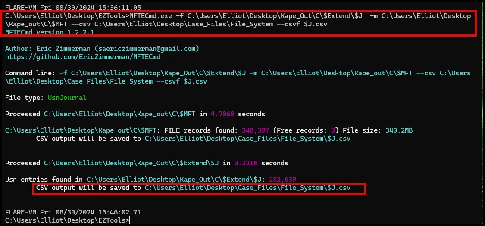

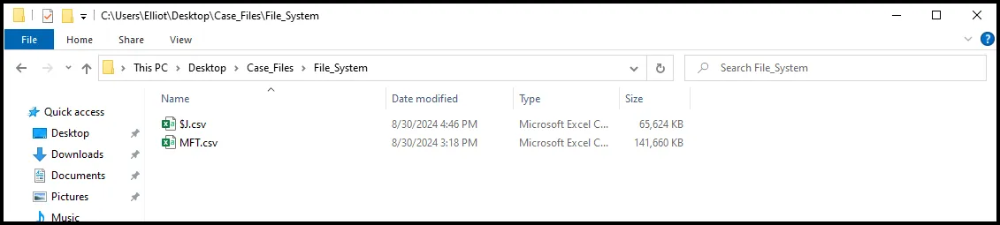

Open the $J CSV in Timeline Explorer and search for “deleteme_”

```powershell
deleteme_
```

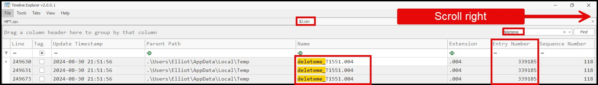

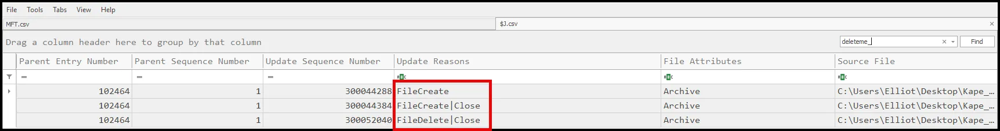

As seen above, the USN Journal records file create, file close, and file delete.  

We can pivot from the entry number (339185) to the $MFT to see if the file still exists in the $MFT.

```powershell
MFTECmd.exe -f C:\Users\Elliot\Desktop\Kape_Out\C\$MFT --de 339185
```

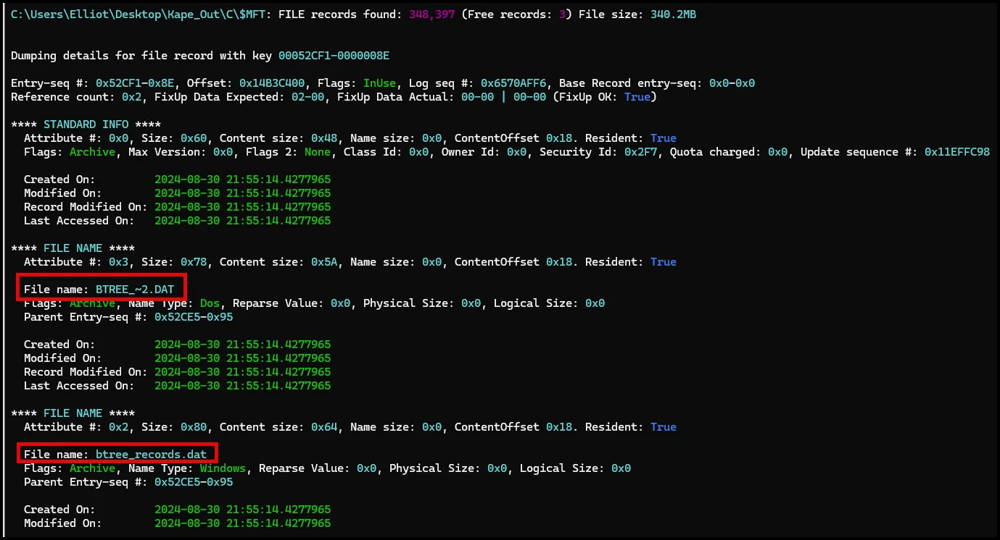

At first it appears that the file is still in the $MFT; however, closer examination shows us that the filenames are different. This means that the original file (deleteme_) has been overwritten and is likely not recoverable. 

The above search of the $MFT shows the value of $J. 

## **Case Study: Reconstructing User Actions on a Compromised System Using the $J Data Stream**

**Scenario Overview**

A healthcare organization experienced a data breach in which patient records were accessed and exfiltrated from a secure server. Initial investigations pointed to a compromised administrative account, but the exact method of access and the actions taken by the attacker remained unclear. The forensic team was tasked with reconstructing the sequence of user actions on the compromised system to determine how the breach occurred, identify unauthorized software used, and understand the attacker’s persistence mechanisms.

**Initial Forensic Findings**

1. **Suspicious Network Activity**: Network monitoring revealed large data transfers to an external IP address associated with a known malicious domain. The transfers occurred late at night, suggesting automated or remote operations.
2. **Anomalous Login Patterns**: Event logs showed multiple logins using the compromised account during off-hours, which were inconsistent with the normal working schedule of the legitimate user.
3. **Detection of Deleted Files**: Preliminary scans identified deleted executable files in the system’s temporary directories, but it was unclear how these files were used or when they were removed.

**Role of the $J Data Stream**

To piece together the attacker’s actions, forensic analysts examined the $J data stream, which is part of the USN (Update Sequence Number) Journal in NTFS. The $J data stream tracks changes to files and directories, including creation, modification, and deletion events. This data is invaluable for reconstructing activities on the file system, especially when direct evidence has been deleted.

**Analysis of the $J Data Stream**

1. **Extraction and Examination**: Using tools like UsnJrnl2csv and AnalyzeMFT, analysts extracted and parsed the $J data stream entries from the compromised server’s NTFS volume. The $J stream provided a chronological record of file system changes, including detailed information on files that were created, modified, or deleted.
2. **Identifying Unauthorized Software Use**: The $J data stream revealed the creation and execution of a suspicious executable named exfil_tool.exe located in C:\Temp\. The entries showed that this file was created shortly after an unauthorized login using the compromised account. Importantly, the $J stream recorded that the file was deleted a few hours later, but not before it had been executed multiple times.
    - **Creation and Deletion Timestamps**: The creation timestamp in the $J stream matched the initial unauthorized access, while the deletion timestamp aligned with the termination of the last suspicious network connection, suggesting that the tool was used for data exfiltration.
    - **Modification Entries**: Modification entries for exfil_tool.exe indicated that it was actively used during the time window when patient records were accessed and transferred. This aligned with the unusual network activity logs, providing a direct link between the unauthorized software and the data breach.
3. **Reconstructing the Sequence of Actions**: By examining the sequence of entries in the $J data stream, analysts reconstructed the timeline:
    - **Login and Deployment**: The attacker logged in using stolen credentials and immediately deployed exfil_tool.exe.
    - **Execution and Modification**: The tool was executed several times, modifying its settings or logs to evade detection, as evidenced by multiple modification entries in the $J stream.
    - **File Access and Exfiltration**: The attacker accessed and exfiltrated patient records using the tool, as confirmed by the timestamps in both the $J stream and the network logs.
    - **Cleanup Attempts**: The final action recorded in the $J data stream was the deletion of exfil_tool.exe, likely an attempt to cover the attacker’s tracks.
4. **Detection of Persistence Mechanisms**: Further analysis of the $J data stream revealed changes to the Registry associated with a new Run Key (HKCU\Software\Microsoft\Windows\CurrentVersion\Run) that pointed to another hidden executable, auto_start.exe. This executable was designed to re-establish the attacker’s access upon system reboot, indicating a persistence mechanism.

**Corroborating Evidence**

1. **Cross-Referencing with Event Logs**: The timeline from the $J data stream was cross-referenced with Windows event logs, which confirmed the unauthorized logins and subsequent file creation and deletion activities. This correlation provided strong evidence linking the attacker’s actions to the compromised account and the unauthorized software.
2. **Alignment with Network and File Access Logs**: Network logs showing data transfers to the malicious domain matched the periods when exfil_tool.exe was active, as indicated by the $J stream’s modification entries. File access logs further confirmed that patient records were accessed during the times exfil_tool.exe was running.
3. **Supporting Evidence from Prefetch Files and Scheduled Tasks**: Prefetch files on the system confirmed that both exfil_tool.exe and auto_start.exe were executed multiple times, supporting the findings from the $J data stream. Scheduled tasks analysis revealed a task linked to auto_start.exe, which was set to run automatically on system reboot, corroborating the persistence mechanism identified through the Registry changes recorded in the $J stream.

**Conclusion**

The analysis of the $J data stream was pivotal in reconstructing the sequence of actions on the compromised system. By examining the detailed records of file system changes, investigators identified when unauthorized software was introduced, how it was used to exfiltrate data, and how the attacker attempted to cover their tracks through deletion.

The $J data stream analysis, corroborated by event logs, network activity, Prefetch data, and Registry changes, provided a comprehensive view of the breach. It allowed the forensic team to establish a detailed timeline of the attacker’s actions, linking the unauthorized software to the data exfiltration and revealing the persistence mechanisms used to maintain access. This case underscores the importance of the $J data stream in digital forensics, demonstrating how it can uncover hidden activities, validate other forensic findings, and construct an accurate narrative of events on compromised systems.