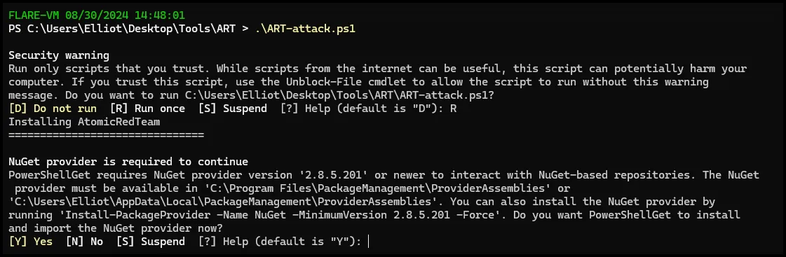
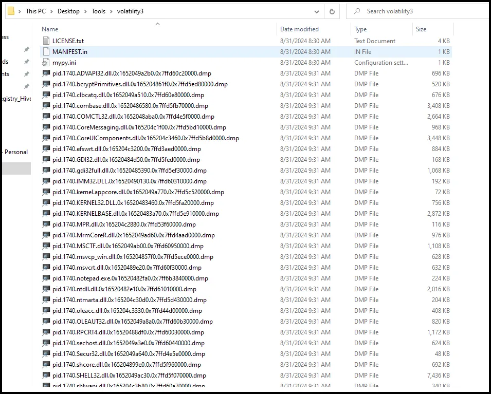
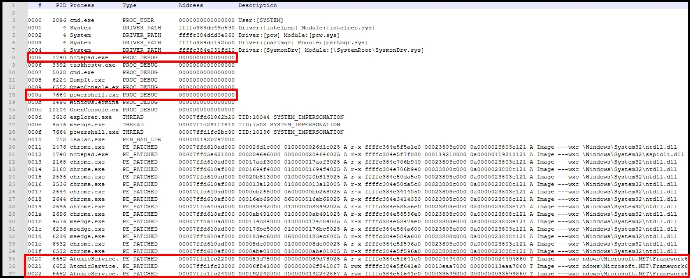

# Intro to Memory Analysis

## Summary:

In this lesson we will continue our endpoint forensic analysis of the events related to the attack script we ran at the beginning of the forensics section. We will be focused on memory analysis and introduce two tools, Volatility 3 and MemProcFS. 

## Objectives:

1) Introduce the techniques and complexities associated with extracting digital artifacts from volatile memory samples.

2) Gain familiarization with Volatility 3 and MemProcFS

3) Demonstrate the value of including memory analysis during forensic investigations. 

4) Complete the Memory Analysis CTF located at this TryHackME room: 

[](http://tryhackme.com/jr/memoryanalysisctf)

## Lab Setup:

Use the 4N6Lab VM to complete this exercise. 

**Attack Emulation**

Launch the Atomic Red Team PowerShell script on your Windows VM.

1. Open a PowerShell terminal as administrator and navigate to the ART folder located at C:\Users\Elliot\Desktop\Tools\ART.
2. Run the PowerShell script called ART-attack.ps1

 


Select “R” when prompted.


Select “Y”



Select OK on the pop up.


Once the emulation is completed the curser will return and you can close the notepad app that should have started.


**Attack Script Review**

As a reminder, the Atomic Red Team attack script was executed before the forensic collection was performed. The attack script performed the following functions.

1. **Check if ART (Atomic Red Team) framework is already installed**: Although the script doesn't explicitly check for the existence of the ART framework, it assumes it's not already installed and proceeds with the installation.
2. **Install Execution Framework and Atomics Folder**: It installs the ART framework using the **`install-atomicredteam.ps1`** script from the **`bluecapesecurity`** repository and the **`install-atomicsfolder.ps1`** script to download and configure the atomic tests.
3. **Start Atomic Red Team Attack Simulation**: Once the ART framework is installed, the script starts an attack simulation by invoking various atomic tests. These tests simulate different stages of a cyber attack, including initial access, execution, persistence, and defense evasion. The script then pauses briefly using **`Start-Sleep`** before each test to simulate realistic attack timings.

Here's a list of some of the specific atomic tests being invoked in the script, along with their descriptions:

- **Initial Access**:
    - **T1566.001 Atomic Test #1 - Download Macro-Enabled Phishing Attachment**: Simulates downloading a malicious macro-enabled document as part of a phishing attack.
- **Execution**:
    - **T1059.001 Atomic Test #11 - PowerShell Fileless Script Execution**: Simulates executing a PowerShell script in a fileless manner, which is a common tactic used by attackers to evade detection.
- **Persistence**:
    - **T1547.001 Atomic Test #1 - Reg Key Run**: Tests adding a registry key to the system to achieve persistence.
    - **T1547.001 Atomic Test #6 - Suspicious bat file run from startup Folder**: Simulates running a suspicious batch file from the startup folder for persistence.
- **Defense Evasion**:
    - **T1055.001 Atomic Test #1 - Process Injection via mavinject.exe**: Simulates process injection using the **`mavinject.exe`** utility.
    - **T1070.004 Atomic Test #6 - Delete a single file - Windows PowerShell**: Simulates an attacker using PowerShell to delete a file, which could be used to evade detection or disrupt operations.

Each of these Atomic Red Team tests is designed to mimic a specific tactic or technique used by real attackers, allowing organizations to assess their ability to detect and respond to such threats.

**Memory Capture**

Open a command prompt as Administrator and navigate to C:\Users\Elliot\Desktop\Tools.

Use the command below to capture the memory with Dumpit and save it to the \Users\Elliot\Desktop\Case_Files\Memory\ directory. 

```go
DumpIt.exe /OUTPUT \Users\Elliot\Desktop\Case_Files\Memory\Elliot.raw
```

Select “y” when prompted.


## **Sources of Memory**

**RAM**

RAM is volatile memory, meaning it requires power to maintain the stored information. When the computer is turned off, the data in RAM is lost. RAM is used by computers to temporarily store data that is actively being used or processed. This includes the operating system, applications, and data being worked on. 

**hiberfil.sys**

**`hiberfil.sys`** is a system file used by Windows to store the contents of the system's memory (RAM) when the computer hibernates. Hibernation is a power-saving state that allows the computer to resume quickly from where it left off, as opposed to a full shutdown and boot-up process.

When you hibernate your computer, Windows saves the current state of your system, including open programs and files, to the **`hiberfil.sys`** file on your system drive (usually C:). This file is hidden and is typically large, roughly equal to the amount of installed RAM on your computer. It allows Windows to restore your system to its pre-hibernation state when you turn on your computer again.

**pagefile.sys**

**`pagefile.sys`** is a system file in Windows that serves as a paging file, also known as a "swap file" or "virtual memory file." It is used to supplement the physical RAM in your computer by providing additional storage space for data that doesn't fit into the RAM.

When your computer runs out of physical RAM, Windows moves some data from the RAM to the **`pagefile.sys`** file on your hard drive or SSD. This process, called "paging" or "swapping," allows your computer to continue running without crashing or slowing down excessively due to insufficient memory.

The **`pagefile.sys`** file is located in the root directory of the drive where Windows is installed (usually C:). Its size is dynamically managed by Windows, but you can manually configure its size in the System Properties settings.

**swapfile.sys**

**`swapfile.sys`** is similar to **`pagefile.sys`** in that it serves as a swap file or virtual memory file in Windows. However, **`swapfile.sys`** is used specifically in Windows 10 versions 1903 and later, and Windows 11, as part of the new "compressed memory" feature.

When your system is under memory pressure and needs to free up physical RAM, Windows can compress some of the least recently used pages in memory and store them in the **`swapfile.sys`** file. This allows the system to reclaim memory more efficiently compared to traditional paging methods.

The **`swapfile.sys`** file is located in the root directory of the drive where Windows is installed (usually C:). Its size is dynamically managed by Windows and can vary based on system usage.

## Volatility

Volatility is a free memory forensics tool developed and maintained by Volatility Foundation, commonly used by malware and SOC analysts within a blue team or as part of their detection and monitoring solutions. Volatility is written in Python and is made up of python plugins and modules designed as a plug-and-play way of analyzing memory dumps. There is a list of the Windows Volatility plugins at the bottom of this document.

Volatility was the “go to” memory analysis tool for most forensic analysts since 2007; however, we will discuss another alternative (MemProcFS) in the next section.

**Info Plugin**

The **`windows.info`** plugin in Volatility is used to gather general information about the Windows operating system from memory. It provides a summary of various aspects of the Windows system, including the operating system version, architecture, install date, and various other system details. 
Navigate to the C:\Users\Elliot\Desktop\Tools\volatility3 directory.

```powershell
 python vol.py -f \Users\Elliot\Desktop\Case_Files\Memory\Elliot.raw [windows.info](http://windows.info/) >\users\Elliot\Desktop\Case_Files\Memory\systeminfo.txt
```


### Process Analysis

**pstree plugin**

The **`pstree`** plugin in Volatility is used to display the process tree (or process hierarchy) of a Windows system based on information extracted from memory. It visualizes the relationships between processes, showing parent-child relationships and the overall structure of process creation. 

```powershell
python vol.py -f \Users\Elliot\Desktop\Case_Files\Memory\Elliot.raw windows.pstree > \users\Elliot\Desktop\Case_Files\Memory\pstree.txt
```


Pivot from AtomicService using PID 6652.

**pslist plugin**

The **`pslist`** plugin in Volatility is used to list all running processes on a system based on information extracted from memory. It provides a detailed overview of each process, including its PID (Process ID), PPID (Parent Process ID), name, creation time, and other attributes.

```powershell
python vol.py -f \Users\Elliot\Desktop\Case_Files\Memory\Elliot.raw windows.pslist --pid 6652 > \users\Elliot\Desktop\Case_Files\Memory\pid6652.txt
```


Pivot to PPID 688.

```powershell
python vol.py -f \Users\Elliot\Desktop\Case_Files\Memory\Elliot.raw windows.pslist --pid 688 > \users\Elliot\Desktop\Case_Files\Memory\pid688.txt
```


### **Dumping a process**

Dump the AtomicServices process using the command below.

```powershell
python vol.py -f \Users\Elliot\Desktop\Case_Files\Memory\Elliot.raw windows.pslist --pid 6652 --dump
```


We can then conduct malware analysis on the file.

### Analyze Injected Files

**dlllist plugin**

The **`dlllist`** plugin in Volatility is used to list the loaded DLLs (Dynamic Link Libraries) for a given process based on information extracted from memory. It provides a detailed overview of each DLL loaded into a process's address space, including the base address, size, path, and other attributes. We can run the command below for notepad.exe PID of 1740.

```powershell
python vol.py -f \Users\Elliot\Desktop\Case_Files\Memory\Elliot.raw windows.dlllist --pid 1740 > \Users\Elliot\Desktop\Case_Files\Memory\dlllist_pid1740(notepad).txt
```


Dump notepad dlls

```go
python vol.py -f \Users\Elliot\Desktop\Case_Files\Memory\Elliot.raw windows.dlllist --pid 1740 --dump
```




**MalFind**

The **`malfind`** module in Volatility is used for finding hidden and injected code in processes. It works by scanning the memory of a process for characteristics that suggest the presence of malicious code. 

```powershell
python vol.py -f \Users\Elliot\Desktop\Case_Files\Memory\Elliot.raw windows.malfind > \Users\Elliot\Desktop\Case_Files\Memory\malfind.txt

```


**Get SIDs**

**getsid**

The ‘getsid’ plugin in Volatility is used to display the security identifiers (SIDs) associated with each process based on information extracted from memory. SIDs are unique identifiers used by Windows to represent security principals such as users, groups, and computers. We can search by PIDs of PowerShell, notepad.exe, and AtomicService

```go
python vol.py -f \Users\Elliot\Desktop\Case_Files\Memory\Elliot.raw windows.getsid --pid 6652 7664 1740 >\Users\Elliot\Desktop\Case_Files\Memory\pid_6652_7664_1740.txt
```


**Registry Keys**

**printkey plugin**

The **`registry.printkey`** plugin in Volatility is used to display the contents of a registry key from a memory dump of a Windows system. It allows you to examine the values and subkeys stored within a specific registry key, providing insights into the configuration and state of the Windows system. 

```go
 python vol.py -f \Users\Elliot\Desktop\Case_Files\Memory\Elliot.raw windows.registry.printkey --key AtomicRedTeam >\Users\Elliot\Desktop\Case_Files\Memory\reg_AtomicRedTeam.txt

```


## MemProcFS

MemProcFS was released in 2022 and is a “game changer” in the way memory analysis is done in support of IR. MemProcFS is a virtual file system that allows you to access the memory of running processes as if it were a file system. It presents a file-based interface to the memory of each process, enabling you to read and write memory regions, view process memory maps, and interact with the memory of running processes using standard file operations.

MemProcFS can be useful for various purposes, including debugging, forensics, and analysis of running processes. By providing a file-based interface to process memory, MemProcFS simplifies the task of accessing and analyzing process memory, making it more accessible to users familiar with file systems and file-based tools.

The forensic module in MemProcFS enhances the capabilities of the virtual file system by providing tools and features specifically designed for forensic analysis of process memory. Open a command prompt as Administrator and navigate to the C:\Users\Elliot\Desktop\Tools\MemProcFS_files_and_binaries directory and run the command below.

```powershell
MemProcFS.exe -device \Users\Elliot\Desktop\Case_Files\Memory\Elliot.raw -forensic 1
```


As seen below, it is mounted as if it were another drive.


When it is opened it is clear to see the file structure, as seen below.


The specific details are located in text files within the folder structure. As seen below, going to the \Sys\Proc\ folder and opening the text file is the same as running the Volatility pstree plugin. As seen below, it identified the three suspicious processes we discovered earlier and provides a timestamp.


Going to the \sys\net\ directory and opening the netstat.txt file produces the same results as running netstat. 


Additionally, you can access changes to the Registry that are still in memory. As seen below, we can discover one of the persistence mechanisms the script created by placing an executable in the Run key.


The \forensic\findevil\ directory contains a text file that is the same as running the malfind volatility plugin. As seen below, we see the three suspicious processes. 



The \forensic\csv\ directory contains multiple csv files containing different elements of the memory. As seen below, it also includes several timelines. By filtering on scheduled tasks, we see the other persistence mechanism established by the attack script. We can see that calculator will open after each startup and logon.


We could spend hours going through all the information collected from memory with MemProcFS. It is much easier to examine the artifacts in a file format than running specific Volatility plugins.  

## Conclusion

Memory analysis is often overlooked during incident response in enterprised environments. However, tools such as EDR and other endpoint agents, such as Velociraptor, make memory capture easier to perform remotely. As demonstrated above there is a wealth of information that can be gleaned from memory analysis. Due to the volatile nature of RAM it should be captured first and as soon as possible after an incident. Additionally, hiberfil.sys and swapfile.sys provide opportunities to capture memory artifacts, even if the system has been shutdown and the RAM is no longer available. 

## Appendix 1 Volatility Windows Plugins

```
timeliner.Timeliner
                    Runs all relevant plugins that provide time related
                    information and orders the results by time.
windows.bigpools.BigPools
                    List big page pools.
windows.callbacks.Callbacks
                    Lists kernel callbacks and notification routines.
windows.cmdline.CmdLine
                    Lists process command line arguments.
windows.crashinfo.Crashinfo
windows.devicetree.DeviceTree
                    Listing tree based on drivers and attached devices in
                    a particular windows memory image.
windows.dlllist.DllList
                    Lists the loaded modules in a particular windows
                    memory image.
windows.driverirp.DriverIrp
                    List IRPs for drivers in a particular windows memory
                    image.
windows.driverscan.DriverScan
                    Scans for drivers present in a particular windows
                    memory image.
windows.dumpfiles.DumpFiles
                    Dumps cached file contents from Windows memory
                    samples.
windows.envars.Envars
                    Display process environment variables
windows.filescan.FileScan
                    Scans for file objects present in a particular windows
                    memory image.
windows.getservicesids.GetServiceSIDs
                    Lists process token sids.
windows.getsids.GetSIDs
                    Print the SIDs owning each process
windows.handles.Handles
                    Lists process open handles.
windows.info.Info   Show OS & kernel details of the memory sample being
                    analyzed.
windows.joblinks.JobLinks
                    Print process job link information
windows.ldrmodules.LdrModules
windows.malfind.Malfind
                    Lists process memory ranges that potentially contain
                    injected code.
windows.mbrscan.MBRScan
                    Scans for and parses potential Master Boot Records
                    (MBRs)
windows.memmap.Memmap
                    Prints the memory map
windows.mftscan.MFTScan
                    Scans for MFT FILE objects present in a particular
                    windows memory image.
windows.modscan.ModScan
                    Scans for modules present in a particular windows
                    memory image.
windows.modules.Modules
                    Lists the loaded kernel modules.
windows.mutantscan.MutantScan
                    Scans for mutexes present in a particular windows
                    memory image.
windows.netscan.NetScan
                    Scans for network objects present in a particular
                    windows memory image.
windows.netstat.NetStat
                    Traverses network tracking structures present in a
                    particular windows memory image.
windows.poolscanner.PoolScanner
                    A generic pool scanner plugin.
windows.privileges.Privs
                    Lists process token privileges
windows.pslist.PsList
                    Lists the processes present in a particular windows
                    memory image.
windows.psscan.PsScan
                    Scans for processes present in a particular windows
                    memory image.
windows.pstree.PsTree
                    Plugin for listing processes in a tree based on their
                    parent process ID.
windows.registry.certificates.Certificates
                    Lists the certificates in the registry's Certificate
                    Store.
windows.registry.hivelist.HiveList
                    Lists the registry hives present in a particular
                    memory image.
windows.registry.hivescan.HiveScan
                    Scans for registry hives present in a particular
                    windows memory image.
windows.registry.printkey.PrintKey
                    Lists the registry keys under a hive or specific key
                    value.
windows.registry.userassist.UserAssist
                    Print userassist registry keys and information.
windows.sessions.Sessions
                    lists Processes with Session information extracted
                    from Environmental Variables
windows.skeleton_key_check.Skeleton_Key_Check
                    Looks for signs of Skeleton Key malware
windows.ssdt.SSDT   Lists the system call table.
windows.statistics.Statistics
windows.strings.Strings
                    Reads output from the strings command and indicates
                    which process(es) each string belongs to.
windows.svcscan.SvcScan
                    Scans for windows services.
windows.symlinkscan.SymlinkScan
                    Scans for links present in a particular windows memory
                    image.
windows.vadinfo.VadInfo
                    Lists process memory ranges.
windows.vadyarascan.VadYaraScan
                    Scans all the Virtual Address Descriptor memory maps
                    using yara.
windows.verinfo.VerInfo
                    Lists version information from PE files.
windows.virtmap.VirtMap
                    Lists virtual mapped sections.
yarascan.YaraScan   Scans kernel memory using yara rules (string or file).

```

[]()