# Registry Analysis

The Registry is often referred to as the heart of the Windows OS because it stores configuration settings and options for the operating system, hardware, user preferences, and much more. For forensic investigators, the Registry is a treasure trove of information that can reveal user activity, system configurations, installed software, and traces of malware.

The Windows Registry is a hierarchical database that stores low-level settings for the Windows OS and installed applications. It functions as a centralized repository for system, application, and user settings, making it essential for both the normal operation of Windows and as a source of evidence in forensic investigations.

The Registry records a wide range of information, from details about user accounts, connected devices, recently accessed files, and network connections, to the presence of malicious software. It provides a detailed view of how a system has been used, which can be invaluable when reconstructing user actions or investigating suspicious activities.

Attackers frequently use the Registry to establish persistence on compromised systems. By modifying specific keys and values, they can ensure their malicious code runs automatically on startup or whenever a specific event occurs. Understanding the structure of the Registry and how to analyze it can help investigators identify these persistence mechanisms and mitigate potential threats.

The Registry is organized into hives, keys, and values, much like a file system. The main hives include:

- `HKEY_LOCAL_MACHINE (HKLM)`: Contains hardware and software settings that are common to all users.
- `HKEY_CURRENT_USER (HKCU)`: Stores settings specific to the currently logged-in user.
- `HKEY_CLASSES_ROOT (HKCR)`: Associates file types with the programs that open them.
- `HKEY_USERS (HKU)`: Contains settings for all user profiles on the system.
- `HKEY_CURRENT_CONFIG (HKCC)`: Stores hardware profile information.

Each hive contains keys and subkeys, which function like folders, and values, which are akin to files, holding specific configuration data.

One of the challenges in working with the Registry is its complexity and volatility. It’s a live database that changes frequently as the system operates, so capturing a reliable snapshot during an investigation is crucial. Moreover, some keys and values are dynamic and may not retain historical data, which can complicate the timeline reconstruction.

Another challenge is that attackers with sufficient knowledge can manipulate or delete Registry entries to hide their tracks. Therefore, it’s essential to use robust forensic methods and tools to identify tampering and recover deleted or hidden data whenever possible.

You can view these keys when you open the **`regedit.exe`** utility. 

In this prompt, type **`regedit.exe`**, and you will be greeted with the registry editor window. It will look something like this:

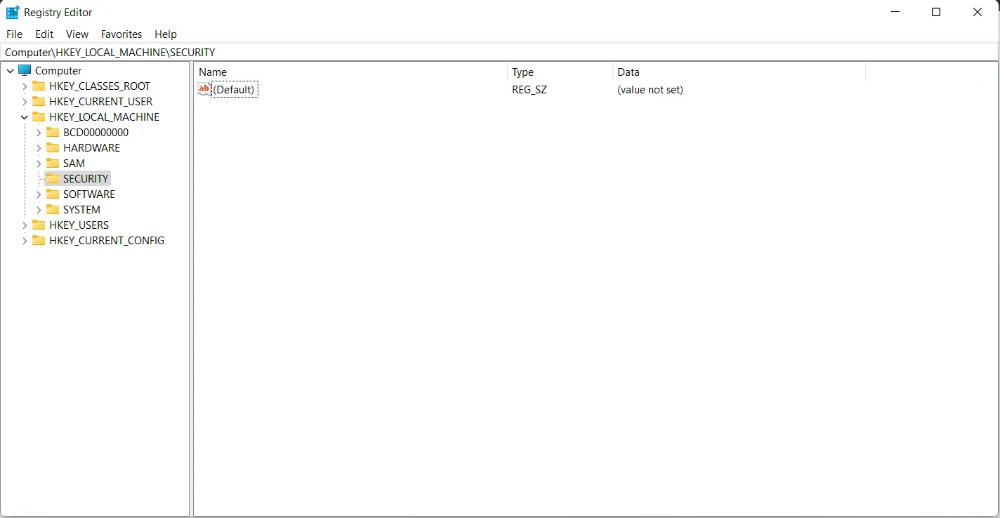

Here you can see the root keys in the left pane in a tree view that shows the included registry keys, and the values in the selected key are shown in the right pane. You can right-click on the value shown in the right pane and select properties to view the properties of this value.

Here is how Microsoft defines each of these root keys. For more detail and information about the following Windows registry keys, please visit [Microsoft's documentation](https://docs.microsoft.com/en-US/troubleshoot/windows-server/performance/windows-registry-advanced-users).

| **Folder/ predefined key** | **Description** |
| --- | --- |
| **HKEY_CURRENT_USER** | Contains the root of the configuration information for the user who is currently logged on. The user's folders, screen colors, and Control Panel settings are stored here. This information is associated with the user's profile. This key is sometimes abbreviated as HKCU. |
| **HKEY_USERS** | Contains all the actively loaded user profiles on the computer. HKEY_CURRENT_USER is a subkey of HKEY_USERS. HKEY_USERS is sometimes abbreviated as HKU. |
| **HKEY_LOCAL_MACHINE** | Contains configuration information particular to the computer (for any user). This key is sometimes abbreviated as HKLM. |
| **HKEY_CLASSES_ROOT** | Is a subkey of **`HKEY_LOCAL_MACHINE\Software`**. The information that is stored here makes sure that the correct program opens when you open a file by using Windows Explorer. This key is sometimes abbreviated as HKCR.
Starting with Windows 2000, this information is stored under both the HKEY_LOCAL_MACHINE and HKEY_CURRENT_USER keys. The **`HKEY_LOCAL_MACHINE\Software\Classes`** key contains default settings that can apply to all users on the local computer. The **`HKEY_CURRENT_USER\Software\Classes`** key has settings that override the default settings and apply only to the interactive user.
The HKEY_CLASSES_ROOT key provides a view of the registry that merges the information from these two sources. HKEY_CLASSES_ROOT also provides this merged view for programs that are designed for earlier versions of Windows. To change the settings for the interactive user, changes must be made under **`HKEY_CURRENT_USER\Software\Classes`** instead of under HKEY_CLASSES_ROOT.
To change the default settings, changes must be made under **`HKEY_LOCAL_MACHINE\Software\Classes`** .If you write keys to a key under HKEY_CLASSES_ROOT, the system stores the information under **`HKEY_LOCAL_MACHINE\Software\Classes`**.
If you write values to a key under HKEY_CLASSES_ROOT, and the key already exists under **`HKEY_CURRENT_USER\Software\Classes`**, the system will store the information there instead of under **`HKEY_LOCAL_MACHINE\Software\Classes`**. |
| **HKEY_CURRENT_CONFIG** | Contains information about the hardware profile that is used by the local computer at system startup. |

You would not normally conduct a forensic investigation using the built-in registry editor tool. 

Below are a the two main tools to parse and analyze Windows registry hives.

### Registry Explorer

Registry Explorer is a GUI based tool used to view the contents of offline Registry Hives. It can load
multiple hives at once, search across all loaded hives using strings or regular expressions, exporting
of data, and much more.

Registry Explorer fills the gaps in existing tools and expands the capabilities of Registry viewers in
many unique and powerful ways. It is GUI based and contains powerful searching, filtering, and
other visualization concepts that makes exploring Registry hives very easy while exposing all the
technical information contained in Registry hives

Registry analysis can provide multiple types of useful evidence for investigations, including:
– Malware persistence
– Evidence of file knowledge
– Mounted drives
– Services created
– Software installed (and often uninstalled)
– Files viewed in Explorer (USRCLASS.DAT)
– Evidence of execution
– etc…

Open Registry Explorer by going to the C:\Users\Elliot\Desktop\EZTools\RegistryExplorer directory.

 

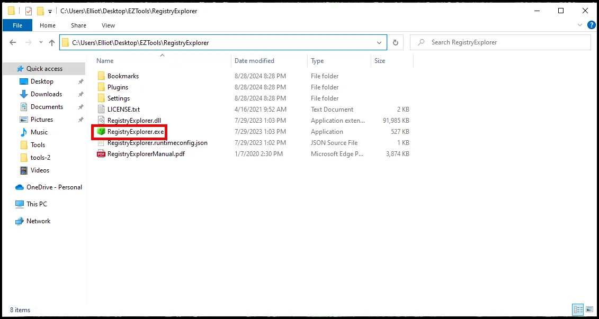

Process the SYSTEM, SECURITY, SOFTWARE, SAM, NTUser.dat, and UsrClass.dat registry hives with Registry Explorer. The registry hives can be found in the following paths:

**C:\Users\Elliot\Desktop\Kape_out\C\Windows\System32\config\SAM**

**C:\Users\Elliot\Desktop\Kape_out\C\Windows\System32\config\SECURITY**

**C:\Users\Elliot\Desktop\Kape_out\C\Windows\System32\config\SOFTWARE**

**C:\Users\Elliot\Desktop\Kape_out\C\Windows\System32\config\SYSTEM**

**C:\Users\Elliot\Desktop\Kape_out\C\Users\<Your User Name>\NTUser.dat**

**C:\Users\Elliot\AppData\Local\Microsoft\Windows\UsrClass.dat**

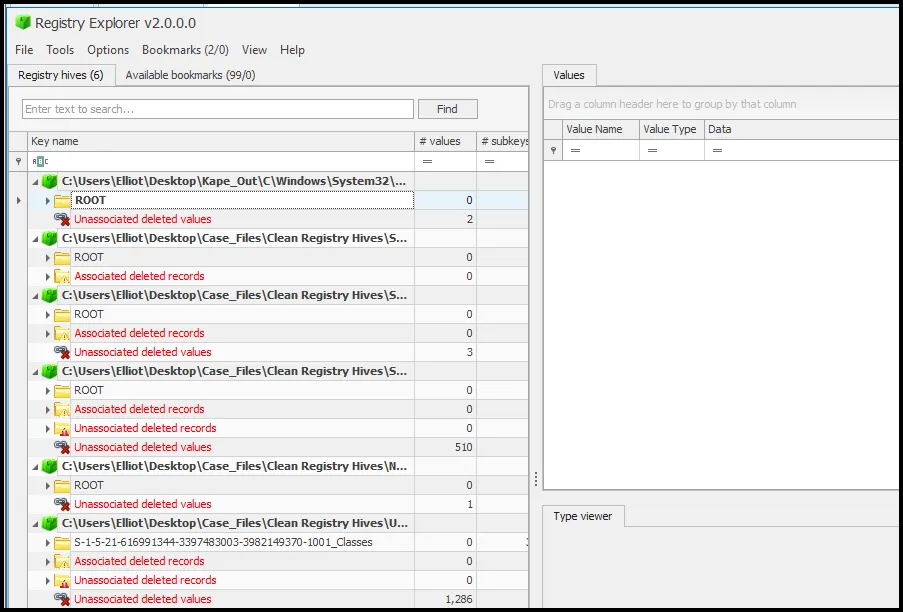

### RegRipper

From the directory where the clean registry hives are located run the following for loop.

```powershell
for /r %i in (*) do (C:\Users\Elliot\Desktop\Tools\RegRipper3.0-master\rip.exe -r %i -a > %i.txt)
```

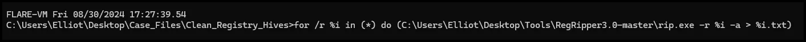

This command loops through all registry hives in the current directory and executes regripper on each of them.

Let's break it down:

- **`for /r %i in (*) do`**: This starts a loop where **`%i`** is a variable for each registry hive recursively (**`/r`**) in the current directory. The **`(*)`** specifies that we're considering all files and directories.
- **`(C:\Users\m122\Downloads\RegRipper3.0-master\rip.exe -r %i -a > %i.txt)`**: This is the command that will be executed for each file or directory **`%i`** found in the loop.
    - **`C:\Users\m122\Downloads\RegRipper3.0-master\rip.exe`**: This is the path to the **`rip.exe`** executable.
    - **`r %i`**: **`r`** is an option for **`rip.exe`** indicating that it should parse a registry hive file. **`%i`** is the file being processed in the loop.
    - **`a`**: **`a`** is another option for **`rip.exe`**, indicating that it should analyze the hive file more thoroughly.
    - **`> %i.txt`**: This redirects the output of the command (**`rip.exe`**) to a file named **`%i.txt`**, where **`%i`** is the name of the file being processed in the loop.

So, in summary, this command is running  RegRipper on each file found in the current directory and its subdirectories, parsing each file as a registry hive and saving the output to a text file with the same name as the original file but with a **`.txt`** extension.

To parse through regripper TXT files open all the files in Notepad++ and conduct a search all documents.

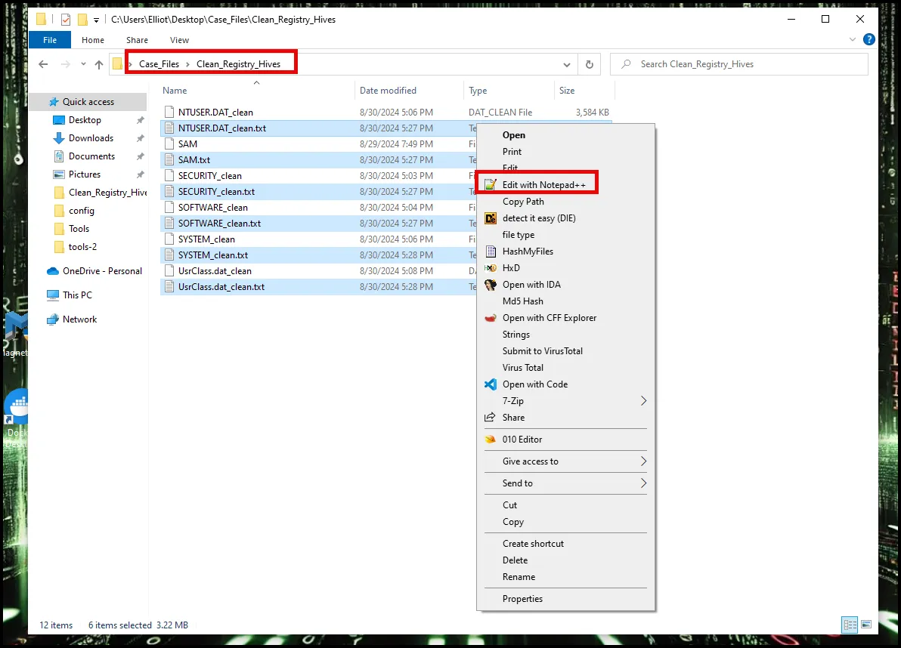

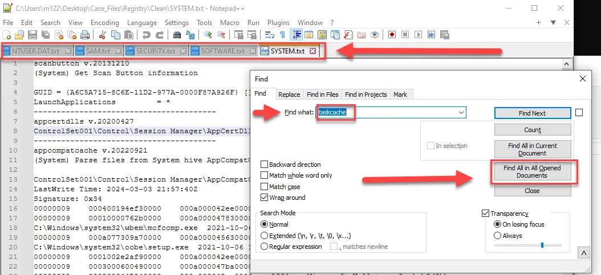

### RegRipper GUI Option

There is also a GUI option to use RegRipper to create the .txt files. The GUI tool will be downloaded when you download RegRipper from github. To open it, right click the file rr.exe as administrator. 

<aside>
💡

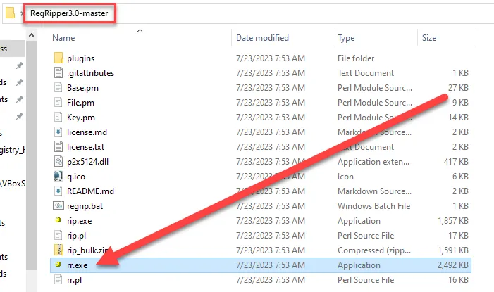

</aside>

Once it is open browse to where the clean registry hives were stored and select the hive you wish to rip to a .txt file.  Note that you can only process one registry hive at a time.

<aside>
💡

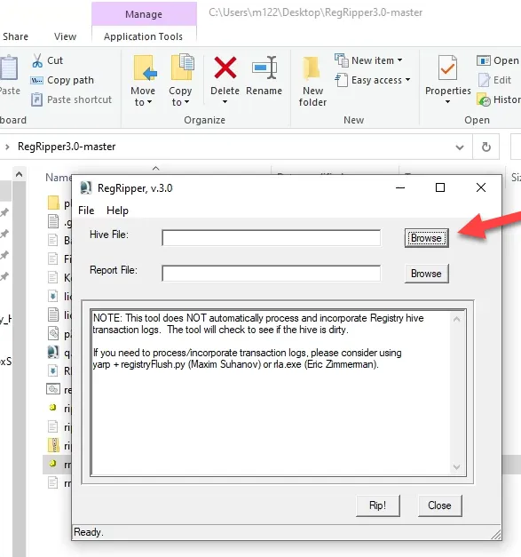

</aside>

<aside>
💡

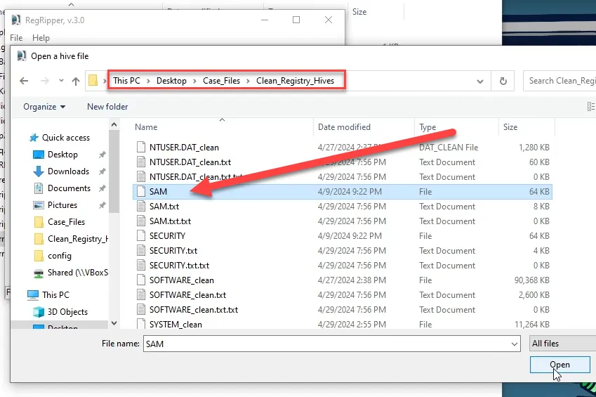

</aside>

Then select where you want to save the .txt file. 

<aside>
💡

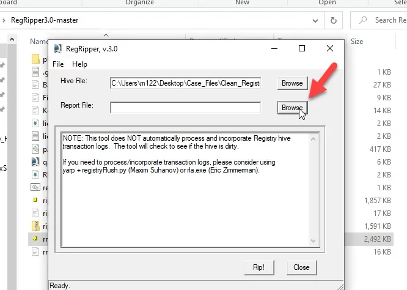

</aside>

<aside>
💡

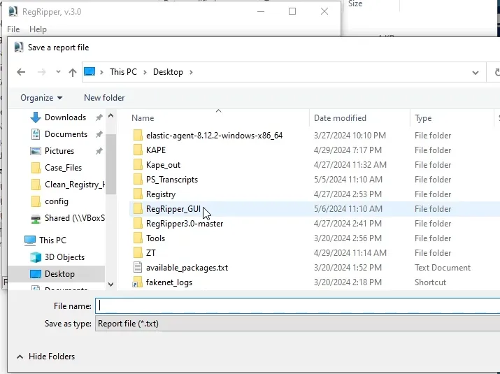

</aside>

Then select “Rip!”

<aside>
💡

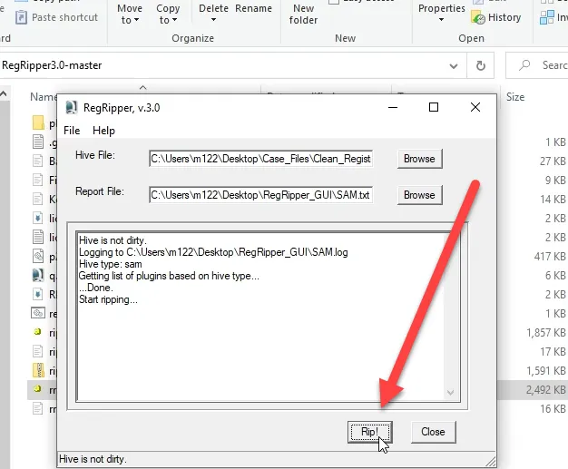

</aside>

The .txt file is created in the directory you chose. You can use the same techniques to parse through them as previously discussed using the command line version of regripper.

In conclusion, the Windows Registry is a critical artifact in digital forensics, providing detailed insights into system and user behavior, configuration changes, and potential security breaches. By mastering Registry analysis, you equip yourself with the skills to uncover hidden evidence, identify persistence mechanisms, and construct comprehensive narratives of what occurred on a compromised system. 

We will now explore key Registry Keys.