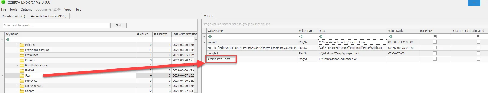
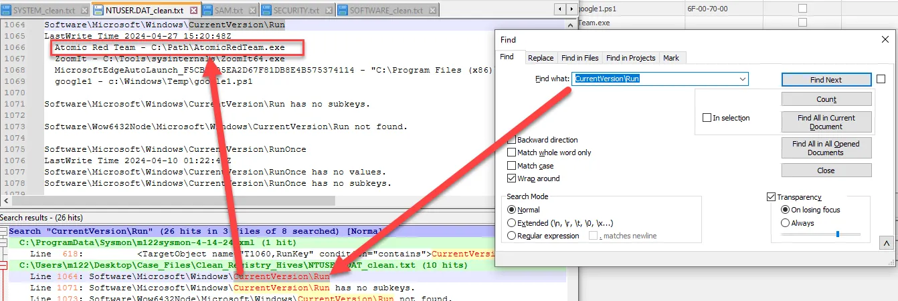

# Run Keys

Run Keys—an essential aspect of the Windows Registry that plays a significant role in system startup and user sessions. Run Keys are often used by legitimate software to launch necessary programs at startup, but they’re also a favorite tool for attackers to achieve persistence on compromised systems.

Run Keys are specific Registry entries that automatically execute programs when a user logs in or the system starts. They are found in various locations within the Registry and are crucial for controlling which applications run automatically on a system. Understanding Run Keys can help us detect unauthorized or malicious programs that are designed to start without the user’s knowledge.

Attackers commonly use Run Keys as a persistence mechanism to ensure that their malware or unauthorized applications run every time a system starts or a user logs in. This makes Run Keys a critical artifact to examine during forensic investigations.

By analyzing Run Keys, we can reconstruct user actions and determine which programs were set to run automatically, providing insights into both legitimate and potentially malicious activities on a system.

Run Keys are found in several locations within the Windows Registry, including:

- `HKEY_LOCAL_MACHINE\Software\Microsoft\Windows\CurrentVersion\Run` (for system-wide startup applications)
- `HKEY_CURRENT_USER\Software\Microsoft\Windows\CurrentVersion\Run` (for user-specific startup applications)

Each Run Key entry typically contains the name of the application, the command to execute it, and sometimes parameters for its execution. By reviewing these entries, we can determine what software is configured to start automatically on a system.

One challenge in analyzing Run Keys is distinguishing between legitimate entries and those set up by attackers. Many legitimate applications use Run Keys, so it’s important to carefully evaluate each entry in the context of the system’s normal operations and user behavior.

Attackers may also modify or delete Run Key entries to cover their tracks, or use techniques like registry redirection to hide malicious entries. This makes it essential to conduct a thorough and methodical analysis when investigating Run Keys.

***HKEY_CURRENT_USER\Software\Microsoft\Windows\CurrentVersion\Run HKEY_CURRENT_USER\Software\Microsoft\Windows\CurrentVersion\RunOnce HKEY_LOCAL_MACHINE\Software\Microsoft\Windows\CurrentVersion\Run HKEY_LOCAL_MACHINE\Software\Microsoft\Windows\CurrentVersion\RunOnce***

Using Registry Explorer we can navigate to the first Run key and we discover AtomicRedTeam.exe, which is what is being used as a persistence mechanism.

<aside>




</aside>

We can search the .txt files we created earlier with regripper and search for “CurrentVersion\Run” and find the same information.

```powershell
CurrentVersion\Run
```

<aside>
💡



</aside>

In conclusion, Run Keys are a powerful artifact in digital forensics, offering insights into which programs are set to run automatically on a Windows system. By mastering the analysis of Run Keys, you can uncover hidden persistence mechanisms, identify unauthorized applications, and better understand the sequence of events on a compromised system.