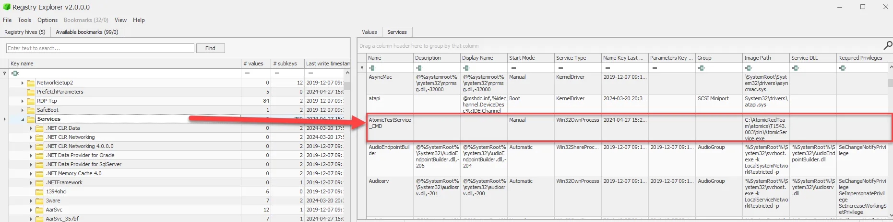
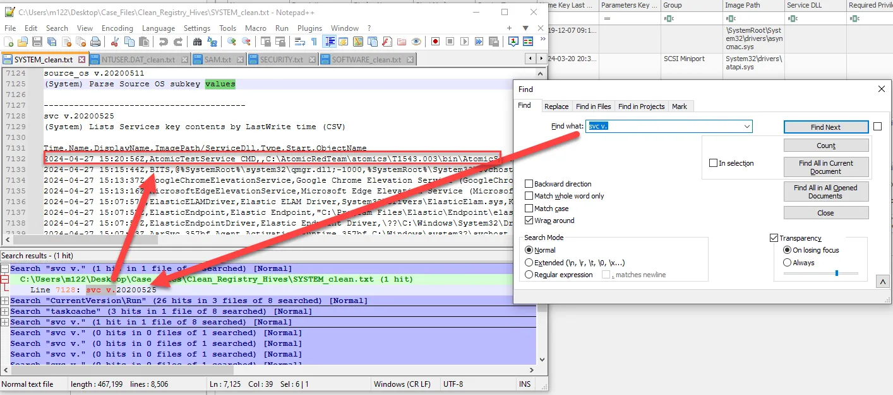

# Windows Services

Windows Services, an integral part of the Windows operating system that plays a crucial role in both legitimate system operations and malicious activities. Understanding Windows Services is vital for forensic investigators, as services can be manipulated to provide persistence, hide malicious operations, or execute unauthorized actions on a compromised system.

Windows Services are long-running executable applications that operate in the background and can start automatically at system boot, be paused, or be restarted. They are commonly used for essential system functions like networking, security, and application support. However, attackers can also misuse services to maintain persistence, run malicious code, or evade detection.

Windows Services are a popular persistence mechanism for attackers. By creating or modifying services, adversaries can ensure their malicious code runs every time the system starts or at specified intervals, making it a key artifact to examine during forensic investigations.

Malicious actors often use services to execute their payloads with higher privileges, allowing them to perform actions that regular user-level processes might not be able to achieve. Detecting rogue or modified services can therefore be a crucial step in identifying how an attack was carried out.

Windows Services information is stored in the Registry under the key:

- `HKEY_LOCAL_MACHINE\SYSTEM\CurrentControlSet\Services`

Each service entry contains important details such as the service name, display name, executable path, start type (automatic, manual, or disabled), and permissions. This information helps determine if a service is legitimate or potentially malicious.

One of the challenges in analyzing Windows Services is distinguishing between legitimate and malicious services. Attackers often disguise their services with names similar to legitimate Windows processes or use paths that look benign, requiring careful analysis and cross-referencing with known good baselines.

Another challenge is that services can be modified or deleted by attackers to hide their tracks. It’s important to capture system images and logs as soon as possible during an investigation to preserve this critical data.

<aside>
💡



</aside>

We can search the regripper txt files for “svc v.” to find a list of the services installed on the host and the timestamp.  

```powershell
svc v.
```

<aside>
💡



</aside>

In conclusion, Windows Services are a powerful artifact in digital forensics, offering insights into system operations and potential persistence mechanisms used by attackers. By mastering the analysis of Windows Services, you can uncover hidden threats, identify unauthorized activities, and better understand the scope of a compromise.

## **Case Study: Reconstructing User Actions on a Compromised System Using Run Keys**

**Scenario Overview**

A law firm experienced a data breach in which sensitive client information was leaked. The initial investigation suggested that a compromised workstation was used to exfiltrate data, but it was unclear how the attackers maintained persistence on the system. The forensic team was tasked with reconstructing the sequence of user actions to identify unauthorized software use, establish persistence mechanisms, and understand how the attackers maintained control over the compromised workstation.

**Initial Forensic Findings**

1. **Suspicious Network Activity**: Network logs showed frequent outbound connections from the compromised workstation to an external server associated with data leaks. The connections were intermittent but consistent, indicating some level of automated activity.
2. **System Alerts**: Antivirus logs recorded attempts to run a known malicious executable, which was subsequently quarantined. However, the malware seemed to reappear repeatedly, suggesting that the attacker had established persistence.
3. **Evidence of Credential Theft**: Windows event logs indicated the use of compromised credentials to access the workstation, correlating with the times of the suspicious network activity.

**Role of Run Keys**

To identify how the attackers maintained persistence and to uncover unauthorized software, the forensic analysts turned their attention to Run Keys in the Windows Registry. Run Keys were crucial in understanding how malicious programs were configured to start automatically and persist on the system despite removal attempts.

**Analysis of Run Keys Data**

1. **Extraction and Examination**: Using Autoruns and Registry Explorer, analysts extracted the Run Key entries from key locations in the Registry:
    - HKEY_LOCAL_MACHINE\Software\Microsoft\Windows\CurrentVersion\Run
    - HKEY_CURRENT_USER\Software\Microsoft\Windows\CurrentVersion\Run
2. **Identifying Unauthorized Entries**: The analysis revealed a suspicious entry named "Updater," which was configured to execute a hidden executable located in a seemingly benign directory (C:\Users\Public\Documents\Updater.exe). This executable was identified as the same malware flagged by the antivirus, set to run every time the user logged in, thus re-infecting the system after each removal attempt.
3. **Timeline Reconstruction**: By examining the creation and modification timestamps of the Run Key entries, investigators established that the "Updater" entry was created shortly after the first successful compromise of the user’s credentials. This timeline aligned with the first detected instance of the malware, suggesting that the Run Key was used to establish persistence almost immediately after the initial breach.
4. **Detection of Additional Malicious Run Keys**: Further analysis identified another Run Key entry named "SystemMonitor" linked to a keylogger executable. This program was designed to capture keystrokes and transmit them to the attacker’s server, explaining how credentials were continuously compromised and supporting the ongoing unauthorized access.

**Corroborating Evidence**

1. **Cross-Referencing with Event Logs**: The Run Key creation times were cross-referenced with Windows event logs, confirming that they were added during periods of unauthorized access. This correlation provided strong evidence that the Run Keys were established by the attacker to maintain persistence on the system.
2. **Alignment with Network and File System Logs**: The executable paths from the Run Keys were matched with network logs showing outbound connections to the attacker’s server, and file system logs indicated frequent modifications to the "Updater.exe" file around the times the Run Keys were executed. This alignment confirmed that the Run Keys were actively used to launch the malicious software.
3. **Supporting Evidence from Prefetch and Scheduled Tasks**: Prefetch files confirmed the repeated execution of both "Updater.exe" and the keylogger executable, while a review of Scheduled Tasks revealed attempts to use scheduled tasks as an additional persistence mechanism. However, these tasks were less consistently configured, indicating the primary reliance on Run Keys for persistence.

**Conclusion**

The analysis of Run Keys was pivotal in reconstructing the sequence of user actions on the compromised workstation. Run Keys provided clear evidence of how the attackers maintained persistence by automatically launching unauthorized software at startup, despite repeated removal attempts by security software.

By correlating Run Key data with other forensic artifacts, such as event logs, network activity, and file system changes, the forensic team was able to establish a detailed timeline of the attack, identify the persistence mechanisms used, and understand the full extent of the compromise. This case illustrates the importance of Run Keys in digital forensics, demonstrating how they can uncover hidden persistence strategies, reveal unauthorized software use, and corroborate other findings to provide a comprehensive understanding of security breaches on compromised systems.
