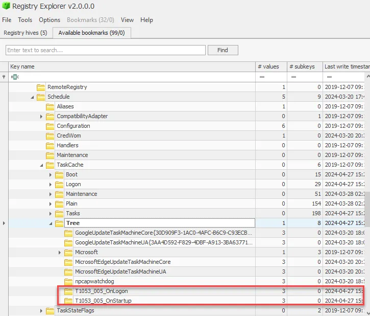
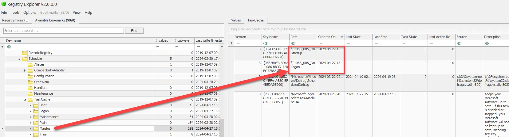
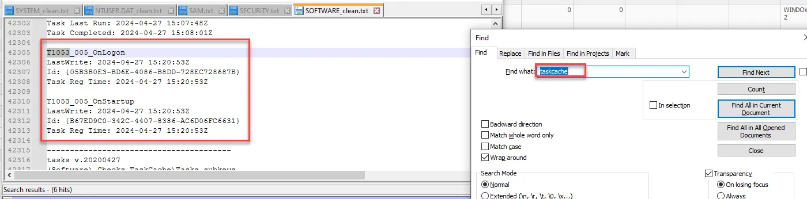
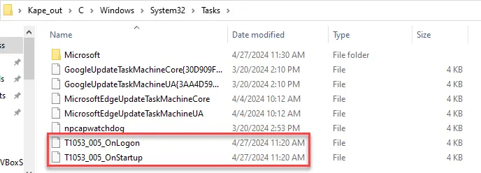

# Scheduled Tasks

Scheduled Tasks—an often overlooked but incredibly valuable artifact in Windows forensics. Scheduled Tasks can provide key insights into both legitimate and malicious activities on a system, helping us to reconstruct user actions, identify persistence mechanisms used by malware, and understand how a system was compromised.

Scheduled Tasks are a feature in Windows that allows users and administrators to automate the execution of programs or scripts at specified times or intervals. While they are typically used for routine maintenance tasks, attackers often exploit them to achieve persistence, execute malicious code, or schedule data exfiltration.

Scheduled Tasks can be used to automate both system and user activities, making them a valuable artifact for understanding what has been running on a system. They record when tasks are scheduled, when they were last run, and what actions they performed, which is crucial for timeline reconstruction.

In many attacks, adversaries use Scheduled Tasks to maintain persistence on a compromised system. By analyzing Scheduled Tasks, forensic investigators can identify these persistence mechanisms and understand how attackers maintain their foothold on a system.

Each Scheduled Task file contains details such as the task’s name, triggers (when the task runs), actions (what the task does), execution times, and the user account under which the task is run. These details are vital for understanding the task’s purpose and timing.

Scheduled Tasks are stored in XML files located in the

```
C:\Windows\System32\Tasks
```

directory. Additionally, information about Scheduled Tasks can be found in the Windows Registry under:

- `HKEY_LOCAL_MACHINE\SOFTWARE\Microsoft\Windows NT\CurrentVersion\Schedule\TaskCache\Tasks`
- `HKEY_LOCAL_MACHINE\SOFTWARE\Microsoft\Windows NT\CurrentVersion\Schedule\TaskCache\Tree`

Each Scheduled Task file contains details such as the task’s name, triggers (when the task runs), actions (what the task does), execution times, and the user account under which the task is run. These details are vital for understanding the task’s purpose and timing.

One challenge in analyzing Scheduled Tasks is distinguishing between legitimate tasks and those set up by an attacker. Many Scheduled Tasks are created by legitimate applications or system processes, so it’s important to thoroughly investigate each task’s purpose and context.

Scheduled Tasks can be modified, disabled, or deleted by attackers to cover their tracks. While some task data might be recoverable, the completeness of the artifact can be affected, making it essential to cross-reference Scheduled Tasks with other forensic artifacts.

<aside>
💡



</aside>

<aside>
💡



</aside>

We can find the same information from regripper txt files.

```powershell
taskcache
```

<aside>
💡



</aside>

Lastly, we could follow the path in the Kape collection to find the same tasks.

<aside>
💡



</aside>

In conclusion, Scheduled Tasks are a powerful tool in the forensic investigator’s toolkit, offering insights into both legitimate system maintenance and malicious activities. By effectively analyzing Scheduled Tasks, you can uncover persistence mechanisms, reconstruct timelines, and identify unauthorized actions on a compromised system.

## **Case Study: Reconstructing User Actions on a Compromised System Using Scheduled Tasks**

**Scenario Overview**

A manufacturing company discovered that critical design files were accessed and transferred to an unauthorized external server. The breach occurred over a weekend when no employees were scheduled to work, raising suspicions of insider involvement or credential theft. The forensic investigation aimed to determine how the breach happened, identify the tools used, and reconstruct the sequence of actions taken on the compromised system.

**Initial Forensic Findings**

1. **Suspicious Network Activity**: Network monitoring logs indicated large data transfers from an engineer’s workstation to an external IP address during off-hours. This was unusual given the engineer's known work patterns and schedule.
2. **Unusual File Access**: File system logs showed that design files were accessed multiple times over the weekend, suggesting that an automated process, rather than manual intervention, was likely responsible for the data transfer.
3. **Possible Unauthorized Software**: Preliminary scans detected traces of file transfer software that was not approved or installed by the company’s IT department, but it was unclear when or how this software was executed.

**Role of Scheduled Tasks**

To create a detailed timeline and confirm the use of unauthorized software, forensic analysts focused on Scheduled Tasks data. Scheduled Tasks entries provided critical evidence of automated activities on the system, helping to establish the sequence of events that led to the data breach.

**Analysis of Scheduled Tasks**

1. **Extraction and Examination**: Using Task Scheduler Viewer and Registry Explorer, analysts extracted Scheduled Tasks data from the workstation. They examined the task XML files located in C:\Windows\System32\Tasks and correlated these with entries in the registry under HKEY_LOCAL_MACHINE\SOFTWARE\Microsoft\Windows NT\CurrentVersion\Schedule\TaskCache\Tasks.
2. **Identifying Unauthorized Scheduled Tasks**: The analysis revealed a Scheduled Task named "SystemMaintenance" that was set to run a hidden executable from a non-standard directory. This executable was identified as unauthorized file transfer software that matched the traces found in the initial scans. The task was set to run at regular intervals during weekends, aligning perfectly with the timeline of the data transfers.
3. **Timeline Reconstruction**: By examining the Scheduled Task’s triggers and execution history, investigators reconstructed the timeline of the breach. The task was created shortly after the engineer’s last legitimate login on Friday evening, suggesting that an unauthorized party, likely using stolen credentials, set up the task to run when the office was empty.
4. **Detection of Additional Malicious Tasks**: Further analysis uncovered another task labeled "Windows Update Check," which, instead of checking for updates, ran a script designed to delete logs and clear evidence of the breach activities. This task was scheduled to run immediately after the data transfer operations, demonstrating an attempt to cover the tracks of the unauthorized actions.

**Corroborating Evidence**

1. **Cross-Referencing with Event Logs**: The task creation and execution times were cross-referenced with Windows event logs, which confirmed the suspicious logins using the engineer's credentials during the times the tasks were created. This correlation supported the theory of credential theft and unauthorized access.
2. **Alignment with Network and File Access Logs**: The timestamps from the Scheduled Tasks matched the times of the network activity showing outbound connections to the external server and the file access logs showing repeated accesses to the design files. This alignment provided a cohesive narrative of how the Scheduled Tasks facilitated the automated exfiltration of sensitive data.
3. **Supporting Evidence from Prefetch and Shim Cache**: Prefetch and Application Compatibility Cache entries confirmed the execution of the unauthorized file transfer tool and the log-clearing script. This consistency across multiple artifacts further corroborated the findings from the Scheduled Tasks analysis, demonstrating the extent of the malicious actions taken on the system.

**Conclusion**

The analysis of Scheduled Tasks was pivotal in reconstructing the sequence of user actions on the compromised system. Scheduled Tasks entries revealed the use of unauthorized software to automate data exfiltration and conceal evidence, providing clear and timestamped records that aligned with other forensic findings.

By leveraging the detailed information from Scheduled Tasks, including triggers, actions, and execution history, investigators were able to establish a clear timeline of the breach, identify the malicious tools used, and confirm unauthorized access. This case underscores the value of Scheduled Tasks in digital forensics, highlighting their role in detecting persistence mechanisms, uncovering automated malicious activities, and corroborating other forensic artifacts to build a comprehensive understanding of security incidents on compromised systems.