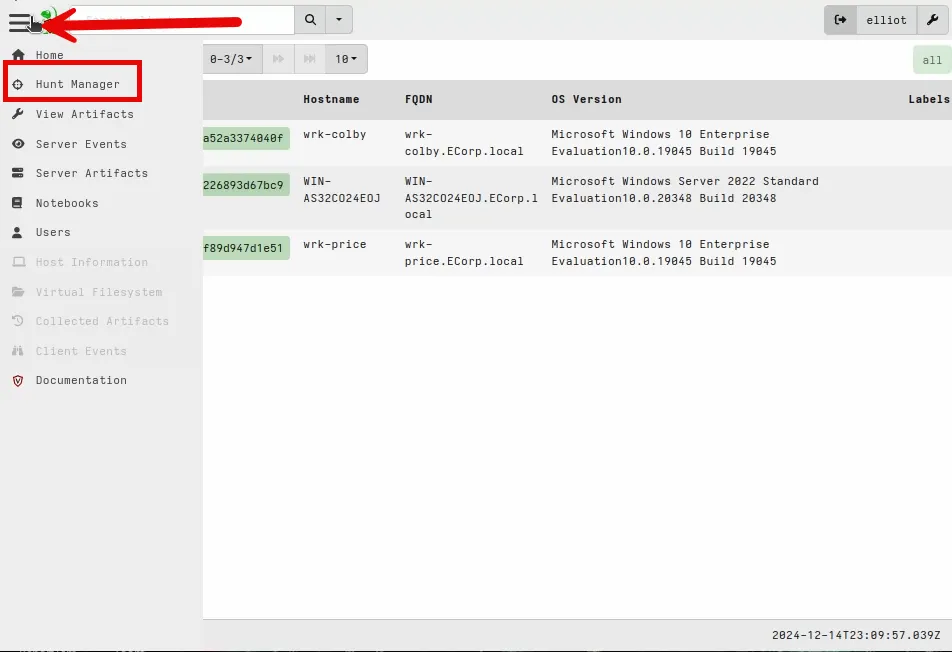
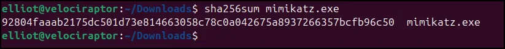
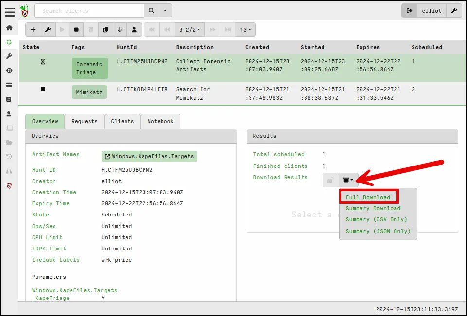

# Velociraptor

### Introduction

This walkthrough includes the steps to install a Velociraptor server on an Ubuntu VM, configure and deploy Windows clients, provide an overview of the Velociraptor Dashboard, and walkthrough two Use Cases for using Velociraptor to support Incident Response.


Session Objectives

### Lab Setup

To follow along with everything in this walkthrough you will need two virtual machines. A Linux VM, I’m using Ubuntu, and a Windows VM.   

### Background

Velociraptor is an open-source incident response and digital forensics tool designed to help security teams quickly investigate and respond to threats in enterprise environments. It leverages a powerful query language, Velociraptor Query Language (VQL), enabling analysts to collect and analyze forensic artifacts from endpoints efficiently. By deploying lightweight agents across systems, Velociraptor provides visibility into host activities, file systems, registry changes, memory, and more, enabling responders to hunt for indicators of compromise (IOCs) and triage incidents at scale. Its centralized server aggregates data from endpoints, offering a comprehensive overview of the network's security posture.


Velociraptor Capabilities

One of Velociraptor’s key strengths is its scalability and ease of use in both proactive hunting and reactive investigations. It allows teams to deploy queries across thousands of endpoints simultaneously, significantly reducing the time needed to identify compromised machines. Its flexible artifact collection framework lets users customize or leverage community-contributed artifacts to adapt to specific investigative needs. With a focus on transparency and user empowerment, Velociraptor provides tools for robust data collection, analysis, and remediation, making it an invaluable resource for organizations looking to enhance their incident response capabilities.


Velociraptor Strengths

### Installing Velociraptor

The video below walks through the installation steps. 

[Install Velociraptor.mp4](https://app.screencast.com/al775Q6HTWESf)

We will install Velociraptor on an Ubuntu VM. The installation is the same regardless of the hypervisor you use Proxmox, Virtualbox, or VMWare. Before installing it is important to give the Ubuntu VM a static IP address. Use the command below to set a static IP address. If net-tools is not already installed, install them now.

```jsx
sudo apt install net-tools 
```

  


Run ifconfig to confirm the IP address and the adaptor name.

```jsx
ifconfig
```


Run ip r to confirm the gateway IP address.

```jsx
ip r
```


Set the static ip address using the command below.

```jsx
sudo ifconfig enp6s18 10.0.2.8 netmask 255.255.255.0
```


Set the default gateway.

```jsx
sudo route add default gw 10.0.2.1 enp6s18
```


Download Velociraptor from the github page using the wget command below.

```json
wget https://github.com/Velocidex/velociraptor/releases/download/v0.74/velociraptor-v0.74.1-linux-amd64
```


Run ls -la to confirm the download and then change the permission to allow us to exectute it.

```jsx
ls -la
```

```jsx
chmod 764 velociraptor[-v0.73.1-linux-amd64](https://github.com/Velocidex/velociraptor/releases/download/v0.73/velociraptor-v0.73.1-linux-amd64)
```

Create a directory for Velociraptor.

```jsx
sudo mkdir /opt/velociraptor
```

Create the server configuration file.

```jsx
sudo ./velociraptor[-v0.73.1-linux-amd64](https://github.com/Velocidex/velociraptor/releases/download/v0.73/velociraptor-v0.73.1-linux-amd64) config generate -i 
```

Make the following selections during the interactive configuration.


Finish creating the configuration files with the options shown below.


Confirm the config files were written by going running the command below.

```jsx
ls -la /opt/velociraptor
```


We need to edit the server .yaml by using the text editor nano to change the GUI IP address to the IP address of the Velociraptor server we just installed.

```jsx
sudo nano /opt/velociraptor/server.config.yaml
```

Scroll down to GUI bind IP address and change the IP address from 127.0.0.1 to the IP of the server, in my case it is 10.0.2.8.


Save the file. 

Create a debian package for the server by using the command below.

```jsx
sudo ./velociraptor[-v0.73.1-linux-amd64](https://github.com/Velocidex/velociraptor/releases/download/v0.73/velociraptor-v0.73.1-linux-amd64) —config /opt/velociraptor/server.config.yaml debian server --binary velociraptor-v0.73.1-linux-amd64  
```


Now that the package is created we can run it.

```jsx
sudo dpkg -i velociraptor_server_0.73.1_amd64.deb
```


The package created a new group, system user, and the velociraptor process. We can confirm the service is running by using the command below.

```jsx
systemctl status velociraptor_server.service
```


As seen above, the service is properly running. 

We can now access the server via of the web interface by navigating to https://10.0.2.8:8889


Log in with the username and password you chose while configuring the server.


We have successfully set up the server; however, we have not set up any clients yet.


To create a client we need to download the Windows Velociraptor binary. We can download it from the github similar to the way we downloaded the Linux Velociraptor binary. 

```jsx
wget [https://github.com/Velocidex/velociraptor/releases/download/v0.73/velociraptor-v0.73.1-windows-amd64](https://github.com/Velocidex/velociraptor/releases/download/v0.73/velociraptor-v0.73.1-linux-amd64)
```


Repackage the binary by importing in the client config file we created earlier.

```jsx
sudo ./velociraptor[-v0.73.1-linux-amd64](https://github.com/Velocidex/velociraptor/releases/download/v0.73/velociraptor-v0.73.1-linux-amd64) config repack --exe [velociraptor-v0.73.1-windows-amd64](https://github.com/Velocidex/velociraptor/releases/download/v0.73/velociraptor-v0.73.1-linux-amd64) /opt/velociraptor/client.config.yaml vraptorclient.exe 
```


Run ls -la to confirm the file was created.

```jsx
ls -la
```


As seen above the .exe file was created. 

To move the .exe to our Windows VM we can set up a webserver using python’s webserver module.

```jsx
sudo python3 -m http.server 1337
```


Go to your windows machine and open a browser and navigate to http:10.0.2.8:1337


Download the .exe we created.

Open PowerShell as administrator and navigate to the Downloads folder.


Execute the file using this command:

```jsx
.\vraptorclient.exe service install 
```


Access the Velociraptor web interface by navigating to https://10.0.2.8:8889.


As seen above the client is now reporting back to the server. 

This completes the installation.

## Introduction to Velociraptor Dashboard


When you first open Velociraptor via the web GUI you are presented with the following screen.


Click on the magnifying glass to view any clients that have successfully enrolled, indicated by a green status icon. Once a client is actively checking in, you can start exploring Velociraptor's capabilities.


**Hunt Manager**

The Hunt Manager displays all hunts executed across your client machines. Hunts consist of **artifacts**, which define the actions to be performed on client machines. 



Adding a new hunt is straightforward—simply click the plus icon at the top. You can choose to include or exclude specific clients based on criteria such as labels or operating systems.


On the "Select Artifacts" tab, choose the specific artifact or action you want to perform on the client machine. Velociraptor provides a wide range of artifacts, each with a unique purpose. If you're unsure what an artifact does, click on it to view details in the right-hand pane.


The "View Artifacts" section lists all available artifacts on your server. Here, you can edit existing artifacts, create custom ones, or import community-developed artifacts, adding to Velociraptor's flexibility.


Server Events log all activities that occur on your Velociraptor server. These logs help you monitor operational health over time.


Server Artifacts focus on actions performed on the server itself, such as data enrichment or integrating Velociraptor with external tools like a SIEM. You can also create an offline Velociraptor binary to collect data from air-gapped machines.


This is also the section used to create offline collectors. 

The offline collector capability of Velociraptor allows security teams to perform incident response and forensic investigations on systems that are not connected to a central Velociraptor server or are in isolated environments. This feature is especially useful for analyzing systems in restricted or air-gapped networks where deploying a live agent isn't feasible. With the offline collector, Velociraptor creates a standalone executable that can be manually deployed to the target machine. Once executed, the collector gathers predefined forensic artifacts based on the investigator's configuration.

The data collected by the offline collector can include file system details, registry keys, memory snapshots, logs, and other forensic artifacts. After execution, the results are stored locally on the target machine or an external storage device, such as a USB drive. These results can then be imported into a Velociraptor server or analyzed separately using forensic tools. This capability makes Velociraptor a versatile tool for both live incident response scenarios and investigations in controlled environments where real-time connectivity isn't possible.


Here, you can view detailed information about a client. One useful option is **Interrogate**, which gathers information about the client’s users, operating system, and network configuration.


The Virtual File System (VFS) feature allows you to browse and interact with a client’s file system. For instance, if a malicious file exists in a user’s Downloads folder, you can locate and download it for analysis. Expand directories, refresh their contents, and collect specific files from the client.


The "Collected" tab displays all actions and artifacts executed on the client. For example, results from the "Interrogate" action can be reviewed here. By default, Velociraptor shows 10 items at a time, but this can be adjusted to display up to 50 items per page.


If malicious activity is detected, Velociraptor can quarantine a client machine. Quarantined hosts are isolated from the network, except for communication with the Velociraptor server. You can initiate quarantine by selecting the quarantine icon from the client’s details page.


## Incident Response Velociraptor Use Cases


**Scenario:** An alert was triggered for Mimikatz on the wrk-price VM. You are tasked with quarantining the infected machine, retrieving the malware for analysis, and searching across the network for other instances of Mimikatz.  


You receive the alert below from Wazuh.


Quarantine wrk-price while you investigate by going to the client tab in Velociraptor and selecting the quarantine button.


You will be presented with the popup shown below. Add comments why you are quarantining the system and select “yes, do it”.


Note the icon when the system is quarantined. 


Use VFS to navigate to the Downloads folder where Mimikatz has been reported.


Collect mimkatz.exe to your Velociraptor server. Note the Velociraptor server is a Linux machine and Mimikatz only works against Windows.


When collection is complete it can be downloaded.


Navigate to Downloads directory and confirm Mimikatz was downloaded. 


Get the SHA256 hash.

```jsx
sha256sum mimikatz.exe
```



Lookup the hash on VirusTotal. 

As seen below it is recognized as Mimikatz.


Now that you have confirmed the alert was a true positive, search across the network to see if the file exists anywhere else in the network.

Create a new hunt.


Create a new tag and give a description. Ensure that it will run everywhere.

Choose the Windows.Search.FileFinder artifact.


Configure the parameters by selecting the wrench icon.

Give the file path to where the file was found on wrk-price (use double wildcard for recursive search).


Keep the default for Specify Resources and select Review.


Once you review the parameters, launch the hunt.

After hitting launch you will be presented with the page below. You must select the “play” button and “Run it” to start the hunt.


After a few seconds we see the hunt was completed across two clients (Remember we now have wrk-price quarantined). 


To quickly review the results select the Notebook tab.


As seen above, Mimikatz was also found on wrk-colby. 

Obviously, we would then quarantine wrk-colby and clean the system as well as analyze logs from both wrk-colby and wrk-price. 

## Forensic Acquisition Use Case

Picking up from the same scenario, we could do a triage collection of forensic artifacts from the affected machines. To do this we can create a new hunt.


Create a new Tag and Description. Under Labels, choose wrk-price (for the purpose of the demo we will only collect from one VM) and then go to Select Artifacts.


Search for Kape and select Windows.KapeFiles.Targets and then go to Configure Parameters.


Select the wrench to configure parameters.


Scroll down and select _Kape Triage. As you can see below Kape Triage includes most, if not all, of the forensic artifacts we will use to investigate this case.  


Keep the defaults the same and select Launch.

Select the play button and then the “Run it!” button to start the collection (hunt).


This will take a little longer than the hunt for Mimikatz because it is collecting more information. Remember, we are only running this on wrk-price. When it is completed you can download the results. Select Full download.



When the file is ready to be downloaded it will show up as available downloads. 

Once it is downloaded to the Velociraptor server, we would move the file to our forensic workstation and begin our forensic analysis. 

This use case shows how quickly we can remotely conduct a forensic acquisition and begin analysis.