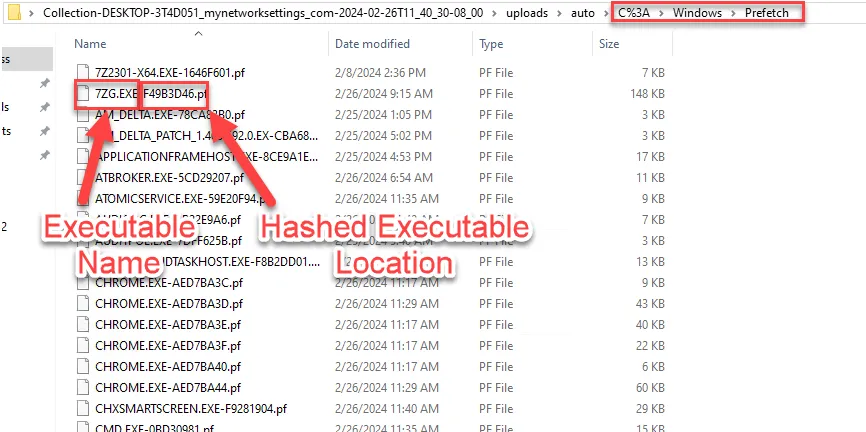
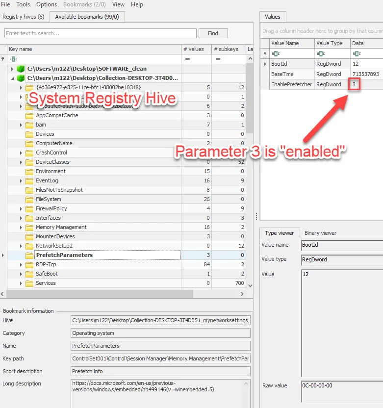
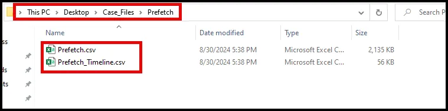
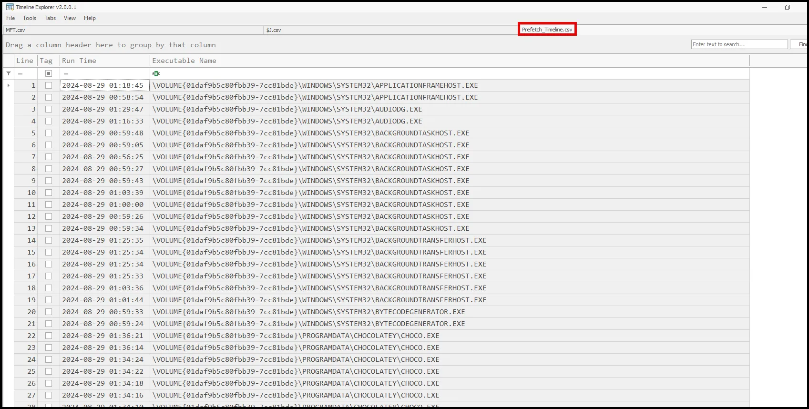
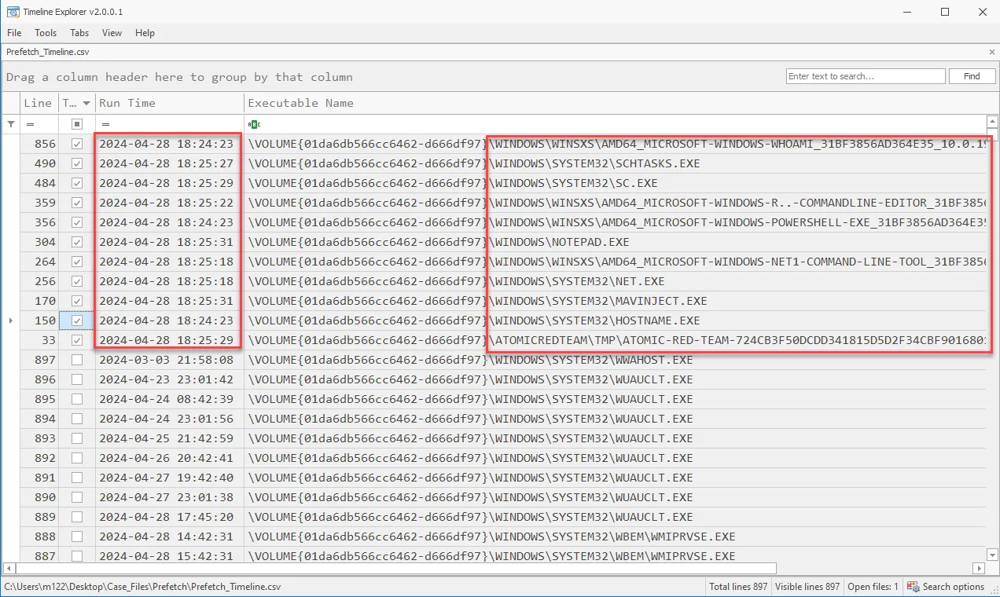

# Prefetch Analysis

Now we’ll dive into prefetch files—one of the unsung heroes in the world of digital forensics. These files can tell us a lot about what has been executed on a Windows system, providing critical insights during an investigation.

Prefetch files are a component of Windows operating systems designed to speed up the startup of applications by caching data related to recently executed programs. They were introduced in Windows XP and continue to be part of newer Windows versions, though their structure and functionality have evolved over time.

Originally, prefetch files were developed to enhance system performance. They record information about application execution to optimize the loading process for future runs.

For forensic analysts, prefetch files are invaluable because they record execution timestamps, file paths, and the number of times an application has been run. This makes them a powerful artifact for tracking user activity, malware execution, or verifying an application's presence on a system.

Each prefetch file follows a specific structure, including headers, file paths, timestamps, and volume information. We’ll break down these components to understand how each piece of data contributes to a forensic investigation.

We must also consider variations across Windows versions. For example, Windows 10 changed the prefetch format, adding more detailed execution metadata, which provides additional context during an investigation.

Prefetch files are located in C:\windows\Prefetch and have a .PF extension
– One file is created per {appName, path, command line} tuple.



The **peCmd** tool from Eric Zimmerman is a tool that can parse all known
versions of prefetch files
– Many prefetch parsers cannot handle compressed prefetch files (Win8+)
• Unlike many other prefetch parsers, peCmd can process an entire directory of prefetch files simultaneously
– Most standalone parsers operate on a single file at a time
• The peCmd tool can also generate a timeline of Prefetch activity
– This is useful in understanding the larger context of an investigation, especially
when combined with filesystem timeline data

Check the registry to ensure prefetch has been enabled.



**PECmd**

```powershell
PECmd.exe -d C:\Users\Elliot\Desktop\Kape_out\C\Windows\Prefetch --csv C:\Users\Elliot\Desktop\Case_Files\Prefetch --csvf Prefetch.csv
```

Here's a breakdown of the command:

- **`PECmd.exe`**: This is the executable file for the Prefetch Extractor tool, which is used to analyze Prefetch files in Windows.
- **`d C:\Users\m122\Desktop\Kape_out\C\Windows\Prefetch`**: This specifies the directory containing the Prefetch files to be analyzed. In this case, it's **`C:\Users\m122\Desktop\Kape_out\C\Windows\Prefetch`**.
- **`-csv C:\Users\m122\Desktop\Case_Files\Prefetch`**: This specifies the output directory where the extracted data will be saved. In this case, it's **`C:\Users\m122\Desktop\Case_Files\Prefetch`**.
- **`-csvf Prefetch.csv`**: This specifies the name of the output CSV file where the extracted Prefetch data will be saved. In this case, it's **`Prefetch.csv`**.

So, overall, this command is extracting and analyzing Prefetch data from the specified directory and saving the results as a CSV file for further analysis.



As seen above, the command produces two CSV files. The first one provides details about each specific Prefetch file. The second one provides the timestamps and names of the prefetch files to use when building a timeline of events.

Since we know the approximate time the event starts we can search for prefetch entries at that time by dropping the csv into Timeline Explorer. As seen below we can check the checkbox for the prefetch files of interest to get a clearer picture of events.



After filtering we can see a series of suspicious events occuring within about 30 seconds.

<aside>
💡



</aside>

While working with prefetch files, it’s essential to ensure that timestamps are correctly interpreted according to the system’s timezone settings. Also, pay attention to how the presence of prefetch files aligns with system boot times and user activity.

Be aware of the limitations—prefetch files are cleared if they exceed the system's limit (usually 128 or 1024 entries, depending on the OS), and they can be deleted by users or cleaned up by the system, making them unavailable for analysis.

To wrap up, prefetch files are a potent forensic artifact that provides insights into application execution on Windows systems. By mastering the analysis of these files, you add a valuable tool to your digital forensics toolkit.

## **Case Study: Reconstructing User Actions on a Compromised System Using Prefetch Files**

**Scenario Overview**

A large corporation experienced a security incident involving the unauthorized access and exfiltration of sensitive intellectual property. The incident response team identified a specific workstation as the potential point of compromise. The objective of the forensic investigation was to reconstruct the sequence of user actions on the compromised system to determine the tools used, establish a timeline of events, and identify any unauthorized software that facilitated the data breach.

**Initial Forensic Findings**

1. **Suspicious Logins**: Security logs indicated unauthorized logins to the workstation during non-working hours. The logins were traced back to an employee who denied involvement, suggesting possible credential theft.
2. **Network Anomalies**: Network monitoring detected unusual outbound connections from the compromised workstation to an external IP address linked to known data exfiltration activity.
3. **System Artifacts**: Initial scans revealed traces of several tools typically associated with data exfiltration, but it was unclear when or how they were executed.

**Role of Prefetch Files**

To build a comprehensive timeline and identify the unauthorized software used, forensic analysts turned to prefetch files located in the C:\Windows\Prefetch directory. Prefetch files record metadata about executable files, including the last time they were run and the number of executions, making them crucial for reconstructing user actions.

**Analysis of Prefetch Files**

1. **Extraction and Examination**: Analysts extracted prefetch files from the compromised system. Using tools like PECmd and WinPrefetchView, they parsed the prefetch files to gather detailed information about executed applications.
2. **Identification of Unauthorized Tools**: Analysis of the prefetch entries revealed that specific unauthorized tools, including a file transfer application and a password cracker, were executed multiple times. These tools were not part of the corporation’s approved software list and were identified as key components in the data breach.
3. **Timeline Reconstruction**: The prefetch data provided precise timestamps for the last execution of each application. By sorting these entries chronologically, analysts could reconstruct a detailed timeline of actions, showing the sequence in which the unauthorized tools were run. This timeline matched the periods of suspicious login activity and the abnormal network connections, supporting the theory that the breach was orchestrated using these tools.
4. **Correlating Execution Counts**: Prefetch files also recorded the number of times each tool was executed. This information revealed that the unauthorized data transfer application was used repeatedly over a span of several days, indicating persistent activity rather than a one-time breach.

**Corroborating Evidence**

1. **Cross-Referencing with Event Logs**: The execution times from the prefetch files were cross-referenced with Windows event logs, confirming that the unauthorized tools were launched during the periods of suspicious login activity. This cross-correlation helped establish that the compromised user account was used to operate these tools.
2. **Alignment with Network Logs**: The timestamps from the prefetch files also aligned with the times of the detected outbound connections to the external IP address. This reinforced the link between the tool execution and the exfiltration of data.
3. **Support from Other Artifacts**: Analysis of other system artifacts, such as shellbags and registry entries, showed file and folder accesses that coincided with the use of the unauthorized applications identified in the prefetch files. This comprehensive view further substantiated the timeline and actions reconstructed from the prefetch data.

**Conclusion**

The analysis of prefetch files was pivotal in reconstructing the sequence of user actions on the compromised system, revealing that unauthorized data exfiltration tools were repeatedly executed. By correlating the prefetch data with event logs, network connections, and other system artifacts, the investigation confirmed the unauthorized use of specific software that facilitated the breach.

The prefetch files provided clear, timestamped evidence of when and how the unauthorized tools were used, creating a compelling narrative of the attacker’s actions. This case highlights the critical role of prefetch files in digital forensics for establishing timelines, identifying unauthorized software, and corroborating other forensic findings to fully understand the scope and nature of a security incident.