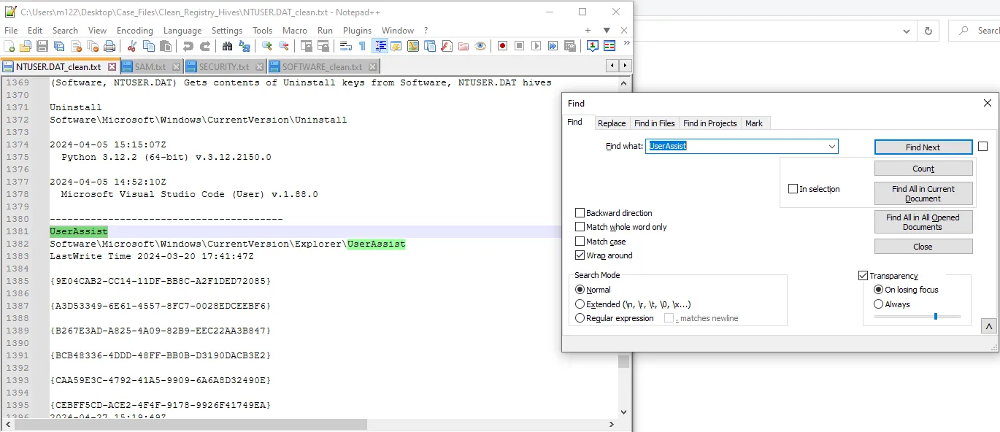
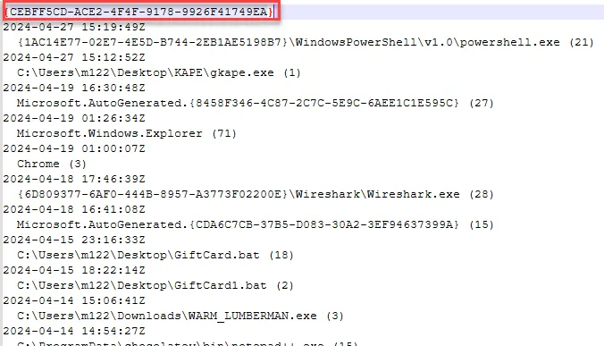
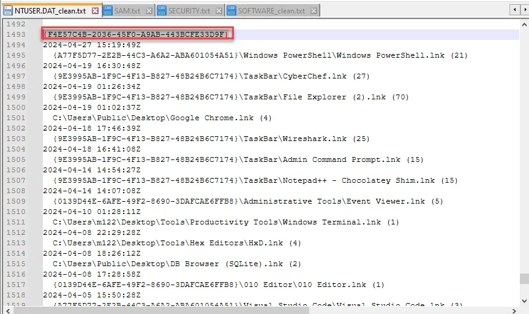

# User Assist

UserAssist files—a lesser-known but incredibly powerful artifact in the realm of Windows forensics. These files can reveal a wealth of information about user activity on a system, making them invaluable for investigations.

UserAssist files are registry entries within the Windows operating system that track the execution of GUI-based applications by a user. They are primarily used by Windows to provide quick access to frequently used programs, but for forensic analysts, they offer a timestamped history of user activity.

UserAssist files help us understand user behavior by recording interactions with the system, including which applications were opened, how often they were accessed, and when. This can be critical in cases involving insider threats, data exfiltration, or user activity reconstruction.

In incident response and malware investigations, UserAssist entries can show if and when a malicious application was executed, helping to establish a timeline of compromise.

- **Registry Path**: "UserAssist data is stored in the Windows Registry under the path: `HKEY_CURRENT_USER\Software\Microsoft\Windows\CurrentVersion\Explorer\UserAssist`. Within this key, there are subkeys named with GUIDs that contain ROT13-encoded values recording executed programs."
- **Data Structure**: "Each entry includes a timestamp of the last execution, a count of executions, and a path to the executable. The values are stored in ROT13 encoding, which is a simple substitution cipher, making it straightforward to decode."

We can find the UserAssist information from our regripper output in notepad++.

<aside>
💡

</aside>

{CEBFF5CD-ACE2-4F4F-9178-9926F41749EA}: Includes a list of applications, files, and other objects that have been accessed.

<aside>
💡

</aside>

{F4E57C4B-2036-45F0-A9AB-443BCFE33D9F}: A list of shortcut links used to start programs.

<aside>
💡

</aside>

To conclude, UserAssist files are a powerful tool for forensic investigators seeking to understand user behavior on Windows systems. They offer a detailed look at how and when applications are used, providing critical context in digital investigations.

## **Case Study: Reconstructing User Actions on a Compromised System Using UserAssist Files**

**Scenario Overview**

A financial institution experienced a data breach involving the unauthorized access and exfiltration of sensitive customer information. An internal employee was suspected of using unauthorized software to extract data from secure systems. The forensic investigation aimed to reconstruct the sequence of user actions to confirm whether the employee had accessed and used the software during the breach period.

**Initial Forensic Findings**

1. **Suspicious Network Activity**: Network logs indicated unusual data transfers from a workstation assigned to the suspect during non-business hours.
2. **System Artifacts**: Initial analysis of system artifacts revealed traces of software that was not approved for use within the organization, specifically data extraction tools.
3. **User Account Activity**: Windows event logs showed that the suspect’s user account was active during the times of the data transfers, aligning with the suspicious network activity.

**Role of UserAssist Files**

To build a more precise timeline of actions and identify specific software use, forensic analysts turned to UserAssist files. These files provided critical evidence of the suspect's interactions with the system, specifically GUI-based applications.

**Analysis of UserAssist Files**

1. **Extraction and Decoding**: Analysts extracted the UserAssist registry entries from the suspect's profile under HKEY_CURRENT_USER\Software\Microsoft\Windows\CurrentVersion\Explorer\UserAssist. Using tools like UserAssistView, they decoded the ROT13-encoded entries.
2. **Identification of Unauthorized Software**: The decoded entries revealed that a data extraction tool, previously flagged during the system artifact review, was executed multiple times. The timestamps from the UserAssist entries closely matched the periods of the suspicious data transfers identified in network logs.
3. **Execution Patterns**: The UserAssist data showed a consistent pattern of the suspect launching the unauthorized software immediately after logging into the system. This pattern corroborated the Windows event logs, reinforcing the timeline of events.
4. **Frequency and Timing**: The UserAssist files provided details on the frequency of software execution, showing repeated use on dates that aligned with key moments in the breach timeline. This demonstrated a deliberate and repeated action rather than an accidental launch of the software.

**Corroborating Evidence**

1. **Correlating with Event Logs**: The UserAssist entries were cross-referenced with Windows event logs, which confirmed that the suspect was logged in and active on the system at the times the unauthorized software was executed.
2. **Alignment with Network Data**: The timestamps from the UserAssist entries coincided with the timestamps of the abnormal data transfers captured in network logs. This alignment further substantiated the claim that the unauthorized software was used to exfiltrate data.
3. **System State Analysis**: Additional analysis of prefetch files showed that the unauthorized software was run from a portable storage device, which aligned with the UserAssist findings and indicated the software was not permanently installed on the system, thus avoiding detection by standard monitoring tools.

**Conclusion**

The UserAssist data was pivotal in reconstructing the sequence of user actions, demonstrating that the suspect had repeatedly used unauthorized data extraction software during the breach. By aligning UserAssist entries with network activity and event logs, the investigation confirmed the suspect's involvement in the unauthorized data exfiltration.

The evidence collected from UserAssist files provided clear and timestamped records of software execution, which, when combined with other forensic findings, created a comprehensive narrative of the suspect's actions. This case underscored the importance of UserAssist files in tracking user activity and substantiating claims of unauthorized software use in digital forensic investigations.