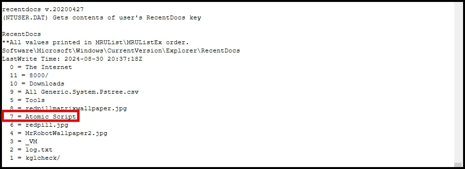
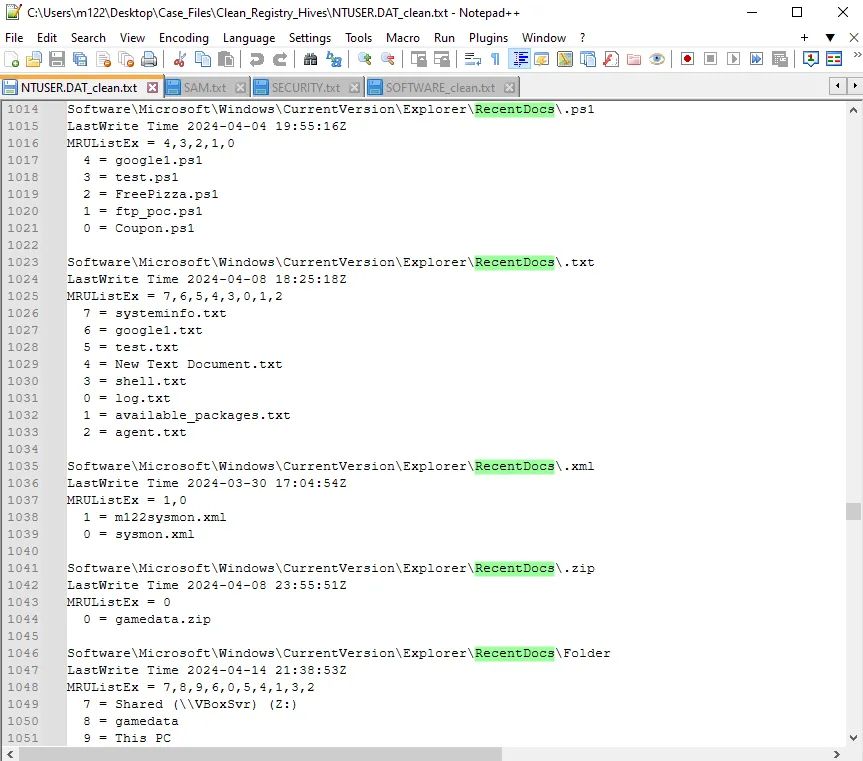

# RecentDocs

RecentDocs, an important artifact in Windows forensics that helps us track user activity by providing insights into recently accessed files and folders. RecentDocs entries can be a goldmine of information when reconstructing a user’s actions on a system. 

RecentDocs is a registry key in Windows that keeps track of the most recently accessed files and folders by the user. It’s part of the user’s activity history and is stored in the Windows Registry under `HKEY_CURRENT_USER\Software\Microsoft\Windows\CurrentVersion\Explorer\RecentDocs`.

RecentDocs is particularly useful for tracking user activity on a system. It records the names of recently opened files, making it an essential artifact for investigations involving document access, intellectual property theft, or verifying claims of data access.

RecentDocs entries are timestamped, allowing forensic investigators to create a timeline of file access. This can be crucial when piecing together the sequence of events in an investigation.

Each entry records the name of the file or folder, its file path, and a timestamp of the last access. Windows uses this data to quickly display recently accessed items to the user in various interface elements, like the Start menu or File Explorer.

One limitation of RecentDocs is that it only retains a limited number of entries, as older entries are overwritten when new files are accessed. This means the data is most useful for recent activity, but may not provide a complete history if the user accesses a large number of files frequently.

Another challenge is that RecentDocs entries can be deleted or cleared by the user, either intentionally or as part of routine system cleanup, which can complicate forensic analysis.

We can find the recentdocs information in our regripper output using notepad++.

As you scroll down you can see the most recent documents by file extension.

<aside>
💡

</aside>

To wrap up, RecentDocs is a valuable artifact for forensic investigators looking to track user activity on Windows systems. By understanding how to extract and interpret RecentDocs entries, you add a crucial tool to your forensic toolkit, helping you piece together user actions and build a clear narrative in your investigations.

## **Case Study: Reconstructing User Actions on a Compromised System Using RecentDocs**

**Scenario Overview**

A mid-sized tech company suspected that an insider had accessed and copied confidential project documents related to an upcoming product launch. The investigation aimed to determine if the employee had accessed these sensitive files and if unauthorized software was used to facilitate data exfiltration. The forensic team needed to reconstruct the user’s actions to confirm or refute these suspicions.

**Initial Forensic Findings**

1. **Unusual File Access**: File server logs indicated that several confidential documents were accessed and downloaded by the suspect’s account during late hours when the employee was not scheduled to work.
2. **External Device Use**: Endpoint monitoring tools detected the connection of an unauthorized USB device to the suspect’s workstation around the same time the sensitive files were accessed.
3. **Potential Use of Unauthorized Software**: Preliminary scans hinted at the presence of unauthorized file transfer and archiving tools that could have been used to collect and move data.

**Role of RecentDocs**

To refine the timeline and identify specific user actions, forensic analysts focused on the RecentDocs entries in the Windows Registry. RecentDocs data provided direct evidence of files recently accessed by the user, including timestamps that aligned with the suspicious activity period.

**Analysis of RecentDocs**

1. **Extraction and Examination**: Using Registry Explorer, analysts extracted the RecentDocs entries from the suspect’s profile located at HKEY_CURRENT_USER\Software\Microsoft\Windows\CurrentVersion\Explorer\RecentDocs. They decoded the entries to identify recently accessed files and folders.
2. **Identifying Access to Confidential Documents**: RecentDocs entries revealed that multiple confidential project documents were accessed during the same timeframe as the suspicious downloads recorded in the file server logs. The file paths and filenames matched those of the sensitive documents, directly tying the suspect to their unauthorized access.
3. **Correlation with Unauthorized Software**: Among the RecentDocs entries, analysts found records of an executable file that was not part of the company’s approved software list. This executable was a portable file transfer tool capable of quickly copying large amounts of data to external devices, matching the type of software suspected to be used for exfiltration.
4. **Timeline Reconstruction**: By analyzing the timestamps associated with the RecentDocs entries, investigators constructed a timeline showing the sequential access of confidential documents followed by the launch of the unauthorized file transfer tool. This sequence matched the timeframe of the unauthorized USB device connection detected earlier.

**Corroborating Evidence**

1. **Cross-Referencing with USB Logs**: The RecentDocs timeline was cross-referenced with USB connection logs, which confirmed that the unauthorized USB device was connected shortly after the file transfer tool was accessed. This strongly suggested that the data transfer to the USB device occurred immediately after the documents were accessed.
2. **Matching with System Logs**: Event logs from the system showed that the suspect’s user account was actively logged in and performing actions at the exact times recorded in the RecentDocs entries, further confirming the link between the user’s actions and the unauthorized access.
3. **Supporting Evidence from File Metadata**: Metadata from the confidential documents showed that they were last opened and modified at times corresponding to the RecentDocs timestamps, reinforcing the narrative that the files were accessed and manipulated during the breach period.

**Conclusion**

The RecentDocs analysis was pivotal in reconstructing the sequence of user actions, revealing that the suspect accessed sensitive documents, utilized unauthorized software to collect the data, and transferred it to an external device. This clear timeline of activity, corroborated by other forensic evidence, provided irrefutable proof of the suspect's involvement in the data breach.

The RecentDocs entries not only confirmed unauthorized access to the files but also highlighted the use of unapproved software that facilitated the exfiltration. This case underscores the value of RecentDocs in forensic investigations, demonstrating how these entries can provide crucial insights into user actions, validate other findings, and ultimately help build a comprehensive picture of what occurred on a compromised system.
