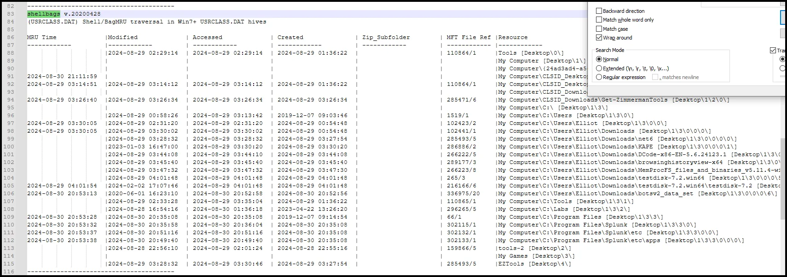
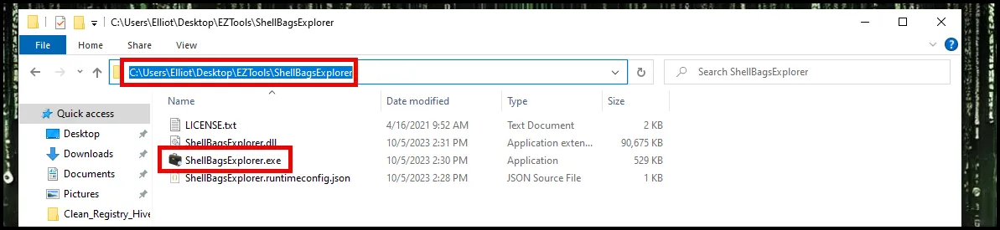
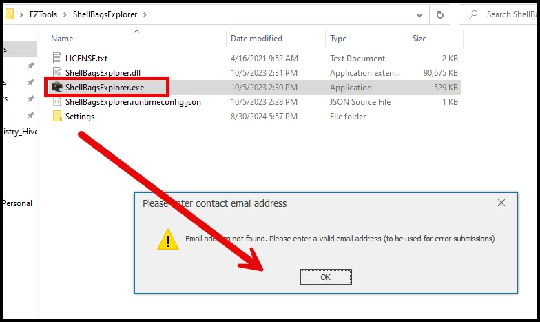
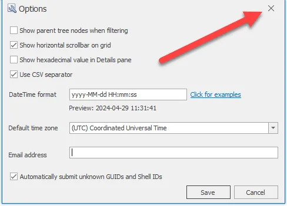
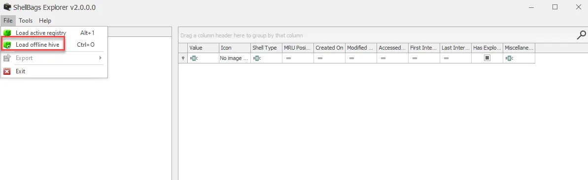
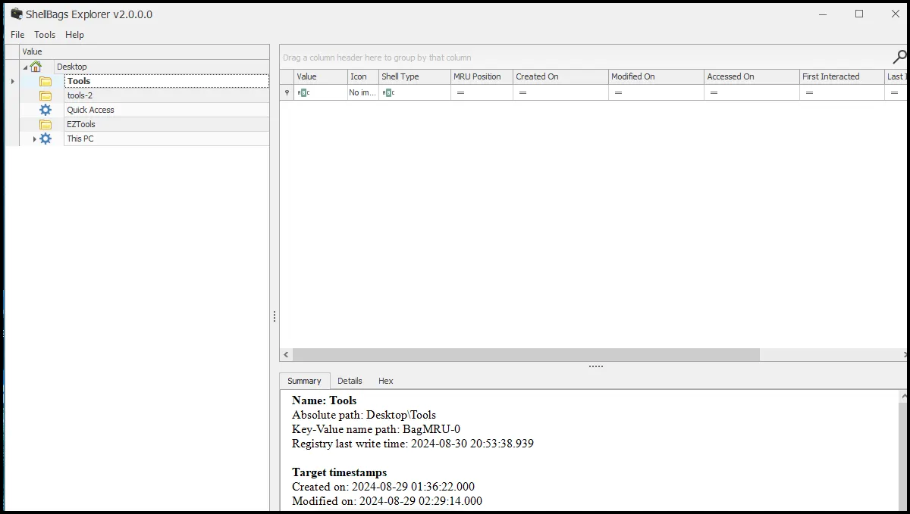

# Shell Bags

Shellbags, a powerful yet often underutilized artifact in digital forensics. Shellbags can provide critical insights into user activity, specifically regarding folder access and directory structure, even if the original files or folders no longer exist on the system.

Shellbags are a set of registry keys that store information about folders viewed through Windows Explorer. They track the user’s folder preferences, such as view settings, sizes, and positions, and can even reveal folders that were accessed on local, removable, or network drives.

Shellbags are incredibly useful for reconstructing folder access and directory structures, including deleted or moved folders. This can be vital in cases involving hidden files, deleted evidence, or attempts to cover up data access.

Shellbags provide insights into the user’s behavior by recording when and how directories were accessed. This can help investigators understand the context of file interactions, such as whether a user was browsing a folder that contained incriminating evidence.

Shellbags data is stored in multiple locations within the Windows Registry, primarily under:

- `HKEY_CURRENT_USER\Software\Classes\Local Settings\Software\Microsoft\Windows\Shell\BagMRU`
- `HKEY_CURRENT_USER\Software\Classes\Local Settings\Software\Microsoft\Windows\Shell\Bags`

Shellbags contain various details, such as folder names, paths, view settings, and timestamps of the last access. This data helps paint a picture of how and when folders were accessed by the user.

One challenge with Shellbags is that they do not record every folder access but rather a snapshot based on user interactions with Windows Explorer. They primarily track changes in folder views, so they may not capture every folder the user accessed, especially if accessed through other means.

Shellbags data can also be overwritten over time as more folders are accessed and settings change. This makes it important to collect and analyze this data promptly to preserve valuable evidence.

We can find the shellbags information in our regripper output using notepad++.

We can also use another Eric Zimmerman tool call ShellBagsExplorer (included in the download of Zimmerman tools).

<aside>
💡 Ignore the email address references and click OK.

</aside>

<aside>
💡 Close the Window using the X.

</aside>

<aside>
💡

Load the user.dat hive by selecting file and load offline hive. Then navigate to where the clean registry hives were saved and open userclass.dat.

</aside>

<aside>
💡 This presents a tree-like structure with additional information in the lower right. It shows folders that were interacted with and the timestamps.

</aside>

In conclusion, Shellbags are a powerful forensic artifact that provides insights into user interactions with directories on a Windows system. By effectively analyzing Shellbags, you can reconstruct folder access, identify hidden or deleted directories, and build a detailed timeline of user activity.

## **Case Study: Reconstructing User Actions on a Compromised System Using Shellbags**

**Scenario Overview**

A healthcare organization experienced a security breach involving the unauthorized access and potential exfiltration of patient records. A forensic investigation was initiated to determine how the breach occurred, identify the actions taken by the perpetrator, and assess the extent of data compromised. The suspect’s workstation was imaged, and investigators needed to reconstruct the sequence of user actions to determine if unauthorized software was used and how sensitive directories were accessed.

**Initial Forensic Findings**

1. **Unusual File Access Patterns**: Security logs indicated that patient records were accessed outside of normal working hours by an employee who denied any involvement, suggesting a possible compromise of their credentials.
2. **External Device Connections**: Endpoint monitoring data showed that a USB drive was connected to the workstation around the time of the suspicious access. This raised concerns about potential data exfiltration.
3. **Presence of Unauthorized Software**: A preliminary scan of system artifacts revealed traces of portable data extraction tools, but it was unclear when or how these tools were used.

**Role of Shellbags**

To create a detailed timeline and understand the actions taken by the user on the compromised system, forensic analysts focused on analyzing Shellbags data. Shellbags provided insights into the directories that were accessed, including those that were deleted or not directly visible in the file system.

**Analysis of Shellbags**

1. **Extraction and Examination**: Using ShellBags Explorer and Registry Explorer, analysts extracted Shellbags entries from the registry hive of the suspect’s user profile. They decoded these entries to identify accessed folder paths, view settings, and timestamps.
2. **Identifying Access to Sensitive Directories**: Shellbags data revealed that several sensitive folders containing patient records were accessed during the breach period. This included folders that were not explicitly listed in recent files or typical logs, indicating direct navigation to these directories using Windows Explorer.
3. **Correlation with Unauthorized Software**: Among the Shellbags entries, analysts found evidence of access to folders associated with unauthorized portable software, including data extraction tools located on the connected USB drive. This access occurred shortly before the suspicious patient record access, suggesting the use of these tools to facilitate the data breach.
4. **Timeline Reconstruction**: Shellbags provided precise timestamps for when the suspect accessed various directories, allowing investigators to construct a sequence of events. The data showed the user navigated through directories containing patient records immediately after connecting the USB drive and before using the unauthorized software. This sequence matched other findings related to the breach.

**Corroborating Evidence**

1. **Cross-Referencing with Event Logs**: The Shellbags timeline was cross-referenced with Windows event logs, which confirmed that the suspect’s user account was active at the times indicated by the Shellbags data. This supported the theory that the suspect was manually navigating through sensitive directories rather than accessing files automatically.
2. **Alignment with USB and File System Logs**: The timestamps from Shellbags closely matched the logs showing USB drive connections and the timestamps of the files modified during the breach. This alignment strongly suggested that files were copied or manipulated via the unauthorized software identified in the Shellbags analysis.
3. **Supporting Evidence from Other Artifacts**: Further corroboration came from prefetch files that confirmed the execution of the unauthorized portable software, and network logs that showed attempted connections to external IP addresses during the times sensitive folders were accessed. This evidence collectively supported the use of unauthorized tools for data exfiltration.

**Conclusion**

The analysis of Shellbags was pivotal in reconstructing the sequence of user actions on the compromised system. By revealing hidden and deleted folder access, Shellbags provided a detailed view of the suspect’s navigation through sensitive directories, use of unauthorized software, and the connection of an external USB device.

Shellbags entries directly linked the suspect’s actions to the data breach, showing deliberate and unauthorized access to patient records and the use of data extraction tools. This case highlights the importance of Shellbags in digital forensic investigations, demonstrating how these entries can uncover hidden user behaviors, validate other forensic findings, and help build a comprehensive narrative of what occurred on a compromised system.