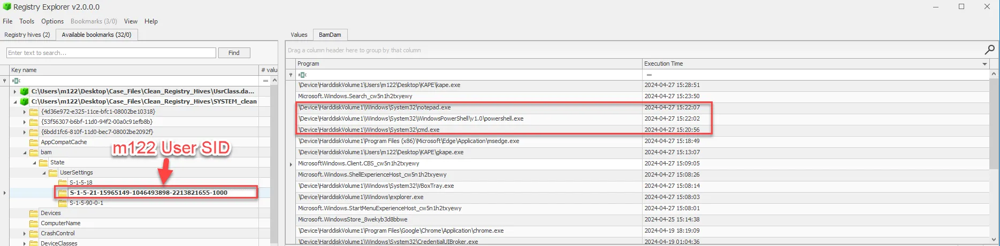
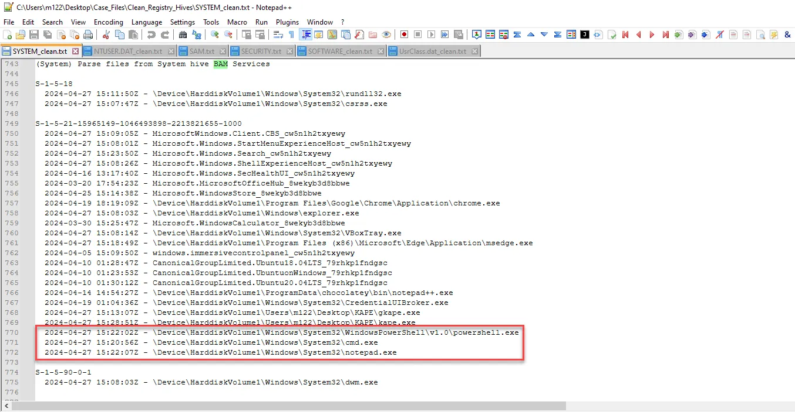

# Background Activity Monitor (BAM)

The Background Activity Monitor, or BAM, a relatively new and highly insightful artifact in Windows forensics. BAM can help us understand what applications have been running on a system in the background, even if those applications leave little trace elsewhere.

BAM is a Windows feature introduced with the Windows 10 April 2018 Update (version 1803). It’s designed to improve battery life and system performance by managing the activity of background applications. However, from a forensic perspective, BAM records metadata about application executions, making it an excellent source of evidence for reconstructing user actions.

BAM provides a record of applications that have run on a system, including the path to the executable and the last run time. This data can be crucial in investigations where it’s important to know not just which applications were run, but also when they were last active.

BAM can help identify unauthorized or suspicious software running in the background, which is often missed by other system logs or artifacts. This makes it particularly useful in cases of malware analysis, data exfiltration, or policy violations.

BAM data is stored in the Windows Registry under the key:

- `HKEY_LOCAL_MACHINE\SYSTEM\CurrentControlSet\Services\bam\State\UserSettings\<User SID>`

Each entry in the BAM registry key records the path to an executable and a timestamp indicating the last time the application ran. This data is specific to each user on the system, identified by their Security Identifier (SID).

One limitation of BAM is that it only retains information for a finite period, and older entries can be overwritten as new applications run. This means that BAM is most useful for capturing recent activity rather than providing a long-term history.

Additionally, BAM does not capture every single execution of an application, particularly if it was quickly opened and closed. It’s also limited to tracking executables that run with user interaction, which may miss some background processes.

As seen below it can be accessed using Registry Explorer.

<aside>
💡 It lists the execution of .exe files and includes a timestamp.

</aside>

<aside>
💡

The BAM information can also be viewed in the regripper output. 

</aside>

To summarize, BAM is a powerful artifact in Windows forensics that provides insight into the background activity of applications on a system. By mastering the extraction and interpretation of BAM data, you add a valuable tool to your forensic toolkit, allowing you to track application usage, identify unauthorized software, and corroborate other findings in your investigations.

## **Case Study: Reconstructing User Actions on a Compromised System Using Background Activity Monitor (BAM)**

**Scenario Overview**

A financial services firm detected unusual behavior on a workstation belonging to a high-level employee. There were signs of unauthorized data access, and sensitive financial documents appeared to be compromised. An internal investigation was launched to determine how the breach occurred, what tools were used, and who was responsible. The forensic team needed to reconstruct the user’s actions on the compromised system to identify unauthorized software use and corroborate other findings.

**Initial Forensic Findings**

1. **Suspicious Logins**: System logs revealed multiple logins to the workstation outside normal working hours, suggesting unauthorized access or credential theft.
2. **Data Exfiltration Alerts**: Network monitoring tools detected large outbound data transfers from the workstation to an unfamiliar IP address, raising concerns of data exfiltration.
3. **Presence of Potentially Malicious Software**: Initial scans revealed traces of unauthorized software, including a file transfer tool not approved by the company’s IT policy.

**Role of BAM**

To provide a more detailed timeline and confirm the use of unauthorized software, forensic analysts turned to the Background Activity Monitor (BAM) data stored in the Windows Registry. BAM was used to identify applications that had run in the background, helping to piece together the actions taken on the compromised system.

**Analysis of BAM Data**

1. **Extraction and Examination**: Using Registry Explorer and BAM Parser, analysts extracted BAM data from the registry under HKEY_LOCAL_MACHINE\SYSTEM\CurrentControlSet\Services\bam\State\UserSettings\<User SID>. They reviewed the entries to identify all executables that had run recently on the system.
2. **Identifying Unauthorized Software Use**: BAM data revealed that a portable file transfer tool, previously identified as suspicious, had been executed multiple times in the background. The data included the path to the executable on the system, which was located on an external USB drive connected around the time of the suspicious activity.
3. **Timeline Reconstruction**: By analyzing the timestamps in the BAM entries, investigators constructed a timeline showing that the unauthorized file transfer tool ran immediately after the external USB drive was connected and before the abnormal outbound data transfers were detected. This confirmed the tool’s use in the data exfiltration process.
4. **Detection of Additional Suspicious Applications**: BAM data also showed the execution of a command-line scripting tool, which was not authorized for use within the organization. This tool was used shortly before the file transfer application, suggesting that the attacker may have scripted or automated parts of the data exfiltration process.

**Corroborating Evidence**

1. **Cross-Referencing with USB Logs**: The BAM timeline matched USB connection logs, which confirmed the external device was connected just before the unauthorized software executions. This alignment reinforced the suspicion that the USB drive was used to run portable applications without leaving traditional installation traces on the system.
2. **Alignment with Network and Event Logs**: The timestamps from BAM entries aligned with the network logs showing the outbound data transfers and the system event logs indicating the unusual logins. This synchronization of data provided a clear picture of the sequence of actions leading to the data exfiltration.
3. **Supporting Evidence from Prefetch Files**: Prefetch files confirmed the execution of both the file transfer tool and the scripting application, adding another layer of validation to the findings from BAM. Prefetch data showed these applications were used more frequently than initially visible from standard logs, indicating sustained unauthorized activity.

**Conclusion**

The BAM analysis was pivotal in reconstructing the sequence of user actions on the compromised system, revealing that unauthorized portable software was used to access and transfer sensitive data. By providing precise details on application executions, BAM helped identify the use of specific tools and their association with critical events in the breach.

The data from BAM entries, when correlated with USB connection logs, network activity, and prefetch files, painted a comprehensive narrative of the unauthorized actions taken on the workstation. This case illustrates the power of BAM in digital forensics, showing how it can uncover hidden background activities, identify unauthorized software use, and corroborate other forensic findings to build a detailed and accurate timeline of events on a compromised system.