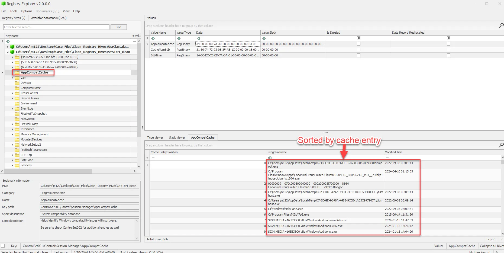
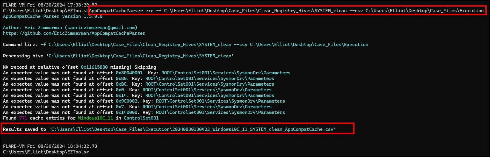
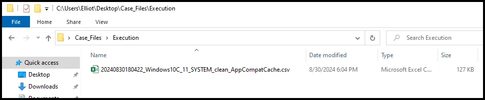
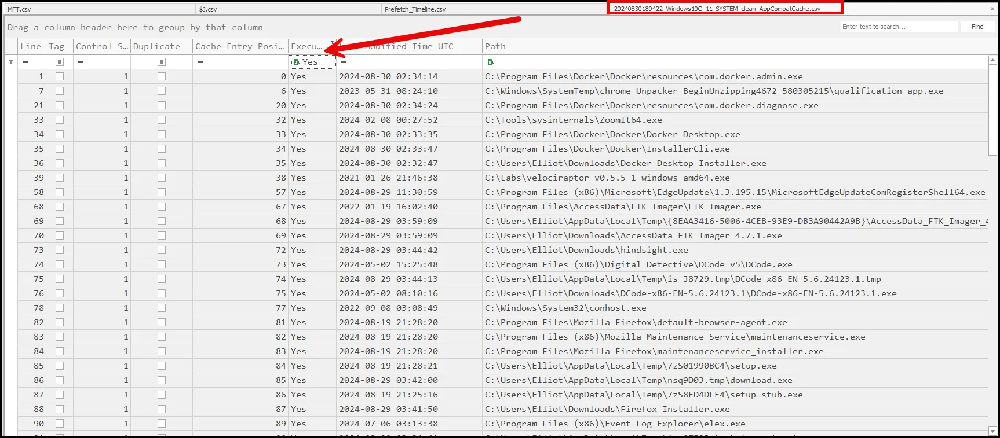

# Application Compatability Cache (aka Shimcache)

The Application Compatibility Cache, commonly known as Shim Cache. This artifact is a critical part of forensic investigations as it provides evidence of program execution, even when other logs or artifacts are absent or have been tampered with.

The Application Compatibility Cache is a feature in Windows designed to maintain compatibility of older software with newer versions of Windows. It tracks executables that have been run on the system, recording key details such as file paths and timestamps. Although its primary purpose is to help with application compatibility, it also serves as a powerful forensic tool for tracking program execution.

Shim Cache records entries for executables that have been launched, providing a snapshot of program activity on the system. This data can help forensic analysts identify when and what applications were run, even if the application has been deleted or its traces have been wiped from other logs.

Because Shim Cache records timestamps, it can be used to create a timeline of program execution, helping to reconstruct user actions, validate claims, or refute alibis during investigations.

Shim Cache data is stored in the Windows Registry at:

- For Windows XP through Windows 7: `HKEY_LOCAL_MACHINE\SYSTEM\CurrentControlSet\Control\Session Manager\AppCompatCache`
- For Windows 8 and later: `HKEY_LOCAL_MACHINE\SYSTEM\CurrentControlSet\Control\Session Manager\AppCompatCache\AppCompatCache`

Shim Cache entries include the executable’s file path, the last modified time, and sometimes, the last execution time. However, it's important to note that the cache does not always record the actual execution time; it mainly logs when the system last processed the file’s metadata.

One limitation of Shim Cache is that it doesn’t guarantee an application was executed—it only indicates that the file was recognized by the system. Some entries are recorded simply because the file was present, not necessarily run.

Shim Cache entries are limited in number and can be overwritten as new entries are added. This makes it crucial to collect the data as soon as possible during an investigation to avoid losing critical information.

**It is only written on system shutdown.**

<aside>
💡



</aside>

We can also use another Eric Zimmerman tool call AppCompatParse. Navigate to where the Zimmerman tools are store and run the following command and it will produce a csv. 

```powershell
AppCompatCacheParser.exe -f C:\Users\Elliot\Desktop\Case_Files\Clean_Registry_Hives\SYSTEM_clean --csv C:\Users\Elliot\Desktop\Case_Files\Execution
```



Open the csv in Timeline Explorer.





In conclusion, the Application Compatibility Cache is a powerful artifact for tracking program activity on a Windows system. By understanding how to extract and interpret Shim Cache entries, you gain an invaluable tool for reconstructing user actions and identifying unauthorized software executions, even when other evidence has been tampered with or deleted.

## **Case Study: Reconstructing User Actions on a Compromised System Using Application Compatibility Cache (Shim Cache)**

**Scenario Overview**

A technology company discovered that sensitive source code from a critical project had been leaked online. An internal investigation revealed that a developer’s workstation was the likely source of the leak. However, the developer denied any involvement, claiming that their credentials must have been compromised. The forensic team was tasked with reconstructing the sequence of user actions on the compromised system to identify if unauthorized software was used for the data leak and to establish a clear timeline of events.

**Initial Forensic Findings**

1. **Unusual Network Activity**: Network monitoring logs showed large file transfers from the developer’s workstation to an external IP address linked to a file-sharing service. The transfers occurred late at night, outside of normal working hours.
2. **Suspicious Login Times**: Windows event logs indicated multiple logins to the developer’s account during the same period, suggesting potential unauthorized access or insider involvement.
3. **System Scans**: Initial scans of the system revealed traces of deleted executable files, including potential data exfiltration tools, but the exact nature and timing of their use were unclear.

**Role of Application Compatibility Cache (Shim Cache)**

To provide a more detailed understanding of the executables that were run on the system and establish a timeline of events, the forensic team turned to the Application Compatibility Cache (Shim Cache). Shim Cache was critical in identifying the execution of potentially unauthorized software that had been deleted from the system.

**Analysis of Shim Cache Data**

1. **Extraction and Examination**: Using ShimCacheParser and Registry Explorer, analysts extracted Shim Cache entries from the registry hive located at HKEY_LOCAL_MACHINE\SYSTEM\CurrentControlSet\Control\Session Manager\AppCompatCache. They parsed the data to identify executables that had been run on the system.
2. **Identifying Unauthorized Software**: Shim Cache revealed the presence of an unauthorized file transfer application that matched the description of the deleted executable found in the initial scans. This application was not part of the company’s approved software list and had been run shortly before the abnormal file transfers were detected. The entry provided the path to the executable and a last modified time, suggesting it was run close to the time of the data exfiltration.
3. **Reconstructing the Sequence of Actions**: By analyzing the timestamps recorded in Shim Cache, investigators reconstructed the sequence of events, showing that the unauthorized file transfer tool was run immediately after the suspicious logins occurred. This sequence matched the period of the abnormal network activity, strongly indicating the tool was used to exfiltrate data.
4. **Detecting Additional Suspicious Executables**: Further examination of Shim Cache entries identified another executable related to a credential-stealing tool. This tool was executed shortly before the unauthorized logins, suggesting that it might have been used to capture the developer’s credentials and gain access to the workstation.

**Corroborating Evidence**

1. **Cross-Referencing with Event Logs**: The timeline from Shim Cache entries was cross-referenced with Windows event logs, confirming that the suspect’s account was active and performing actions on the system at the times indicated by Shim Cache. This correlation supported the hypothesis that the credentials were compromised and used to perform unauthorized activities.
2. **Alignment with Network and File System Logs**: The Shim Cache entries were aligned with network logs showing the outbound data transfers and the suspicious external connections. Additionally, file system metadata corroborated that the identified unauthorized software matched the periods of data exfiltration.
3. **Supporting Evidence from Other Artifacts**: Prefetch files confirmed that the unauthorized file transfer tool had been executed multiple times, aligning with Shim Cache data. This consistency across multiple artifacts strengthened the overall findings, providing a clear picture of how the data exfiltration was carried out.

**Conclusion**

The analysis of the Application Compatibility Cache was pivotal in reconstructing the sequence of user actions on the compromised system. Shim Cache entries revealed the use of unauthorized software for data exfiltration and credential theft, providing crucial evidence that directly linked the compromised workstation to the data leak incident.

By piecing together Shim Cache data with event logs, network activity, and file system metadata, the forensic investigation was able to confirm the use of specific tools, establish a detailed timeline, and demonstrate the attacker’s actions on the system. This case highlights the value of Shim Cache in digital forensic investigations, showing how it can uncover hidden or deleted executable activity, identify unauthorized software use, and corroborate other findings to create a comprehensive narrative of events on a compromised system.