# Intro to Browser Forensics

## Summary:

Today we will cover a basic introduction to browser forensics. Browser forensics plays a vital role in digital forensics and incident response by offering valuable insights into a user's online activities. This includes information such as websites visited, login credentials, download history, bookmarks, and installed extensions or plugins. We will examine history artifacts from three major browsers: Google Chrome, Mozilla Firefox, and Microsoft Edge.


**Collecting Browser Artifacts**

Open Kape from the Kape folder on your desktop.

<aside>
💡

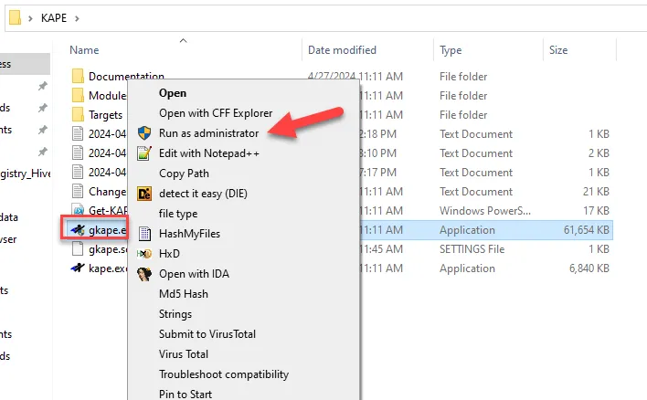

</aside>

Select C: as your target source and create a folder for your target destination (Kape_Out_Browser). Then select the following targets: Chrome, Edge Chromium, and Firefox (as seen below). Be sure that you select Edge Chromium and not just Edge. This is because Microsoft rebuilt the Edge browser a few years ago to run on the Chromium engine. Then select Execute in the bottom right corner.

<aside>
💡

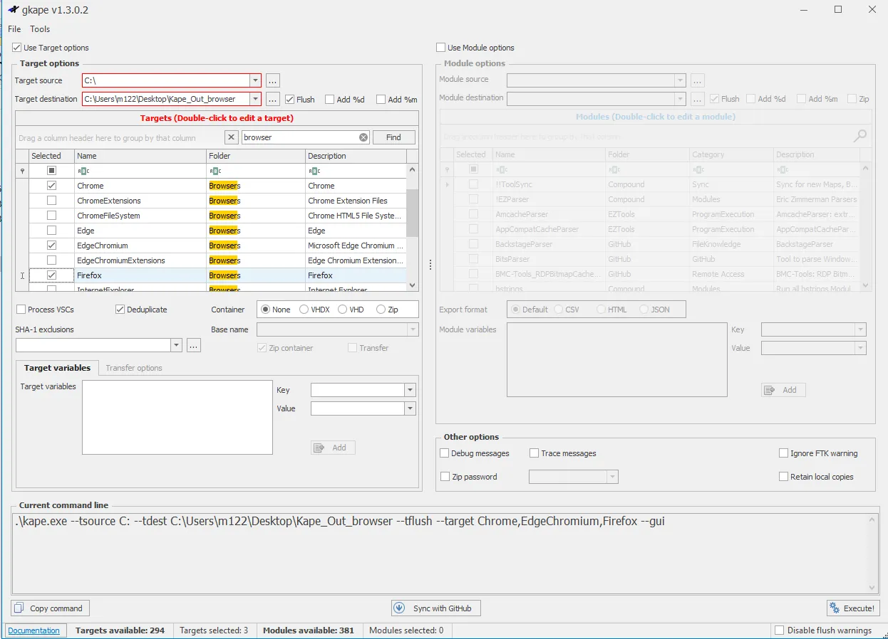

</aside>

We will analyze the collected browser artifacts later.

# Intro to Browser Forensics

Browser forensics is crucial in digital forensic and incident response (DFIR) investigations for several reasons:

1. **Evidence Collection**: Web browsers store a wealth of information about a user's online activities, including visited websites, search history, download history, cookies, form data, and more. Analyzing this data can provide valuable evidence related to a wide range of incidents, including cybercrime, intellectual property theft, insider threats, and unauthorized access.
2. **User Activity Analysis**: Browser history can provide insights into a user's behavior and intentions. By examining a user's browsing history, investigators can understand their online habits, preferences, interests, and interactions with web services. This information can help reconstruct a timeline of events, identify relevant leads, and establish motive or intent.
3. **Malware Analysis**: Malicious software often interacts with web browsers to steal credentials, deliver payloads, or exfiltrate data. Analyzing browser artifacts can help investigators identify indicators of compromise (IOCs), such as suspicious URLs, unauthorized browser extensions, or changes to browser settings. This information aids in malware analysis, threat hunting, and the identification of attack vectors.
4. **Incident Reconstruction**: Browser forensics enables investigators to reconstruct the sequence of events leading up to an incident. By analyzing timestamps, visit durations, navigation paths, and user interactions, investigators can piece together the actions taken by an attacker or insider. This helps establish the scope of the incident, determine the extent of unauthorized access, and assess the impact on affected systems and data.
5. **Digital Footprint Analysis**: Browsers often store information about a user's digital footprint, including saved passwords, autofill data, and browsing preferences. Analyzing this information can help investigators identify accounts, services, and online platforms accessed by the user. This assists in profiling suspects, tracing their online activities across multiple platforms, and corroborating evidence obtained from other sources.
6. **Legal Compliance and Documentation**: Browser forensics provides verifiable evidence that can be used in legal proceedings, regulatory compliance audits, or internal investigations. By documenting browser artifacts and preserving chain of custody, investigators ensure the integrity and admissibility of digital evidence in court. This helps support legal actions, prosecute offenders, and enforce organizational policies and regulations.

Overall, browser forensics plays a vital role in DFIR investigations by providing actionable intelligence, facilitating incident response efforts, and supporting the attribution of cyber incidents. It enables investigators to uncover valuable insights, establish facts, and build a comprehensive understanding of the circumstances surrounding an incident.

The table below includes a few common browser artifacts. 

| **Artifact** | **Applicability** |
| --- | --- |
| **Browsing History** | Since this artifact provides the exact site's URL and the time and date of the visit, the user's online activities can be easily plotted, whether related to access to a malicious link or unauthorized internal documents. |
| **Downloads** | Malicious files downloaded through the browser can be easily determined through this artifact, as well as where they are stored in the workstation and what link was used to download the file. The file name can also be used and correlated with evidence of execution to determine the extent of the potential compromise. |
| **Login Credentials** | If the user has saved their login data, this artefact allows you to correlate the pair of credentials and where they were submitted. Leveraging the contents of this artifact enables you to determine whether the user has a bad practice of saving credentials, has submitted credentials to a phishing website, or the pair of credentials is being reused. |
| **Cookies** | Cookies might be a minimal piece of data. Yet, they can still be used to determine the user's activity on a specific website, like confirming if the user has successfully authenticated and accessed a resource. |
| **Sessions** | Leveraging this artifact allows you to combine all the user's activity in a specific timeframe or a single browsing session. By knowing this, it is easy to correlate the sites accessed by the user and determine the pattern of the activity. |
| **Extensions** | Certain threat actors now leverage fake browser extensions and await for users to deploy and compromise users. Examples such as extensions harvesting login data or recording screen activity are prominent nowadays. |

# Google Chrome

Google Chrome's browsing data is stored in the user's **`AppData\Local\Google\Chrome\User Data\Default`** directory. 

<aside>
💡

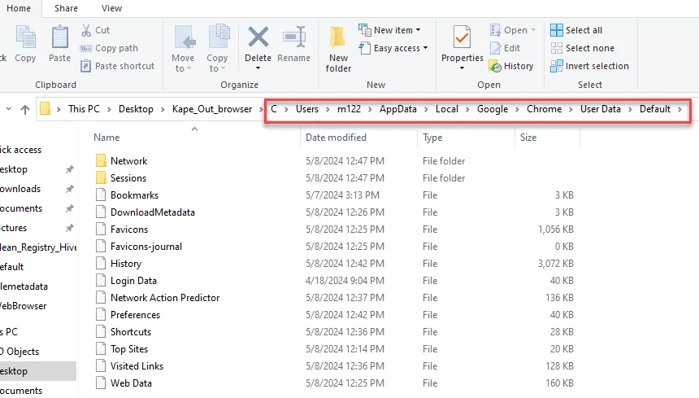

</aside>

**Chrome History provides analysts with the following information:**
•	What sites have been visited in the last X days (X being the number of days the history is set to record)
•	URL, page title, and referring site for each visit
•	How many times a site was visited (frequency information)
•	The specific date and time of each visit
•	The user account that was used to visit the site (nearly all browser data is stored within a user's profile)

## DB Browser for SQLite

Open DB Browser for SQLite (shortcut located on your Desktop) and navigate to the Chrome database stored at **C\Users\<User Name>\AppData\Local\Google\Chrome\User Data\Default.**

<aside>
💡

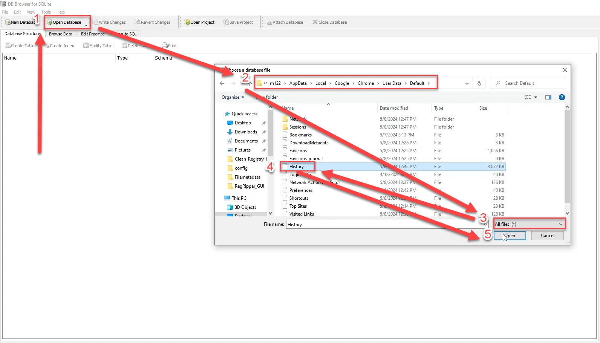

</aside>

## URLS Table

The first table we will view is the urls. 
The urls table in Chrome's browser history database is a key component for forensic analysis as it stores detailed records of all URLs visited by the user. This table includes essential fields such as the URL itself, the title of the webpage, the number of times the URL was visited, the date and time of the last visit, and the typed count, which indicates how often the URL was manually typed into the address bar. By analyzing the urls table, forensic investigators can reconstruct a user’s browsing history, identify patterns of behavior, detect potentially malicious sites, and correlate these findings with other artifacts such as cache, cookies, and downloads. This table provides a comprehensive view of a user's web activity, making it a critical piece of evidence in investigations involving unauthorized access, cyber threats, or policy violations.

<aside>
💡

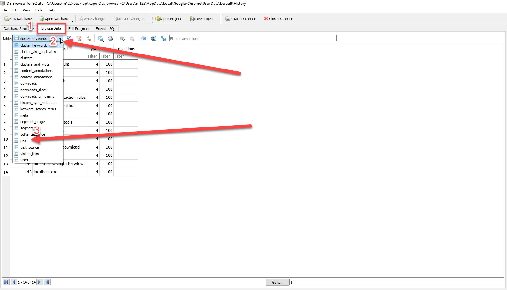

</aside>

As seen below the table shows all URLS visited, the number of times visited, and the data of the last visit.

<aside>
💡

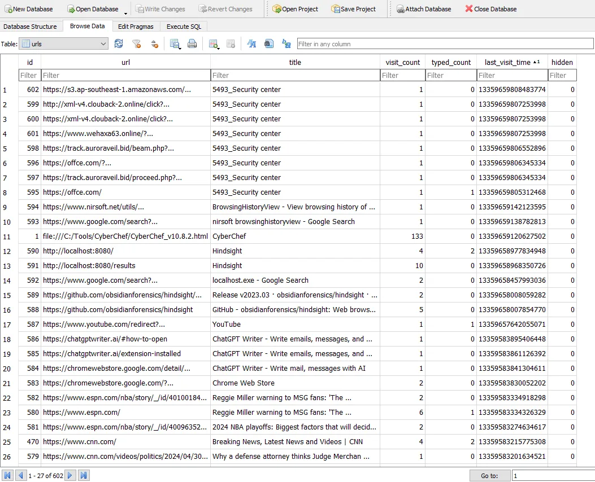

</aside>

Note that the time is displayed in the WebKit time format. It can be decoded using DCode. Copy and paste the WebKit time into DCode’s value field. After selecting “Decode” the time is displayed on the left side, as seen below. 

<aside>
💡

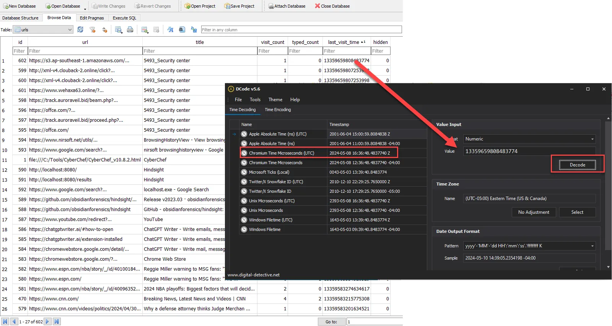

</aside>

## Visits Table

The visits table in Chrome's browser history database is a crucial element in forensic investigations, as it provides detailed insights into user navigation behavior. This table tracks each individual visit to URLs stored in the urls table, including the timestamp of the visit, the transition type, and the referring visit ID, which helps in constructing a sequence of browsing actions. The transition field is particularly valuable because it reveals how a user arrived at a URL—whether through a link click, a typed address, a redirect, or other means—allowing investigators to differentiate between intentional visits and automated or redirected accesses. By analyzing the visits table, forensic analysts can reconstruct a detailed and chronological timeline of browsing activity, detect patterns of suspicious behavior, and correlate these findings with other evidence, such as network logs or malware traces, to build a comprehensive understanding of user actions on a compromised system.

<aside>
💡

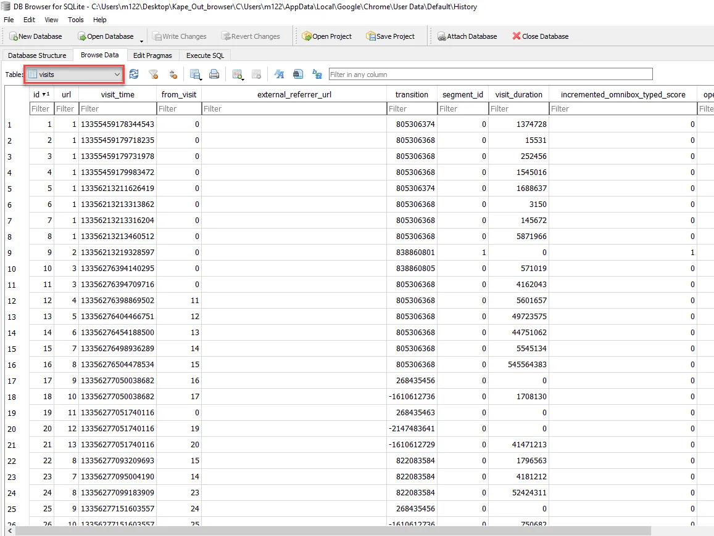

</aside>

### Transition Field

The transition field in the visits table of Chrome's browser history database plays a vital role in understanding the nature of web navigation events, providing context about how a user arrived at a specific URL. Encoded with both core transition types and qualifiers, this field helps differentiate between direct actions, such as clicking a link or typing a URL, and automated or indirect actions, like redirects or subframe loads. It can identify whether a visit was part of a navigation chain, the result of a client-side or server-side redirect, or even if it was triggered by back and forward navigation buttons. Forensic analysts leverage the transition field to reconstruct browsing paths, detect patterns of potentially malicious behavior, and distinguish between legitimate user actions and automated or coerced navigations, thus offering a deeper layer of insight into user activity on a compromised system.

Core transition types and qualifiers in Chrome’s transition field are used to describe how users navigate to URLs and provide additional context for each visit. Core transition types, represented by the last 4 bits of the transition field, indicate the primary method of navigation, such as LINK (0) for clicking on links, TYPED (1) for manually entering URLs, AUTO_BOOKMARK (2) for visits from bookmarks, AUTO_SUBFRAME (3) for automatic loads within subframes, and others like RELOAD (8) for page reloads or FORM_SUBMIT (7) for form submissions. Qualifiers, represented in the higher bits, add further details, such as whether a visit is part of a CHAIN_START (8388608) or CHAIN_END (16777216), was due to a CLIENT_REDIRECT (33554432) like a JavaScript or meta-refresh, a SERVER_REDIRECT (67108864) from a server-side action, or navigations using FORWARD_BACK (268435456) buttons. These combined values help forensic investigators precisely reconstruct browsing behavior, distinguishing between user actions and automated events.

### Core Transition Types

| Decimal Value | Core Transition Type | Description |
| --- | --- | --- |
| 0 | LINK | The visit resulted from clicking a link on another page. |
| 1 | TYPED | The visit was the result of the user typing the URL directly into the address bar. |
| 2 | AUTO_BOOKMARK | The visit was triggered by selecting a URL from the bookmarks. |
| 3 | AUTO_SUBFRAME | The visit was automatically generated by a subframe (e.g., iframe), without direct user action. |
| 4 | MANUAL_SUBFRAME | The visit resulted from the user manually navigating within a subframe. |
| 5 | GENERATED | The visit was the result of a keyword query (e.g., via the omnibox or address bar search). |
| 6 | START_PAGE | The visit was initiated from the start page, such as when the browser opens a new tab. |
| 7 | FORM_SUBMIT | The visit was generated by a form submission. |
| 8 | RELOAD | The visit resulted from the user reloading a page, either by using the reload button or F5. |
| 9 | KEYWORD | The visit was the result of a keyword search initiated from a search engine. |
| 10 | KEYWORD_GENERATED | Similar to GENERATED, but initiated via a keyword search. |

### Qualifiers

| Decimal Value | Qualifier Name | Description |
| --- | --- | --- |
| 8388608 | CHAIN_START | Marks the beginning of a navigation chain, like the first click in a series of redirects. |
| 16777216 | CHAIN_END | Marks the end of a navigation chain, such as the final destination after a series of redirects. |
| 33554432 | CLIENT_REDIRECT | The visit was the result of a client-side redirect, such as a meta refresh or JavaScript redirect. |
| 67108864 | SERVER_REDIRECT | The visit resulted from a server-side redirect, such as an HTTP 3xx status code. |
| 268435456 | FORWARD_BACK | Indicates the visit was the result of navigating forward or backward in the browser’s history. |

Convert core transition

```go
SELECT id, visit_time, transition, 
transition & 0xFF AS core_transition
FROM visits;
```

Convert Qualifier

```go
SELECT 
    id, 
    url, 
    visit_time, 
    visit_duration, 
    visit_duration / 1000000 AS duration_seconds, -- Convert to seconds
    (visit_duration / 1000000) / 60 AS duration_minutes, -- Convert to minutes
    (visit_duration / 1000000) % 60 AS duration_mod_seconds, -- Remaining seconds
    printf('%d:%02d', (visit_duration / 1000000) / 60, (visit_duration / 1000000) % 60) AS formatted_duration
FROM 
    visits;

```

### Visit Duration

The visit duration field in the visits table of Chrome's browser history database captures the amount of time a user spends on a particular webpage during a visit. This field, measured in microseconds, provides valuable insights into user engagement and interaction with web content. By analyzing the visit duration, forensic investigators can determine which pages held a user’s attention the longest, identify potential periods of inactivity, or detect unusual browsing patterns that might suggest automated behavior, such as the use of bots or scripts. The duration data, when correlated with other fields like transition and refering_visit , helps build a comprehensive picture of a user's browsing habits, making it a crucial element in reconstructing the sequence of user actions and understanding the context of their online behavior on a compromised system.

Note the time is in milliseconds. For example, the value 1374728 in the "visit duration" field, seen below, represents the duration of the visit in milliseconds. To convert this value to a more human-readable format (such as hours, minutes, and seconds), you can perform the following calculations:

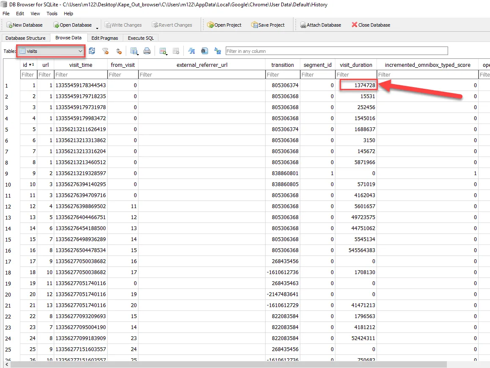

1. Convert milliseconds to seconds: 1374728ms÷1000=1374.728s
    
    1374728 ms÷1000=1374.728 s
    
2. Convert seconds to minutes and seconds: 1374.728s÷60s/min=22.912min(approximately)
    
    1374.728 s÷60 s/min=22.912 min (approximately)
    

So, the visit duration of 1374728 milliseconds is approximately 22 minutes and 54.728 seconds.

Or convert with SQL

```go
SELECT 
    id, 
    url, 
    visit_time, 
    visit_duration, 
    visit_duration / 1000000 AS duration_seconds, -- Convert to seconds
    (visit_duration / 1000000) / 60 AS duration_minutes, -- Convert to minutes
    (visit_duration / 1000000) % 60 AS duration_mod_seconds, -- Remaining seconds
    printf('%d:%02d', (visit_duration / 1000000) / 60, (visit_duration / 1000000) % 60) AS formatted_duration
FROM 
    visits;

```

## Correlate URLs and Visits tables

Chrome maintains more data points on website visits than any other major web browser. However, accessing that data requires cross-referencing multiple tables in the History SQLite database. This example demonstrates the wealth of information available on how a site has been accessed. For example, ID 470  in the urls table was visited a total of four times by the user. The urls table references the last time visited (last_visit_time). but if we want a complete history, information in the visits table is necessary. There we cross-reference by the field "url’’ and can identify the time of each visit (in WebKit time format), how the user found the site (from_visit and transition), and even each visit_duration. 

<aside>
💡

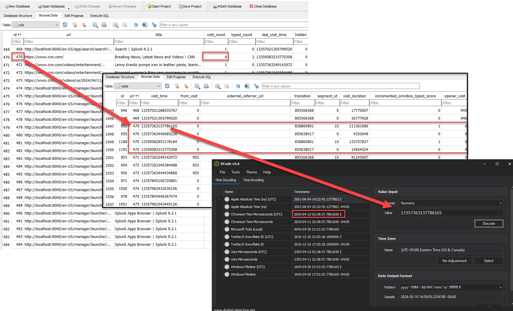

</aside>

After converting the times we can see the date/time for each time the user visited the url. 

2024-04-12 02:38:57.7861650 Z

2024-04-12 02:44:00.0852260 Z

2024-05-07 19:14:13.1781840 Z

2024-05-07 19:20:15.7753080 Z

Now that we understand how to work directly with the SQLite database and convert values, the next section introduces a tool that automatically converts many of those values to a human readable format. 

# HindSight

"Hindsight" is a forensic tool designed specifically for analyzing web browser history. It is commonly used by digital forensic investigators and security professionals to extract, parse, and analyze historical data from web browsers, including Chrome and Edge. Here's what the Hindsight forensic tool typically does:

1. **Extracts Browser History**: Hindsight can extract and parse various artifacts from web browsers, including browsing history, download history, cookies, bookmarks, and cache data.
2. **Parses Data Formats**: It parses the data stored in the browser's local storage files, SQLite databases, and other relevant files to extract meaningful information about the user's browsing activities.
3. **Generates Reports**: Hindsight generates comprehensive reports that summarize the extracted data in a human-readable format. These reports may include details such as visited URLs, visit times, visit durations, download history, and other relevant information.
4. **Timeline Analysis**: The tool often presents the extracted data in a chronological timeline, allowing investigators to visualize the user's browsing activities over time.
5. **Keyword Searching**: Hindsight may provide capabilities for searching the extracted data for specific keywords or URLs of interest, enabling investigators to quickly locate relevant information.
6. **Export and Integration**: It typically supports exporting the extracted data in various formats for further analysis or integration with other forensic tools and platforms.
7. **Cross-Browser Support**: While originally developed for Google Chrome, Hindsight has been expanded to support other web browsers like Edge, providing a broader scope for forensic investigations.

To use Hindsight navigate to the Tools directory on the Desktop. Type the following command (change the paths as appropriate):

```powershell
hindsight.exe -i "C:\Users\Elliot\Desktop\Kape_Out\C\Users\Elliot\AppData\Local\Google\Chrome\User Data" -o C:\Users\Elliot\Desktop\Case_Files\WebBrowser\Chrome
```

Let's break down the command:

- **`hindsight.exe`**: This is the executable file for the Hindsight forensic tool.
- **`i "C:\Users\m122\Desktop\Kape_Out_browser\C\Users\m122\AppData\Local\Google\Chrome\User Data"`**: This flag specifies the input directory or file that contains the Chrome browser data to be analyzed. In this case, it points to the Chrome user data directory on the local machine.
- **`o C:\Users\m122\Desktop\Case_Files\WebBrowser\Chrome`**: This flag specifies the output directory where the analysis results will be saved. In this case, it points to the directory where the output of the Hindsight analysis will be stored.

So, overall, the command is telling Hindsight to analyze the Chrome browser data located in the specified input directory (**`C:\Users\m122\Desktop\Kape_Out_browser\C\Users\m122\AppData\Local\Google\Chrome\User Data`**) and save the analysis results to the specified output directory (**`C:\Users\m122\Desktop\Case_Files\WebBrowser\Chrome`**).

<aside>
💡

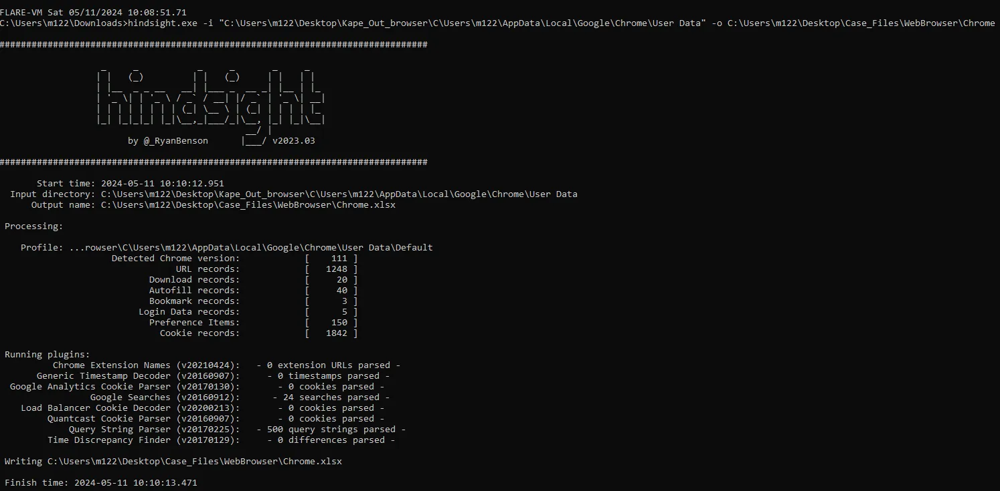

</aside>

After running the command, the summary of the processing is listed in the terminal, as seen above.

To view the output, open EZViewer located in the EZTools folder on the Desktop. Open the .xlsx file created by Hindsight (located in the Case_Files\WebBrowser\Chrome directory) with EZViewer.

 

<aside>
💡

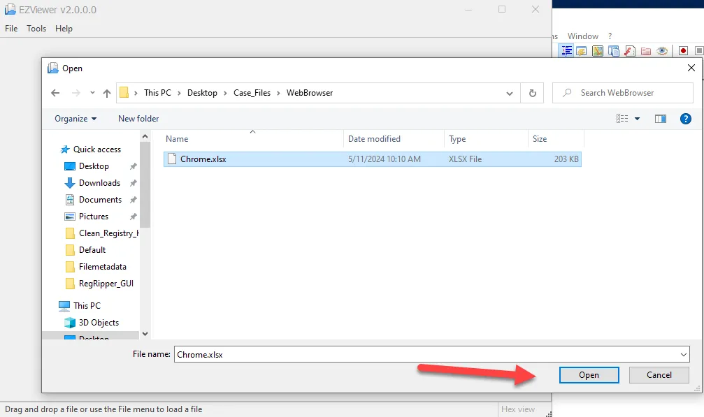

</aside>

When opened there are multiple columns that area filterable and sortable.

<aside>
💡

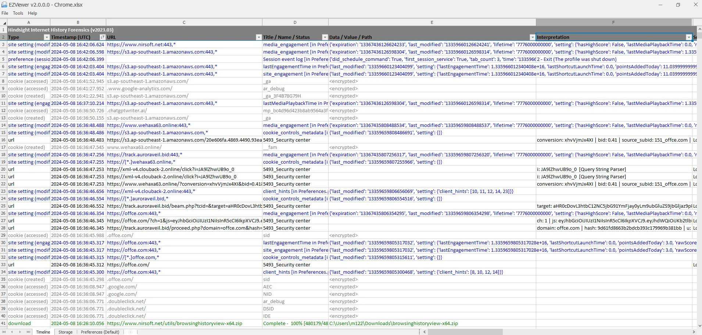

</aside>

Beginning with the “Type” field we can filter out certain values to make it easier to read the table. For example, filtering down to only the values you are currently interested in can greatly decrease the noise. You can always “recheck” a value when needed.

<aside>
💡

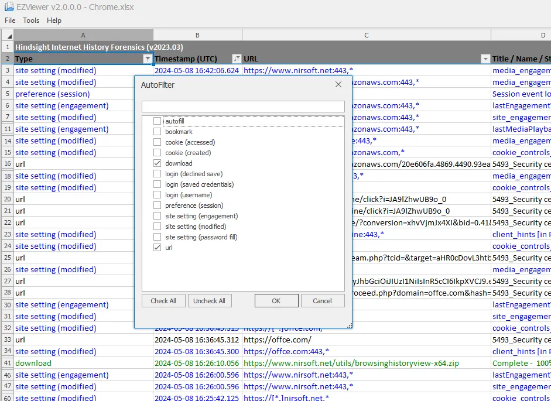

</aside>

By filtering down to url (visited) and downloads, we can see sites visited, date/time of visit, files downloaded, duration of the visits (already calculated), and the transition (already converted to text).

<aside>
💡

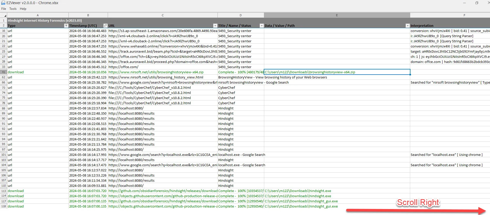

</aside>

<aside>
💡

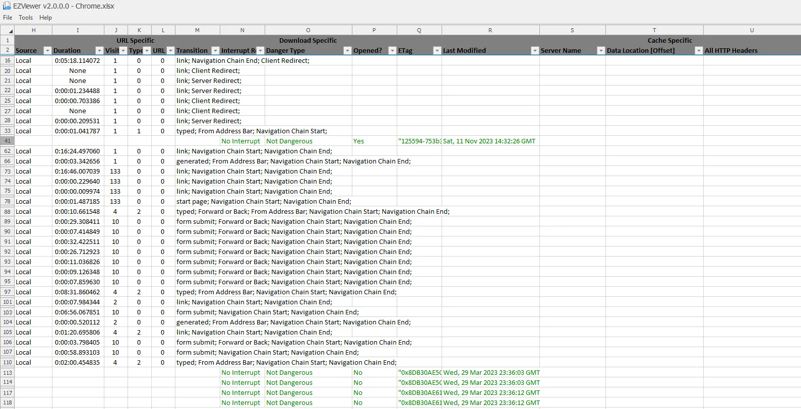

</aside>

# Microsoft Edge

Microsoft Edge was initially developed using its proprietary Edge HTML rendering engine. However, in late 2018, Microsoft announced that it would transition Edge to a Chromium-based browser.

Here's what this transition entails:

1. **Chromium Engine**: Chromium is an open-source web browser engine developed by Google. It serves as the foundation for Google Chrome, as well as several other browsers. By adopting Chromium, Microsoft Edge now uses the same underlying rendering engine as Google Chrome, providing better compatibility with web standards and rendering consistency across different websites.
2. **Improved Compatibility**: One of the primary motivations behind the move to Chromium was to improve compatibility with websites and web applications. Many developers optimize their websites for Chromium-based browsers due to Chrome's widespread usage. By aligning Edge with Chromium, Microsoft aimed to ensure that Edge users could access web content without encountering compatibility issues.
3. **Access to Chrome Extensions**: Chromium-based browsers, including Google Chrome, support a vast ecosystem of extensions and add-ons. By adopting Chromium, Microsoft Edge gained compatibility with Chrome extensions, allowing users to access a wide range of third-party extensions from the Chrome Web Store. This significantly expanded the functionality and customization options available to Edge users.
4. **Faster Development and Updates**: Leveraging Chromium as the browser engine streamlines the development process for Microsoft Edge. Microsoft can focus on enhancing Edge's user interface, features, and performance, while relying on Chromium for core rendering and compatibility functions. Additionally, Edge can benefit from the continuous improvements and security updates contributed to the Chromium project by Google and the broader open-source community.
5. **Cross-Platform Support**: Adopting Chromium enables Microsoft Edge to offer consistent experiences across different platforms, including Windows, macOS, and various Linux distributions. This allows Edge to reach a broader audience and compete more effectively with other browsers in the market.

Overall, the transition of Edge to a Chromium-based browser represents a strategic shift for Microsoft aimed at delivering a more competitive, compatible, and feature-rich web browsing experience to users.

Since Microsoft redesigned Edge to be chromium based a few years ago, many of the same tools to parse Chrome browser artifacts can also be used to parse Edge browser artifacts. 

Edge’s browser data is stored in the user’s **`AppData\Local\Microsoft\Edge\User Data\Default`** directory.  

<aside>
💡

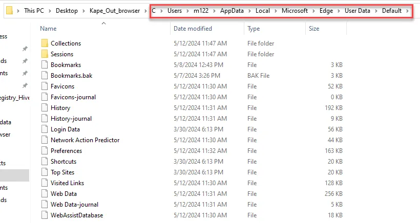

</aside>

The Hindsight command below creates a .csv containing Edge browser data.

```powershell
hindsight.exe -i "C:\Users\Elliot\Desktop\Kape_Out\C\Users\Elliot\AppData\Local\Microsoft\Edge\User Data\Default" -o C:\Users\Elliot\Desktop\Case_Files\WebBrowser\Edge
```

Just as with Chrome, the .csv can be read with EZViewer.

<aside>
💡

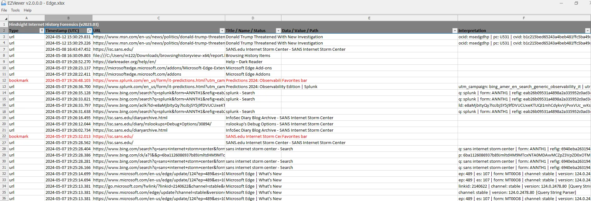

</aside>

Similarly, we can use DB Browser for SQLite to view Edge browser data.

<aside>
💡

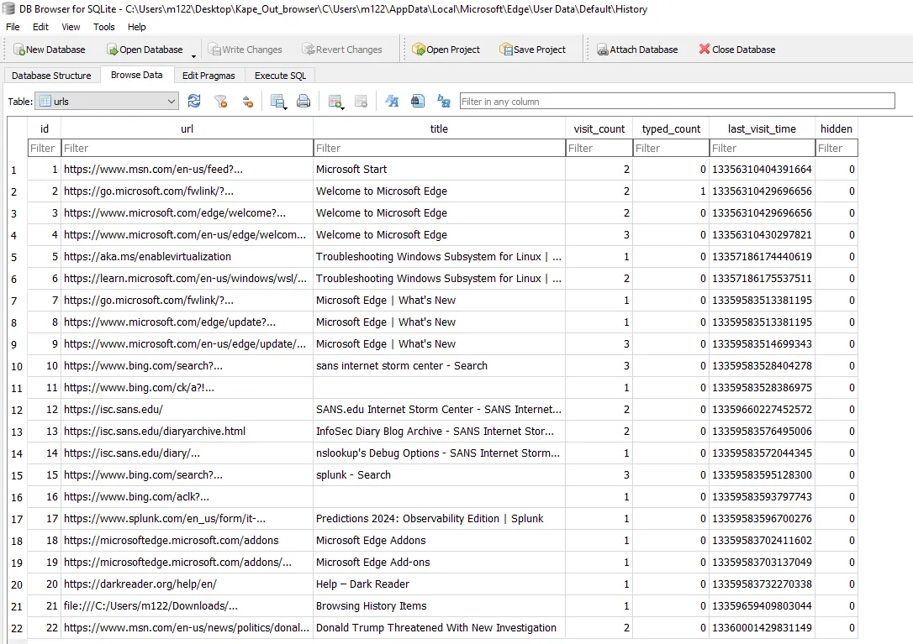

</aside>

# Mozilla Firefox

Firefox's browsing data is stored in the user's  **`AppData\Roaming\Mozilla\Firefox\Profiles`**  directory. 

<aside>
💡

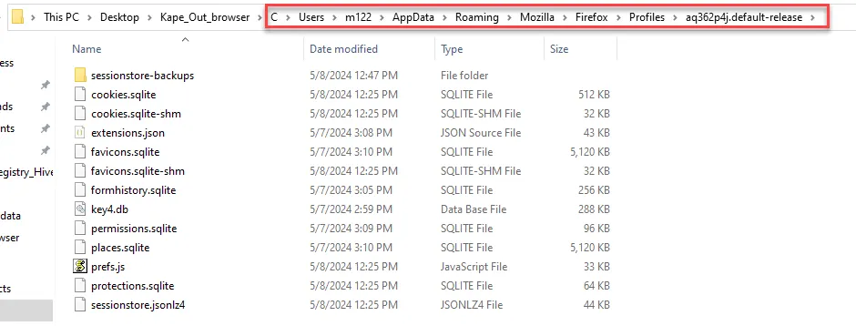

</aside>

| **File / Directory Name** | **Artifact Contents** | **File Type** |
| --- | --- | --- |
| places.sqlite | Contains the browsing history and bookmark metadata. | SQLite |
| logins.json / key4.db | Contains credentials saved through the browser. | JSON / SQLite |
| cookies.sqlite | Contains cookies from sites accessed. | SQLITE |
| extensions.json / extensions directory | Contains all artefacts related to Firefox extensions. | JSON / Folder |
| favicons.sqlite | Favicon metadata indicating sites accessed. | SQLite |
| sessionstore-backups | Handles sessions and tabs metadata.  | Folder (jsonlz4 files) |
| formhistory.sqlite | Contains input data submitted by the user in web forms. | SQLite |

The SQLite browser artifacts can be viewed with DB Browser for SQLite, as with Chrome and Edge.

<aside>
💡

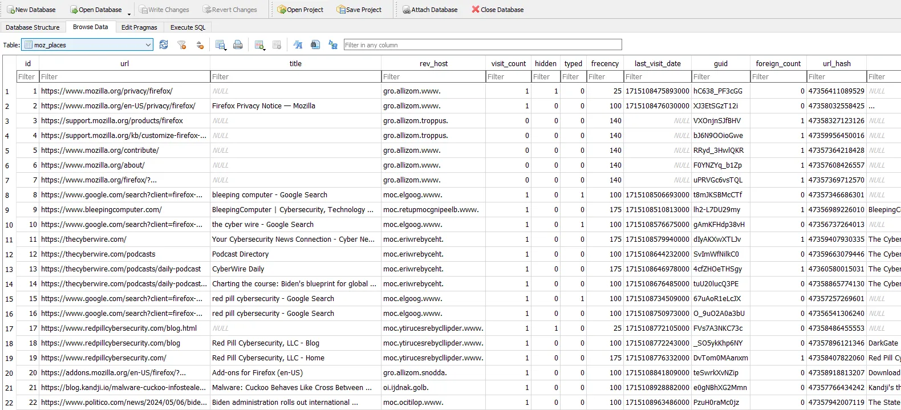

</aside>

# Browsing History View

BrowsingHistoryView is a free utility developed by NirSoft, a software company known for creating various useful system tools and utilities for Windows. BrowsingHistoryView specifically focuses on extracting and displaying browsing history information from different web browsers installed on your system. Here's what it typically does:

1. **Extracts Browsing History**: BrowsingHistoryView extracts and compiles browsing history data from popular web browsers installed on your Windows system. This includes browsers like Internet Explorer, Microsoft Edge, Firefox, Chrome, and Safari.
2. **Displays History Information**: Once the browsing history data is extracted, BrowsingHistoryView displays it in an easily readable format within its user interface. The information typically includes details such as visited URLs, visit times, visit durations, and other relevant metadata.
3. **Filtering and Sorting**: The tool often provides options to filter and sort the extracted browsing history data based on various criteria. Users can narrow down the displayed history by specifying date ranges, keywords, specific browsers, and other filters.
4. **Exporting Data**: BrowsingHistoryView allows users to export the extracted browsing history data to various file formats such as HTML, CSV, XML, or plain text. This can be useful for further analysis or documentation purposes.
5. **Viewing History of Multiple Browsers**: Users can view the browsing history of multiple web browsers simultaneously within BrowsingHistoryView's interface. This consolidated view helps users compare and analyze browsing activities across different browsers.
6. **Portable and Lightweight**: The tool is typically lightweight and portable, meaning it doesn't require installation and can be run directly from a USB flash drive or other storage media. This makes it convenient for forensic investigators or users who need to analyze browsing history data on multiple systems.

To run it, navigate to the C:\Users\Elliot\Desktop\Tools\browsinghistoryview-x64 directory and double click the executable file. 

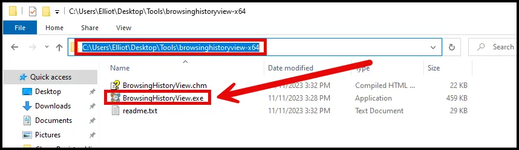

When it opens load the history from the users profiles by selecting “Load history form the specified profiles folder” from the dropdown menu.

<aside>
💡

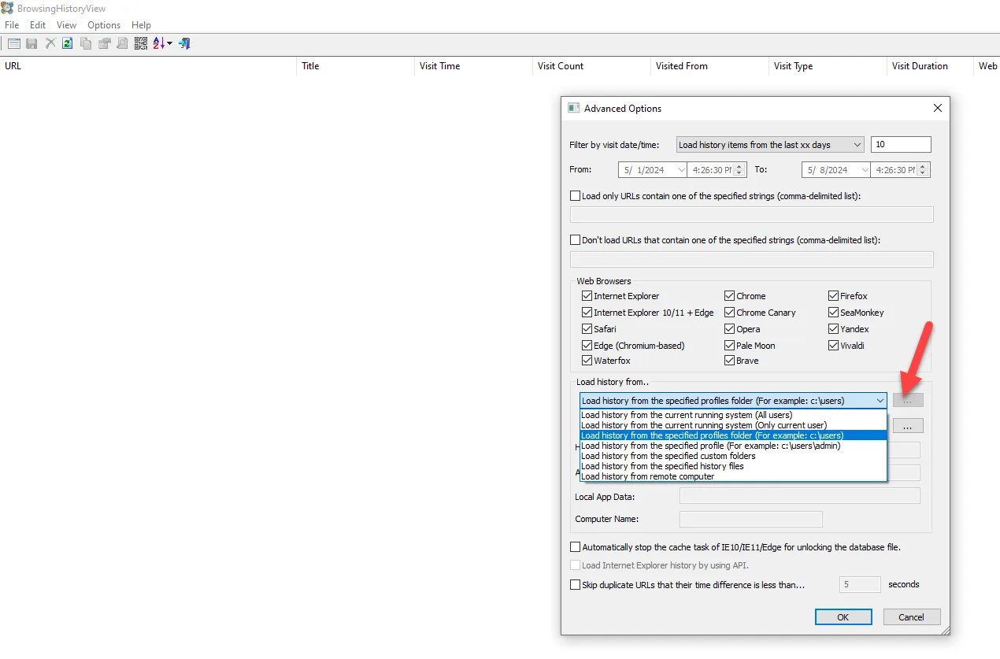

</aside>

Then navigate to the path of the Users profiles from your Kape collection.

<aside>
💡

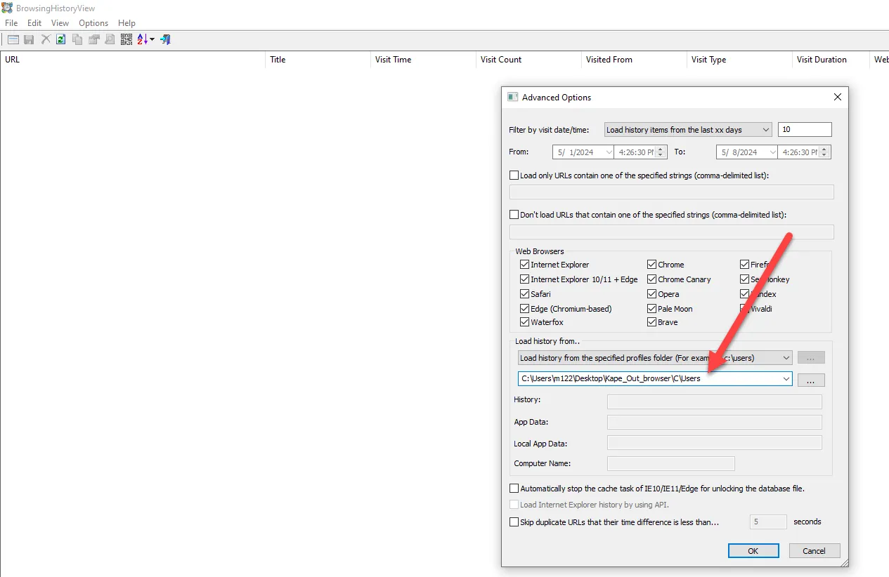

</aside>

Click OK and it displays the history and additional information from Edge, Firefox, and Chrome history.

<aside>
💡

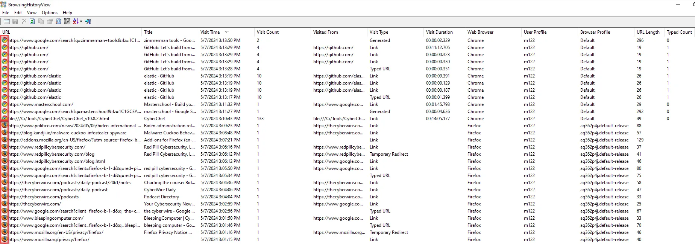

</aside>

# Conclusion

While we primarily focused on the history artifacts, we have demonstrated that browser forensics plays a vital role in DFIR investigations by providing actionable intelligence, facilitating incident response efforts, and supporting the attribution of cyber incidents. It enables investigators to uncover valuable insights, establish facts, and build a comprehensive understanding of the circumstances surrounding an incident.