# Carving Windows Deleted Files with Photorec

## Summary:

Today we will cover carving deleted files from unallocated space on Windows systems. A 16GB USB drive was discovered on the scene. It appears all the files were deleted. When a files are “deleted”, they are not removed from the drive. Only the MFT pointer is deleted. The files remain in unallocated space until they are overwritten. We will use a free tool called PhotoRec to carve files from unallocated space. We will then use a PowerShell script to organize the carved files by file type. 

## Lab Preparation:

**Option 1.** An .E01 file is located in the Case_Files directory under in the USB folder.  You can use that file to try to recover data.

**Option 2.** You can create your own . E01 file using FTK Imager. 

1. Insert a USB drive and delete the files on the USB or perform a “Quick Format”.

 2. Create a disk image (.E01 file) of the USB 

 Open AccessData FTK Imager located on the Desktop as Administrator

Select File —>Create Disk Image

<aside>
💡

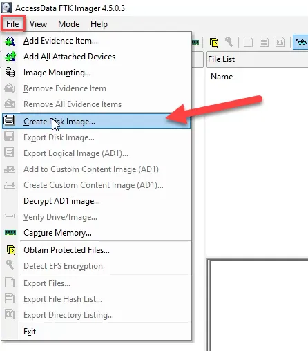

</aside>

Select Physical Drive

<aside>
💡

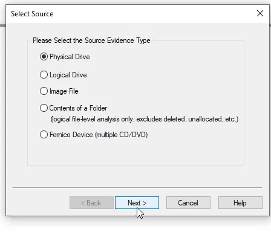

</aside>

<aside>
💡 Select the disk that you want to image from the dropdown.

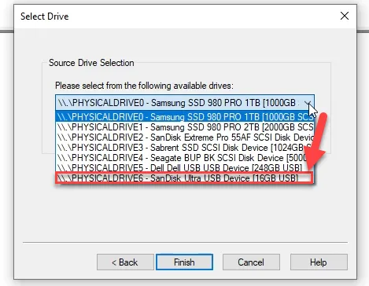

</aside>

<aside>
💡 Select add

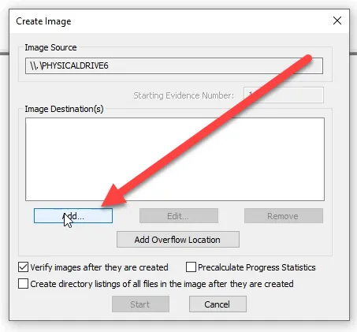

</aside>

<aside>
💡 Choose .E01

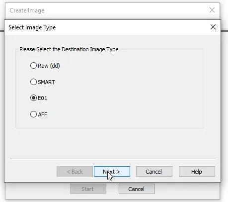

</aside>

<aside>
💡 Complete evidence information as appropriate or leave blank.

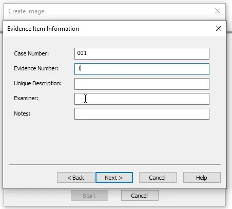

</aside>

<aside>
💡 Choose the destination for the image, the image name, set fragment size to 0, and select 2 for compression.

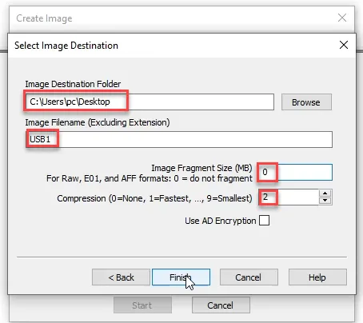

</aside>

<aside>
💡 Select start.


</aside>

<aside>
💡 When completed the image (.E01) is in the directory chosen earlier.

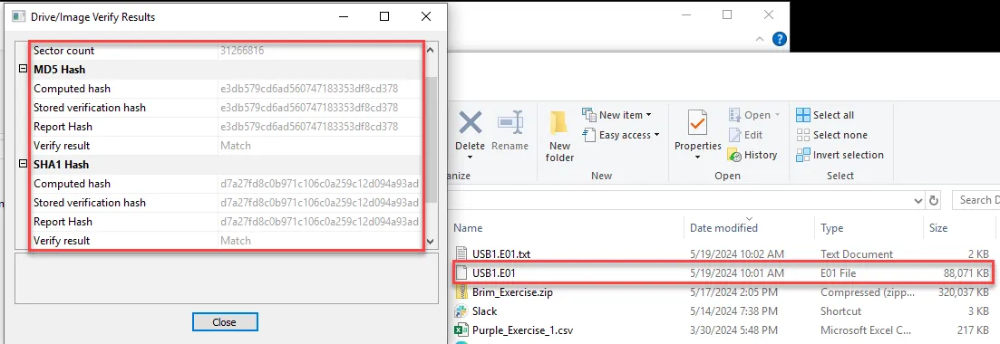

</aside>

1. Mount the .E01 file using FTK Imager. 

Open FTK Imager

Select File —> Image Mounting

 

<aside>
💡

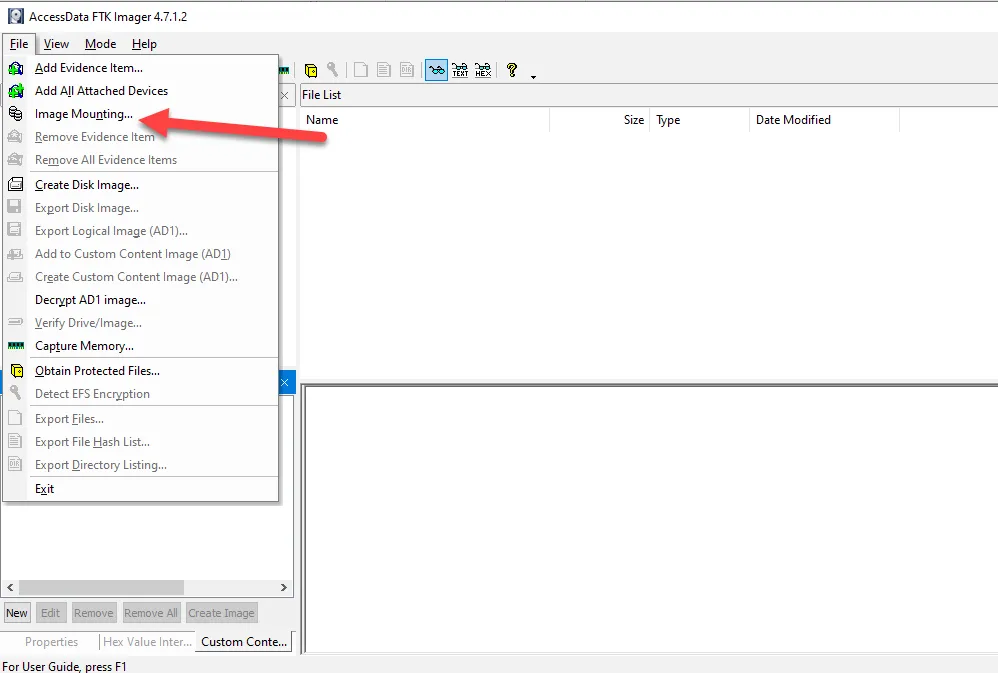

</aside>

Choose USB.E01 file you downloaded and extracted.

<aside>
💡

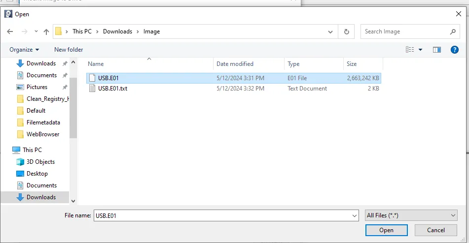

</aside>

Choose the “Mount” button.

<aside>
💡

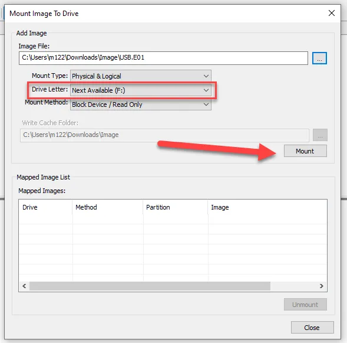

</aside>

The file is mounted as a drive. 

<aside>
💡

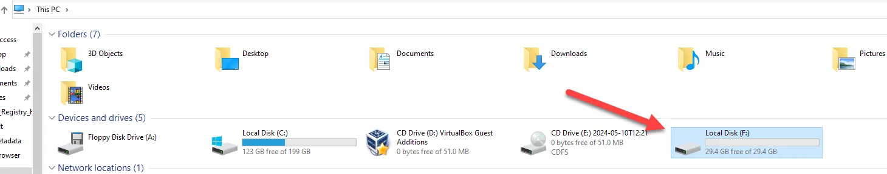

</aside>

When it is opened, you can see there are no files.

<aside>
💡

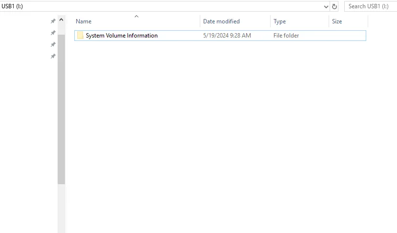

</aside>

## Background

Carving files from unallocated space is useful in digital forensic and incident response (DFIR) investigations for several reasons:

1. **Recovery of Deleted or Partially Overwritten Data**: When files are deleted or overwritten, their data may still remain in unallocated space on the disk. By carving files from unallocated space, forensic investigators can recover deleted or partially overwritten data that might be relevant to the investigation. This data could include incriminating documents, images, emails, or other digital artifacts that provide valuable evidence.
2. **Identification of Hidden or Encrypted Data**: Perpetrators of cybercrimes often attempt to conceal their activities by hiding files or encrypting sensitive data. Carving files from unallocated space allows investigators to uncover hidden or encrypted files that may have been overlooked during initial examination. This can reveal additional evidence of criminal activity or unauthorized access.
3. **Detection of File System Tampering**: In some cases, attackers may attempt to tamper with the file system to hide their tracks or manipulate evidence. Carving files from unallocated space can help detect signs of file system tampering, such as missing or altered file entries. This information can assist investigators in reconstructing the timeline of events and identifying the extent of the intrusion.
4. **Reconstruction of File Fragments**: When files are fragmented on disk, their data may be scattered across multiple clusters or sectors. Carving files from unallocated space allows investigators to reconstruct fragmented files by identifying and assembling the individual fragments. This can provide a more complete picture of the data and help recover files that would otherwise be inaccessible.
5. **Analysis of File Signatures**: Carving files from unallocated space involves searching for specific file signatures or magic numbers that indicate the beginning or structure of a file. By analyzing file signatures, investigators can identify the types of files present on the disk, even if their metadata has been deleted or altered. This information can aid in categorizing recovered files and prioritizing further analysis.

The concept of searching for known signatures in free or unallocated clusters on a file system is fundamental in digital forensic investigations. A signature represents a unique characteristic found at a consistent location within file data. For example, identifying the first four bytes of a file as "0x72 0x65 0x67 0x66" suggests it's likely a Windows Registry file, with the ASCII conversion yielding "regf", the signature for Registry hives. Hundreds of such signatures exist, allowing for their detection in free space. For instance, a Windows Executable can be identified by its "MZ" header, represented in hexadecimal as 0x4D and 0x5A, corresponding to ASCII "M" and "Z". When a carving utility locates these headers, it suggests the presence of an executable or a dynamic link library in unallocated space. Signatures can range from two to 64 bytes, guiding file recovery efforts.

When file recovery software scans unallocated clusters, it examines each cluster's beginning for potential signatures, matching them against the data within. Upon a match, it proceeds to recover and save the data to a file named with an extension corresponding to the signature found. For instance, data containing "regf" might be saved with a '.hbin' extension. However, since data is recovered from free space without associated filenames, recovery software may generate random filenames, such as 'image0001.jpg'. 

Determining when to stop carving is a critical aspect of file recovery. Carving software may utilize various techniques, including carving until allocated clusters are encountered, reaching a maximum length, or locating a file's footer—a signature found at its end. Not all file types have accurate footers, and file carving is not without flaws. Fragmented files, for instance, present challenges for recovery, especially in the absence of file system metadata. Hence, it's crucial to limit carving to relevant signatures to minimize noise in investigations.

## Photorec

PhotoRec is a versatile file-carving utility available in both command line and graphical user interface (GUI) versions. The GUI version features dropdown menus facilitating disk selection and image file selection, such as RAW or EO1 files. Additionally, it supports mounting image files using FTK Imager and Arsenal Image Mounter, enabling scanning of the mounted device. Users can configure file system options, search thoroughness (unallocated space or everywhere), and specify the destination for recovered files. Optional file type selection is available in the File Formats dialog, where the Reset button deselects all options, and the Restore button selects all.

PhotoRec employs advanced techniques to recover data efficiently. It begins by determining the cluster size of the file system from the Boot Sector of NTFS or FAT partitions. Then, it scans clusters for signatures by comparing bytes to a database of over 500 file signatures. Upon a match, data from that cluster onward is saved to a new file with a corresponding extension. Recovered files are organized into base directories and child directories named recup_dir.<number>, with a new directory created every 500 files.

The next two screenshots are examples of file signatures.

<aside>
💡 **An executable file in Hex Editor**

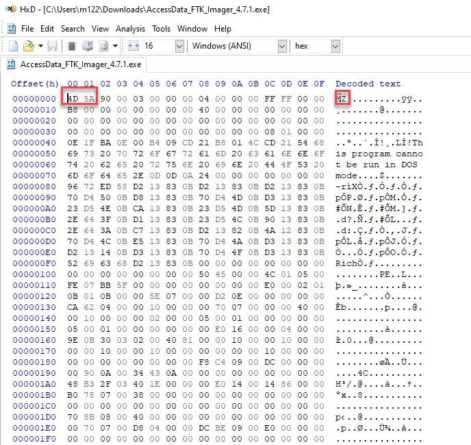

</aside>

<aside>
💡 **Zip file in Hex Editor**

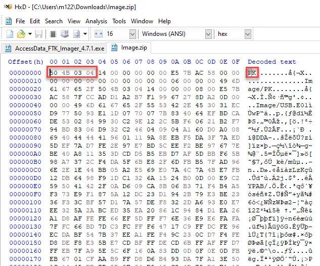

</aside>

<aside>
💡 Magic Number examples.

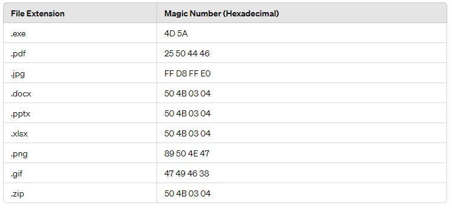

</aside>

A notable feature of PhotoRec is its ability to read file headers during recovery, enabling better file carving by interpreting metadata stored in the Master File Table (MFT). The tool also addresses fragmentation to some extent by attempting to join fragmented data. However, recovery may fail if a file is severely fragmented in multiple places. Despite its interface being less intuitive, PhotoRec excels in recovering various file types, including Windows artifacts, executables, shortcuts, event logs, and multimedia files.

<aside>
💡 **How Photorec Works**


</aside>

### Using Photorec

First, if you have not already mounted the USB.E01 file, do it with FTK Imager and follow the instructions above.

Navigate to the C:\Users\Elliot\Desktop\Tools\Photorec directory and open the qphotorec_win.exe file as Administrator to open the GUI version. Make sure you select the correct file. 

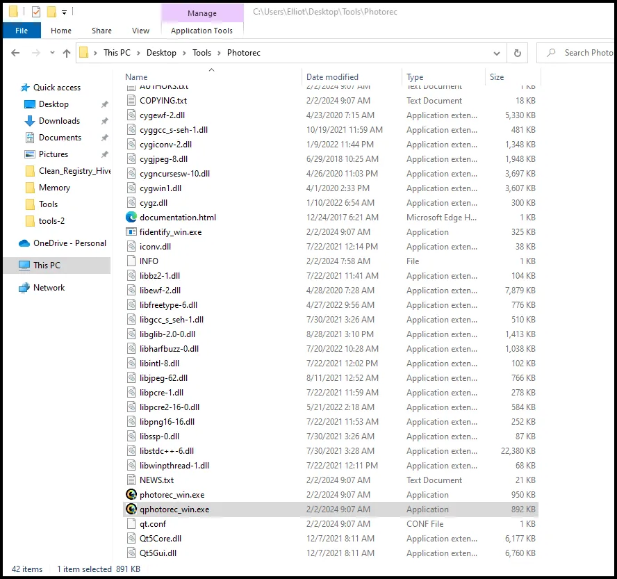

After the GUI is opened, choose the appropriate mounted drive from the dropdown. Ensure File System type is correct and select the destination (C:\Users\Elliot\Desktop\Case_Files\Recovered_Files) to save the recovered files to and select “Search”.

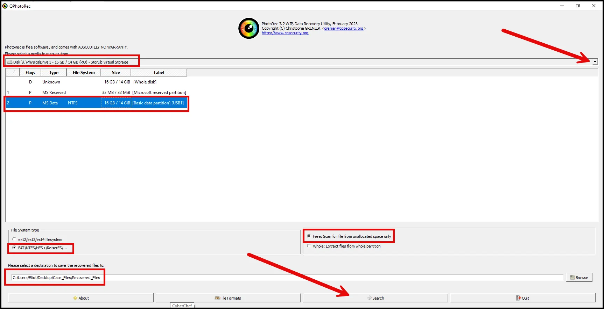

It may take PhotoRec several minutes to carve the files from unallocated space. Be patient. It does have a progress bar and will show the number of files recovered. 

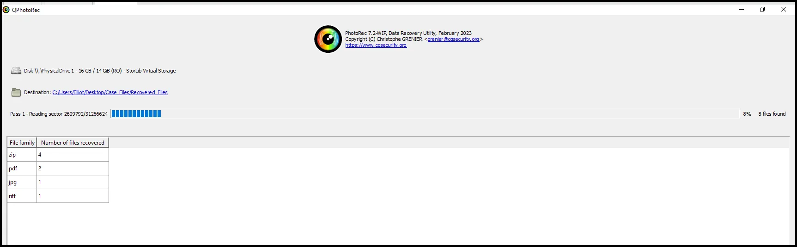

As shown below, 9 files were found.

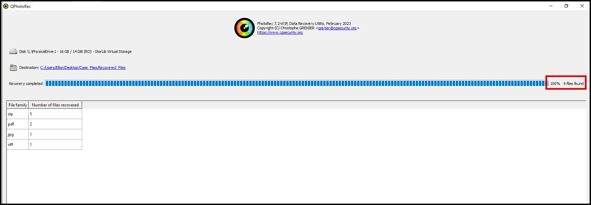

Unfortunately, Photorec does not organize the carved files and does not retrieve the file names. 

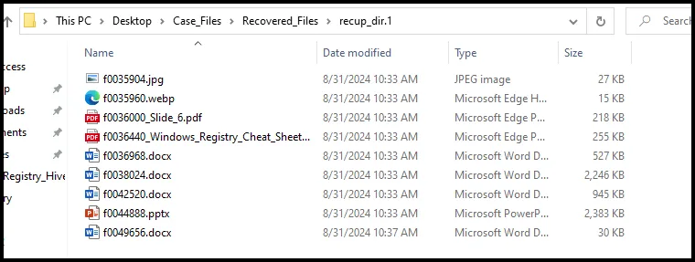

However, we can use a Python script to sort them by file type.

**Sorting**

Open a WSL2 Terminal and select Ubuntu.

 


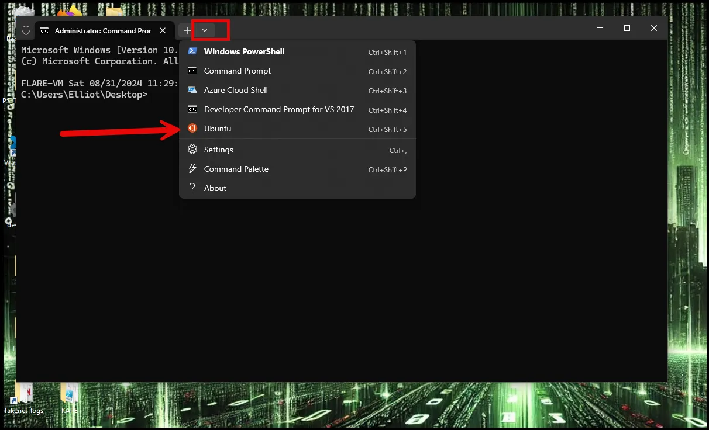

Navigate to the /mnt/c/Users/Elliot/Desktop/Tools directory.

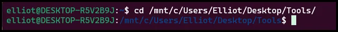

Run the command below to sort the files.

```go
python3 [recovery.py](http://recovery.py/) /mnt/c/Users/Elliot/Desktop/Case_Files/Recovered_Files/recup_dir.1/ /mnt/c/Users/Elliot/Desktop/Case_Files/Recovered_Files/Sorted/  
```

As shown below the python command sorts the files by file extension and creates a folder for each extension.

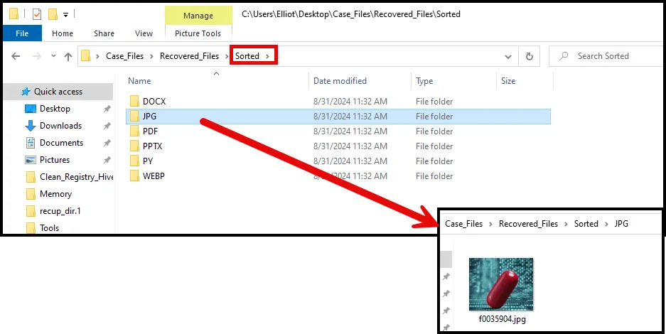

## Conclusion

Carving files from unallocated space is a useful technique in DFIR investigations, enabling investigators to recover, analyze, and reconstruct digital evidence that may be critical to resolving cybercrimes, data breaches, and other security incidents.