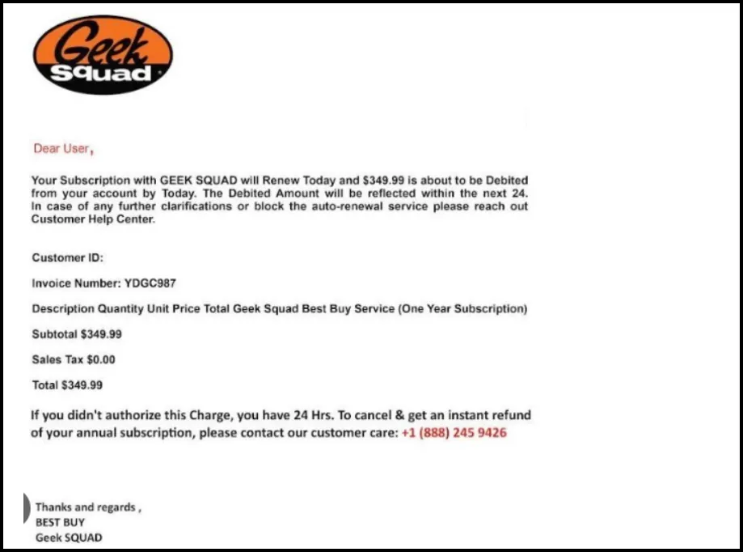

# Windows Forensics Capture The Flag

## Scenario

A user self-reported that on 15 May 2024 she received a suspicious email claiming that she was getting charged for a subscription renewal for Geek Squad.  (See below.)

She was concerned because she never had a Geek Squad subscription. Additionally, she only had 24 hours to cancel and get a refund. She called the number and they told her to get the refund, they needed to remove the Geek Squad access software. In order to do that they told her to go to a website and download some software that gave them access to her computer so that they could remove the Geek Squad access software.    She complied.  Roughly 30-45 minutes later she told a co-worker about the situation and they told her to immediately report it to the SOC.

After the user reported it, the SOC immediately took the system offline and conducted a triage collection using Kape.  Unfortunately, the user was not connected to the organization VPN during the event, so there is no SIEM data or network packet capture. The investigation will be based on the forensic artifacts collected with Kape.

Download the Kape collection and use your Windows VM to do the investigation and answer the questions in the following tasks.

To complete the Forensics CTF you must download the Kape Triage Collection from this link:

[Kape-Out-CTF.zip](Kape-Out-CTF.zip)

Once you have downloaded the Kape Triage Collection, unzip it and use the tools covered in the Windows Forensics section to answer the following questions. You can type your answers in the CTF Quiz in the next lesson.

**What user profile was used during this event?**

**What Browser does the user primarily use?**

**What webmail service did the user use?**

**What email address was the user using?**

**What is the name of the email attachment the user downloaded?**

**What tool did the user download?**

**How did the user initially access the site for remote management tool?**

**How did the user access espn.com?**

**What ransomware family did CISA report on in the article on Bleeping Computer?**

**Is there a persistence mechanism?**

**If yes, what is the flag for the persistence mechanism?**

**Is prefetch enabled on the system?**

**Was command and control beacon established?**

**If C2 was established, what is the name of the beacon?**

**What was the flag placed in the Downloads folder at 2024-05-15 12:36:40.830 (UTC)**

**What was the flag downloaded to the download folder at 2024-05-15 12:39:01.615 (UTC)**

**What enumeration command was executed at 2024-05-15 12:45:21.857 (UTC)**

**What enumeration command was executed at 2024-05-15 12:45:21.857 (UTC)**

**What enumeration command was executed at 2024-05-15 12:45:40.962 (UTC)**

**What executable was used to download the C2 beacon?**

**What IP address was FLAG734 downloaded from?**

**What is the file path for where FLAG734 was downloaded to?**

**What port number did the reverse shell use?**

**What is the IP address for raw.githubusercontent.com**

**What was the name of the malware that was restored from quarantine?**